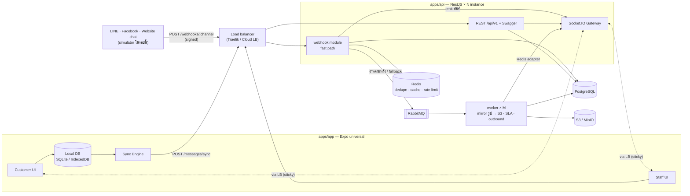
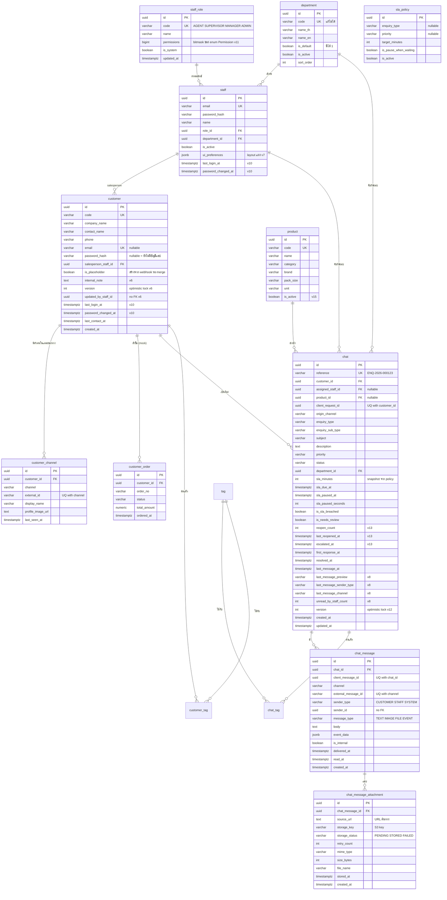
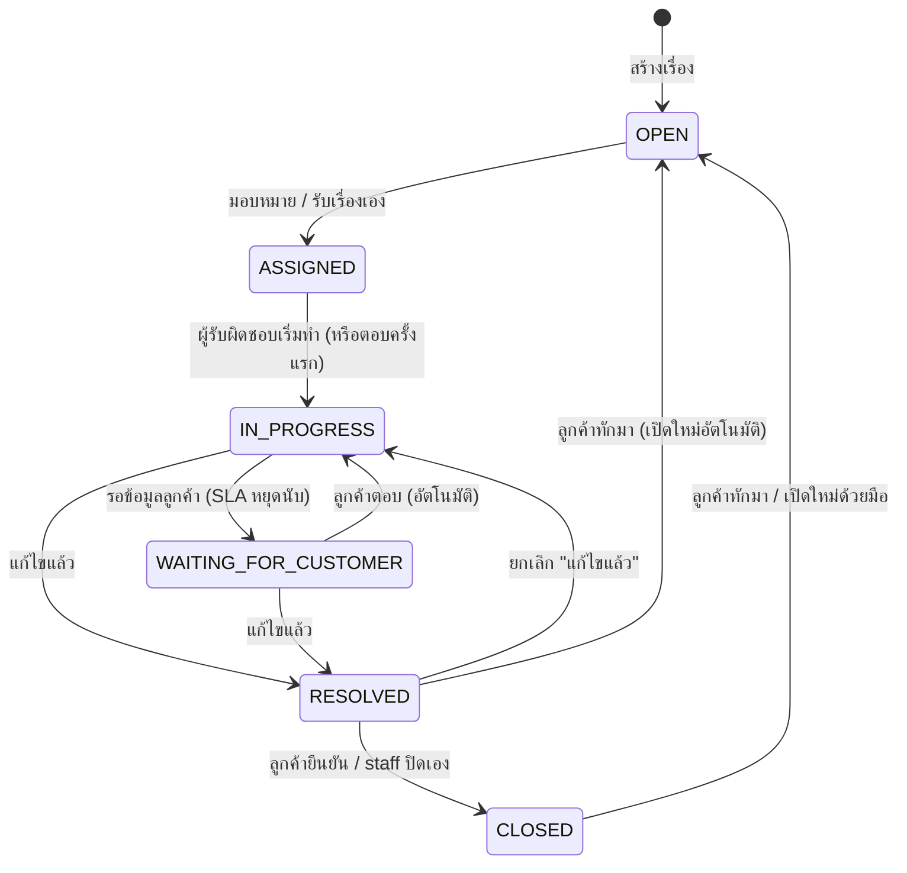
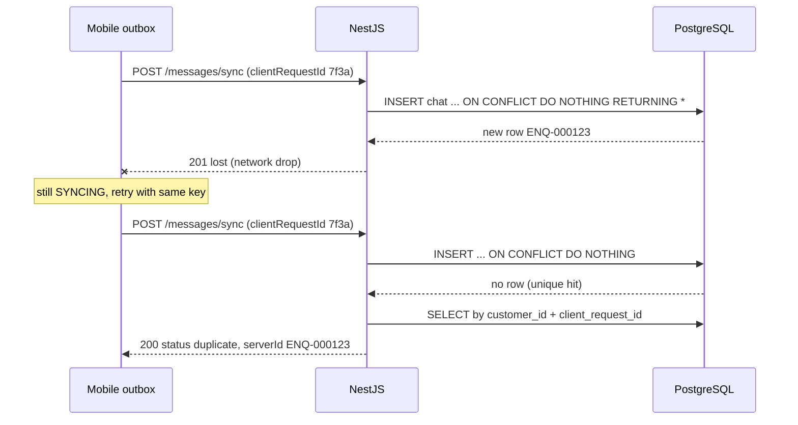
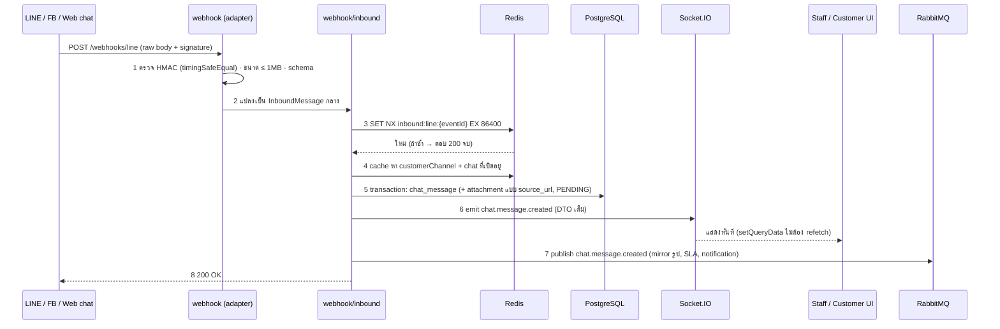
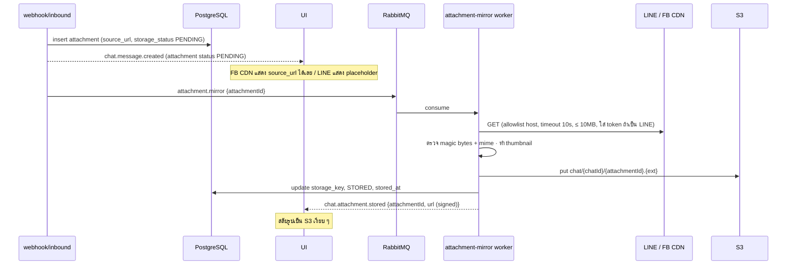
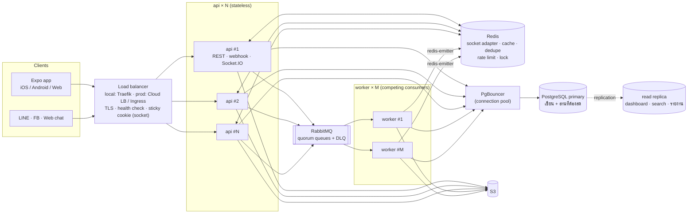
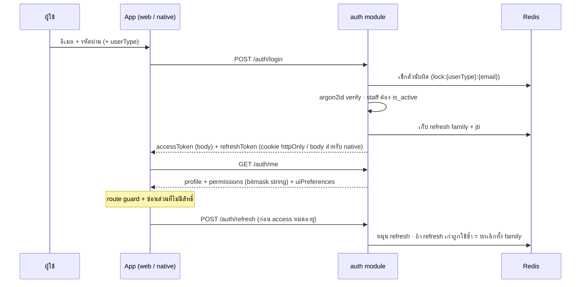

# System Design — Omnichannel Customer Enquiry Management

> ที่มา: `2-Day_Senior_Mobile_Developer_Omnichannel_Enquiry_Test.pdf` · scale: [`scale-assumptions.md`](scale-assumptions.md) · UX: [`ux-ui.md`](ux-ui.md)
> ผู้ออกแบบ: web-sa (ตามมาตรฐาน `web-fullstack-standard` + `system-design` + `database-design`) · v16 — 2026-09-22 (v2: ลดตาราง/relation, ตั้งชื่อ parent→child, webhook fast path, URL-first, sub-module · v3: scale แนวนอน + load balance §15 · v4: สิทธิ์ตามหน้า/หัวข้อ + การมองเห็นแชท §16 · v5: แผนกเพิ่มเองได้ §5 · v6: Customer Panel แผงขวาแก้ข้อมูลลูกค้า §16.9 · v7: ปรับขนาด/ซ่อนเมนูและแผงได้ §13 · v8: chat list รายลูกค้า + ค้นหา §16.10 · v9: ฟอนต์ไทยแบบมีหัว · v10: แท็กสร้างเองได้ §16.11 + ระบบ login §16.12 · v11: realtime ทุกจุด §10.1 + สิทธิ์ bitmask bigint §16.13 · v12: Context Panel แท็บขวามือ §16.14 · v13: สถานะ 6 ขั้น + เปิดใหม่อัตโนมัติ + เปลี่ยนได้เฉพาะผู้รับผิดชอบ §6 · v14: ตัดกติกาตามระยะเวลาของสถานะ · v15: ค้นหาสินค้าผ่าน chat list ด้วย trigram §16.10 · v16: ค้นข้อความด้วย trigram ทั้งใน chat list และในแชท §16.10)

## 0. สรุปใน 30 วินาที

- **แอปเดียวรันได้ทั้ง iOS / Android / Web** — Expo universal มี 2 role: **Customer** (มือถือ, ทำงาน offline ได้) และ **Staff** (web/tablet, layout 3 ช่อง)
- **Backend = NestJS modular monolith** — module ใหญ่แตกเป็น **sub-module ตามหน้าที่** (เช่น `chat/enquiry`, `chat/message`, `chat/attachment`, `chat/sla`)
- **DB 14 ตาราง, 15 FK** — ชื่อตารางเรียง parent→child (`chat` → `chat_message` → `chat_message_attachment`) เปิด pgAdmin แล้วตารางที่เกี่ยวกันอยู่ติดกัน · DB เป็น `snake_case` / โค้ดเป็น `camelCase`
- **Webhook → UI เร็วที่สุด**: ตรวจลายเซ็น → กันซ้ำ → บันทึก 1 transaction → ส่ง Socket.IO พร้อมข้อมูลเต็ม (UI แสดงทันทีไม่ต้อง refetch) → ตอบ 200 · งานหนักทำ async ทีหลัง · ถ้า DB มีปัญหาตกไปที่ RabbitMQ ไม่ทิ้งข้อความ
- **รูปจาก webhook = URL-first**: บันทึก URL ต้นทางลง DB ทันที → worker ดึงไฟล์ไปเก็บ S3 → อัปเดตแถวเดิม → UI สลับเป็นรูปจาก S3 เอง
- **Offline + ไม่สร้างซ้ำ**: บันทึกลงเครื่องก่อน (outbox) + `client_request_id` + unique constraint ใน DB
- ฝั่ง **staff/admin** ใช้ REST ปกติ (controller → service → repository → emit)
- **สิทธิ์ตามหน้า → หัวข้อ → การกระทำบน UI** (`inbox.chat.assign` ฯลฯ) เก็บเป็นชุดใน `staff_role` · staff เห็นแชทที่ตัวเองรับผิดชอบ + แชทแผนกตัวเอง · เห็นทั้งหมดเฉพาะคนมี `inbox.scope.all` · query เดียวรวมด้วย OR → แชทไม่ขึ้นซ้ำ (§16)
- **แผนกเพิ่มเองได้**: ตาราง `department` จัดการในหน้า Settings › Departments · ปิดใช้งานแทนการลบเพื่อรักษาประวัติ · มีแผนกค่าเริ่มสำหรับแชทใหม่ (§5)
- **Scale & load balance**: `api` และ `worker` ไม่เก็บ state → เพิ่ม instance ได้ทันทีหลัง load balancer (Traefik ใน local / Cloud LB ใน prod) · Socket.IO ข้าม instance ด้วย Redis adapter · worker เป็น competing consumers · งานตามเวลาใช้ Redis lock · DB เพิ่ม read replica + PgBouncer เมื่อถึงจุด (§15)

---

## 1. Constraints

| ด้าน | ข้อกำหนด | ที่มา |
|---|---|---|
| บังคับ | React Native, TypeScript, REST, local DB, auth, error handling, README | โจทย์ §19 |
| บังคับ | Offline create + ค้างหลัง kill app + auto sync + retry + ไม่ซ้ำ | §13–15 |
| บังคับ | Real-time conversation + delivery state | §10 |
| บังคับ | API ขั้นต่ำ 11 endpoint (path `/conversations` ตามโจทย์) | §20 |
| user | ทำครั้งเดียวได้ทั้งเว็บและแอป | คำตอบ user |
| user | relation น้อยแต่พอดี, ชื่อ parent→child, snake_case ใน DB / camelCase ในโค้ด | feedback v2 |
| user | ข้อมูลจาก webhook ถึง UI เร็วที่สุดแต่ปลอดภัย; รูปเก็บ URL ก่อนแล้วค่อยย้าย S3 | feedback v2 |
| scale | prototype แต่วางให้โตได้ (ปีที่ 3 ~20k ลูกค้า / 150 staff) · ต้อง scale แนวนอน + load balance ได้ | scale-assumptions, feedback v3 |
| นอก scope | ต่อ LINE/Facebook จริง (มี adapter + simulator ที่ใช้รูปแบบ payload จริง), ระบบ order จริง (mock) | §2, §12 |

---

## 2. Architecture



| จุดตัดสินใจ | เลือก | เหตุผล |
|---|---|---|
| Client | Expo universal | user ต้องการทำครั้งเดียวได้ทั้งเว็บและแอป; ทุกหน้าอยู่หลัง login ไม่ต้องใช้ SSR |
| Local DB | expo-sqlite / IndexedDB หลัง interface `LocalStore` | ทนการ kill app; DIP → เทสด้วย in-memory ได้ |
| Backend | NestJS modular monolith + sub-module | ตัวเลข prototype ไม่คุ้ม microservice; แตก sub-module ให้แต่ละโฟลเดอร์ทำเรื่องเดียว อ่านง่าย แก้เฉพาะจุดได้ |
| DB | PostgreSQL | unique constraint สำหรับกันซ้ำ, FTS + trigram ในตัว |
| Realtime | Socket.IO | reconnect + fallback polling, rooms, ack (delivery state), Redis adapter (ดู §8) |
| Async | RabbitMQ | งานหลังบันทึก (mirror รูป, SLA, ส่งออก LINE) + ที่พักข้อความตอน DB มีปัญหา |

---

## 3. Modules และ sub-modules

กติกา:
- **module** = bounded context (เป็นเจ้าของกลุ่มตารางที่ขึ้นต้นด้วยชื่อเดียวกัน เช่น `chat*`, `customer*`)
- **sub-module** = หน้าที่ย่อยใน module นั้น แต่ละตัวมี `controllers/ services/ repositories/ dto/ entities/` ของตัวเอง
- sub-module ใน module เดียวกันเรียก service กันตรง ๆ ได้ · **ข้าม module ต้องผ่าน service ที่ export หรือ RMQ event** — ไม่ใช้ repository ของ module อื่น

| module | sub-module | หน้าที่ | ตาราง |
|---|---|---|---|
| `auth` | `login` | login ลูกค้า/staff, refresh token (Redis) | — |
| | `permission` | `PermissionService`, `PermissionGuard`, `@RequirePermission()`, `StaffViewer` | — |
| `staff` | `profile` | ข้อมูล staff, รายชื่อให้ assign | `staff` |
| | `department` | เพิ่ม/แก้/เรียง/ปิดใช้งานแผนก, แผนกค่าเริ่ม | `department` |
| | `role` | ชุดสิทธิ์ของแต่ละ role (หน้า Settings › Roles) | `staff_role` |
| `customer` | `profile` | ข้อมูลลูกค้า, ค้นหา | `customer` |
| | `channel` | ตัวตนในแต่ละช่องทาง, ผูก/ย้าย (merge) | `customer_channel` |
| | `order` | ประวัติสั่งซื้อ (mock) | `customer_order` |
| | `overview` | Customer Panel: รวมข้อมูลทุกหัวข้อตามสิทธิ์ + merge (ประกอบจาก sub-module อื่น + `ChatService`) | — |
| `catalog` | — | ค้นหาสินค้า | `product` |
| `chat` | `enquiry` | สร้าง/ค้น/assign/เปลี่ยนสถานะ/escalate + state machine + `ChatAccessPolicy` (ใครเห็นแชทไหน) | `chat` |
| | `message` | ข้อความ, delivery/read, system event ใน thread | `chat_message` |
| | `attachment` | upload จากแอป, mirror URL → S3, signed URL | `chat_message_attachment` |
| | `sla` | policy, คำนวณ due, ตรวจ breach | `sla_policy` |
| | `customer-chat` | รายการแชทรายลูกค้า + ค้นหา + timeline รวมทุกเรื่องของลูกค้า (v8) | (อ่าน `chat`, `chat_message`) |
| `webhook` | `inbound` | pipeline กลาง: กันซ้ำ → หาลูกค้า/แชท → บันทึก → emit | — |
| | `line` · `facebook` · `web-chat` | adapter: ตรวจลายเซ็น + แปลง payload เป็นรูปแบบกลาง | — |
| | `outbound` | ส่งข้อความ staff กลับไปยังช่องทางเดิม (worker) | — |
| `sync` | — | batch sync จาก outbox มือถือ | — |
| `dashboard` | — | ตัวเลขสรุป (ผ่าน `ChatService.getStats`) | — |
| `common` | `socket` · `rmq` · `redis` · `storage` · `guards` · `filters` · `utils` | ของที่ทุก module ใช้ | — |

### ตัวอย่างโครงไฟล์ `chat`

```
src/modules/chat/
├─ chat.module.ts                  # import 4 sub-module + export ChatService (facade ให้ module อื่น)
├─ chat.service.ts                 # facade: findByCustomer(), getStats() — module อื่นเรียกผ่านตัวนี้เท่านั้น
├─ enquiry/
│  ├─ enquiry.module.ts
│  ├─ controllers/enquiry.controller.ts       # /conversations, /conversations/:id/assign|status
│  ├─ services/enquiry.service.ts
│  ├─ services/enquiry-status.machine.ts      # ตาราง transition
│  ├─ repositories/chat.repository.ts
│  ├─ dto/create-enquiry.dto.ts · assign-enquiry.dto.ts · change-status.dto.ts · enquiry-response.dto.ts
│  └─ entities/chat.entity.ts
├─ message/
│  ├─ controllers/message.controller.ts       # /conversations/:id/messages
│  ├─ services/message.service.ts
│  ├─ repositories/chat-message.repository.ts
│  ├─ dto/…
│  └─ entities/chat-message.entity.ts
├─ attachment/
│  ├─ controllers/attachment.controller.ts    # /attachments
│  ├─ services/attachment.service.ts
│  ├─ services/attachment-mirror.service.ts   # URL → S3
│  ├─ consumers/attachment-mirror.consumer.ts # RMQ
│  ├─ repositories/chat-message-attachment.repository.ts
│  └─ entities/chat-message-attachment.entity.ts
└─ sla/
   ├─ services/sla.service.ts · sla-policy.resolver.ts
   ├─ jobs/sla-breach.job.ts                  # ทุก 1 นาที (worker)
   ├─ repositories/sla-policy.repository.ts
   └─ entities/sla-policy.entity.ts
```

---

## 4. Requirement → องค์ประกอบ

| โจทย์ | endpoint / event | ตาราง | หน้าจอ |
|---|---|---|---|
| §4 Customer app | `POST /auth/login`, `POST/GET /conversations`, `.../messages` | chat, chat_message, chat_message_attachment | C1–C5 |
| §6 Workflow | `PUT /conversations/:id/status` | chat + chat_message (EVENT) | A3 |
| §7 Staff app | `GET /conversations?filters`, `PUT .../assign`, `PUT .../status` | chat, staff | A1–A4 |
| §9 Product search | `GET /products?q=` | product | C3, A3 |
| §10 Realtime | Socket.IO `chat.message.created` ฯลฯ | chat_message | C4, A3 |
| §11 Omnichannel | `POST /webhooks/:channel` (+ simulator) | customer_channel, chat_message.channel | A5, A3 |
| §12 Customer 360 | `GET /customers/:id` | customer, customer_channel, customer_order + chat | A3, A4 |
| §13–15 Offline | `POST /messages/sync` | UQ `client_request_id`, `client_message_id` | C1, C3 |
| §16 SLA | `GET/PUT /sla-policies` | sla_policy, chat.sla_* | A1, A2, A6 |
| §17 Attachments | `POST /attachments` + mirror | chat_message_attachment | C3, C4 |
| §18 Dashboard | `GET /dashboard/summary` | chat | A1, A2 |

> path ของ API ใช้ `/conversations` ตามที่โจทย์กำหนด ข้างในระบบเรียกว่า `chat` (1 chat = 1 enquiry)

---

## 5. Data model (14 ตาราง, 15 FK)

### หลักตั้งชื่อ
| ที่ | รูปแบบ | ตัวอย่าง |
|---|---|---|
| ตาราง | `snake_case` เอกพจน์, **ขึ้นต้นด้วย parent** → ตารางลูกเรียงติดกันใน pgAdmin | `chat` → `chat_message` → `chat_message_attachment` |
| column | `snake_case`, FK = `<ตารางที่อ้าง>_id` | `customer_id`, `assigned_staff_id` |
| boolean | `is_` / `has_` | `is_sla_breached`, `is_internal` |
| เวลา | `_at` (`timestamptz`) | `created_at`, `sla_due_at` |
| index / constraint | `idx_<table>__<cols>`, `uq_<table>__<cols>`, `fk_<table>__<col>` | `uq_chat__customer_id_client_request_id` |
| TypeORM entity | class `PascalCase`, property `camelCase` (ใช้ `SnakeNamingStrategy` แปลงอัตโนมัติ) | `ChatMessage.chatId` ↔ `chat_message.chat_id` |
| API JSON / TS | `camelCase` | `{ "chatId": "…", "createdAt": "…" }` |

### ตารางใน pgAdmin (เรียงตามตัวอักษร = จัดกลุ่มเอง)

```
chat                        ← enquiry (1 chat = 1 เรื่อง)
chat_message                ← ข้อความ + system event ใน thread
chat_message_attachment     ← ไฟล์/รูปของข้อความ
chat_tag                    ← แท็กของแชท — v10
customer
customer_channel            ← ตัวตน LINE / FB / Web / App / Phone
customer_order              ← mock
customer_tag                ← แท็กของลูกค้า — v10
department                  ← แผนก (admin เพิ่มเองได้) — v5
product
sla_policy
staff                       ← agent / supervisor / manager / admin
staff_role                  ← ชุดสิทธิ์ (permissions bigint bitmask) — §16.13
tag                         ← แท็กที่ผู้ใช้สร้างเอง — v10 §16.11
```



### แผนก — admin เพิ่ม/แก้เองได้ (v5)

> สรุป: แผนกเป็นตาราง `department` (ไม่ใช่ enum ในโค้ดแล้ว) · เพิ่ม/แก้ชื่อ/เรียงลำดับ/ปิดใช้งานได้จากหน้า **Settings › Departments** · ลบจริงไม่ได้เมื่อมีข้อมูลอ้างถึง (ใช้ปิดใช้งานแทน) เพื่อไม่ให้ประวัติแชทเสีย

| column | ใช้ทำอะไร |
|---|---|
| `id` uuid PK | ใช้อ้างทุกที่ (`staff.department_id`, `chat.department_id`, socket room `department:{id}`) |
| `code` varchar UK | รหัสสั้นอ่านง่าย (`CS`, `QC`, `COLD_CHAIN`) · ตั้งตอนสร้างแล้ว **แก้ไม่ได้** (ใช้ใน log/รายงาน/seed) |
| `name_th`, `name_en` | ชื่อที่แสดงตามภาษา (แผนกที่ผู้ใช้เพิ่มเองจึงเก็บชื่อใน DB ไม่ใช่ไฟล์ i18n) |
| `is_default` boolean | แผนกที่รับแชทใหม่อัตโนมัติ (แชทจาก webhook/แอปที่ยังไม่ระบุแผนก) · มีได้ **1 แผนกเท่านั้น** (partial unique index `WHERE is_default`) |
| `is_active` boolean | ปิดใช้งาน = ไม่แสดงในตัวเลือก assign/escalate/สร้าง staff แต่แชทเก่ายังแสดงชื่อแผนกเดิม |
| `sort_order` int | ลำดับในเมนู/ตัวเลือก |
| `created_at`, `updated_at` | |

**กติกา (บังคับใน `DepartmentService`):**
- เพิ่ม: ต้องมี `code` ไม่ซ้ำ (A–Z, 0–9, `_`) + ชื่อทั้ง 2 ภาษา
- ปิดใช้งาน: ทำไม่ได้ถ้า (ก) เป็น `is_default` → ต้องตั้งแผนกอื่นเป็นค่าเริ่มก่อน (ข) ยังมี staff ที่ active อยู่ → ต้องย้าย staff ก่อน (ค) ยังมีแชทที่ไม่ CLOSED → หน้าจอให้เลือก "ย้ายแชทที่เปิดอยู่ไปแผนก…" ในขั้นตอนเดียว (ย้ายเป็น EVENT `DEPARTMENT_CHANGED` ใน thread + emit `chat.visibility.changed`)
- ลบจริง: เฉพาะแผนกที่ไม่เคยถูกอ้างเลย (สร้างผิด) — นอกนั้นปิดใช้งาน
- ทุกการเปลี่ยน → ล้าง cache `department:list` ใน Redis + emit `department.updated` ไป `scope:staff` → แอป invalidate รายการแผนก
- seed เริ่มต้น 7 แผนกตามโจทย์ (Customer Service = `is_default`)

**ผลต่อส่วนอื่น:** `chat.department` / `staff.department` (enum) → `department_id` FK · ขอบเขต `inbox.scope.department` เทียบด้วย `department_id` · socket room `department:{departmentId}` · สิทธิ์ใหม่ `settings.department.manage` · API `GET /departments` (ทุก staff, เฉพาะ active ยกเว้นขอ `?includeInactive=true` พร้อมสิทธิ์) · `POST /departments` · `PUT /departments/:id` · `PUT /departments/:id/deactivate` `{ moveOpenChatsTo? }` · `PUT /departments/:id/default`

### ลดจาก v1 อย่างไร (13 → 9 ตาราง · v4 +`staff_role` · v5 +`department`) และทำไมยัง "พอดี"

| v1 | v2 | เหตุผล |
|---|---|---|
| `users` + `agents` | `staff` (+ login ของลูกค้าอยู่ใน `customer`) | ตัดตารางกลาง 1:1 · `/auth/login` รับ `userType` (`customer`/`staff`) |
| `departments` | ~~enum~~ → ตาราง `department` (v5) | user ต้องการเพิ่มแผนกเองได้ → ต้องเป็นข้อมูลใน DB · ยังตัดส่วนที่ไม่ใช้ (ไม่มีหัวหน้าแผนก/SLA ต่อแผนก) |
| `refresh_tokens` | Redis | ข้อมูลอายุสั้น ไม่ต้องอยู่ใน DB |
| `conversation_events` | `chat_message` แบบ `message_type = EVENT` + `event_data` | timeline กับ thread เป็นลำดับเดียวกันอยู่แล้ว → query เดียวได้ทั้งหมด · `is_internal` ซ่อน event ภายในจากลูกค้า |
| `chat.sla_policy_id` FK | `chat.sla_minutes` (snapshot) | แก้ policy แล้วไม่ย้อนไปเปลี่ยนเรื่องที่เปิดอยู่ + ลด 1 relation |
| `messages.channel_identity_id` FK | `chat_message.channel` + `external_message_id` | พอสำหรับแสดง badge และกันซ้ำ; ตัวตนหาได้จาก `customer_channel` |
| attachment ผูกทั้ง conversation และ message | ผูกกับ message อย่างเดียว | รายละเอียดตอนสร้าง enquiry = ข้อความแรก (ไฟล์แนบไปกับข้อความนั้น) |
| `channel_identities.customer_id` nullable | not null + ลูกค้า placeholder (`is_placeholder`) | ไม่มี relation ลอย ๆ; staff merge placeholder เข้าลูกค้าจริงได้ในคลิกเดียว |

**ที่ยังเก็บไว้เพราะตัดแล้วจะแย่ลง:** `customer_channel` (หัวใจ omnichannel), `chat_message_attachment` แยกจาก message (1 ข้อความหลายรูป + สถานะ mirror ต่อรูป), `sla_policy` (โจทย์ให้ตั้งค่าได้)

**`chat_message.sender_id` ไม่มี FK (ตั้งใจ):** ผู้ส่งเป็นได้ทั้ง customer / staff / system → ใช้ `sender_type` + `sender_id` แทน FK 2 ตัวที่ว่างครึ่งหนึ่ง · ความถูกต้องคุมที่ `MessageService` (ผู้ส่งมาจาก JWT เสมอ ไม่รับจาก body)

### Index / constraint สำคัญ
- `uq_chat__customer_id_client_request_id` · `uq_chat_message__chat_id_client_message_id` · `uq_chat_message__channel_external_message_id` (กันซ้ำทั้งจากแอปและ webhook)
- `uq_customer_channel__channel_external_id`
- `idx_chat__status_sla_due_at` (dashboard + SLA job) · `idx_chat__assigned_staff_id_status` · `idx_chat__department_id_status` · `idx_chat__customer_id_last_message_at`
- `idx_chat_message__chat_id_created_at` (thread, keyset)
- `idx_chat_message_attachment__storage_status` แบบ partial `WHERE storage_status <> 'STORED'` (mirror retry)
- GIN: `chat.search_vector` (subject/description), trigram บน `customer.phone`, `customer.email`, `customer.company_name`, `customer.contact_name`, `customer_channel.display_name`, `chat_message.body` (v8) · `product` แบบ expression index รวม code/name/brand/category (`idx_product__search_trgm`, v15) + `idx_product__code_prefix` + `idx_chat__product_id`

### Entity ตัวอย่าง (snake_case ↔ camelCase)

```ts
@Entity('chat_message')
@Unique('uq_chat_message__chat_id_client_message_id', ['chatId', 'clientMessageId'])
@Unique('uq_chat_message__channel_external_message_id', ['channel', 'externalMessageId'])
export class ChatMessage extends BaseEntity {
  @Column('uuid') chatId: string;                       // → chat_id
  @Column('uuid', { nullable: true }) clientMessageId: string | null;
  @Column() channel: Channel;
  @Column({ nullable: true }) externalMessageId: string | null;
  @Column() senderType: SenderType;
  @Column('uuid', { nullable: true }) senderId: string | null;
  @Column() messageType: MessageType;
  @Column('text', { nullable: true }) body: string | null;
  @Column('jsonb', { nullable: true }) eventData: ChatEventData | null;
  @Column({ default: false }) isInternal: boolean;

  @ManyToOne(() => Chat, { onDelete: 'CASCADE' })
  @JoinColumn({ name: 'chat_id', foreignKeyConstraintName: 'fk_chat_message__chat_id' })
  chat: Chat;
}
```

---

## 6. Workflow — สถานะ 6 ขั้น (v13)

> สรุป: สถานะเดินตามลำดับ **OPEN → ASSIGNED → IN_PROGRESS → WAITING_FOR_CUSTOMER → RESOLVED → CLOSED** · ลูกค้าทักเรื่องที่ RESOLVED/CLOSED → **กลับเป็น OPEN อัตโนมัติ เสมอ (ไม่มีกรอบเวลา)** · ไม่มีการปิดอัตโนมัติตามเวลา · เปลี่ยนสถานะได้ **หลังถูก assign แล้วเท่านั้น** และทำได้เฉพาะ **ผู้รับผิดชอบ** หรือคนที่มีสิทธิ์ `INBOX_STATUS_CHANGE_ANY` · "ส่งต่อแผนก" และ "เปิดใหม่" ไม่ใช่สถานะแยกแล้ว แต่เป็น **การกระทำ + ป้าย** (ยังตอบโจทย์ REOPENED/ESCALATED ของข้อสอบ)



### 6.1 ตาราง transition (ไฟล์เดียว `packages/shared/enquiry-status.ts` ใช้ทั้ง API และแอป)

| จาก → ไป | ใครทำได้ | เงื่อนไข |
|---|---|---|
| OPEN → ASSIGNED | คนรับเองที่มี `INBOX_ASSIGN_SELF` · หรือคนมอบหมายที่มี `INBOX_ASSIGN_OTHERS` | ต้องระบุ `staffId` (ผู้รับผิดชอบ) |
| ASSIGNED → IN_PROGRESS | **ผู้รับผิดชอบ** (+ `INBOX_STATUS_CHANGE`) หรือ `INBOX_STATUS_CHANGE_ANY` | อัตโนมัติเมื่อผู้รับผิดชอบตอบข้อความแรก |
| IN_PROGRESS → WAITING_FOR_CUSTOMER | ผู้รับผิดชอบ หรือ `…_ANY` | เริ่มหยุดนับ SLA |
| WAITING_FOR_CUSTOMER → IN_PROGRESS | ระบบ (ลูกค้าตอบ) · ผู้รับผิดชอบ หรือ `…_ANY` | นับ SLA ต่อ |
| IN_PROGRESS / WAITING → RESOLVED | ผู้รับผิดชอบ หรือ `…_ANY` | บันทึก `resolved_at` |
| RESOLVED → IN_PROGRESS | ผู้รับผิดชอบ หรือ `…_ANY` | กดผิด/ยังไม่เสร็จจริง |
| RESOLVED → CLOSED | ลูกค้าเจ้าของเรื่อง (ปุ่ม "ยืนยันว่าแก้ไขแล้ว") · ผู้รับผิดชอบ หรือ `…_ANY` | **ไม่มีการปิดอัตโนมัติตามเวลา** — เรื่องค้าง RESOLVED จนกว่าจะมีคนปิด |
| RESOLVED / CLOSED → OPEN | **ระบบเมื่อลูกค้าทักมา (ทุกครั้ง ไม่ว่าจะผ่านไปนานแค่ไหน)** · หรือกด "เปิดใหม่" ด้วยมือ (`INBOX_STATUS_REOPEN`) | ถ้าเป็นคำถามเรื่องใหม่จริง ๆ staff กด "แยกเป็นเรื่องใหม่" ได้ (§6.2) |

**เปลี่ยนสถานะได้เฉพาะหลัง assign:** ถ้าเรื่องยังไม่มีผู้รับผิดชอบ (`assigned_staff_id` ว่าง) การเปลี่ยนสถานะเดียวที่ทำได้คือ "มอบหมาย/รับเรื่อง" → อย่างอื่นตอบ `409 chat.notAssigned`
**เฉพาะผู้รับผิดชอบหรือผู้มีสิทธิ์:** actor ต้องเป็น `assigned_staff_id` (และมี `INBOX_STATUS_CHANGE`) **หรือ** มี `INBOX_STATUS_CHANGE_ANY` (ใช้ได้เฉพาะเรื่องที่อยู่ใน scope ของตัวเอง) → ไม่ใช่ทั้งคู่ตอบ `403 chat.notResponsible`
ข้ามขั้น / ถอยผิดทาง (เช่น OPEN → RESOLVED) → `409 chat.invalidTransition`

```ts
// chat/enquiry/services/enquiry-status.policy.ts
assertCanChange(chat: Chat, to: ChatStatus, actor: Actor): void {
  const rule = TRANSITIONS[chat.status]?.[to];
  if (!rule) throw new ConflictException('chat.invalidTransition');
  if (rule.bySystemOnly && actor.type !== 'SYSTEM') throw new ConflictException('chat.invalidTransition');
  if (to === ChatStatus.ASSIGNED) return; // ตรวจด้วยกติกามอบหมาย (ASSIGN_SELF / ASSIGN_OTHERS)
  if (actor.type === 'SYSTEM' || (actor.type === 'CUSTOMER' && rule.byCustomer)) return;
  if (!chat.assignedStaffId) throw new ConflictException('chat.notAssigned');
  const isOwner = chat.assignedStaffId === actor.id && actor.can(Permission.INBOX_STATUS_CHANGE);
  if (!isOwner && !actor.can(Permission.INBOX_STATUS_CHANGE_ANY)) throw new ForbiddenException('chat.notResponsible');
}
```

### 6.2 เปิดใหม่อัตโนมัติเมื่อลูกค้าทักมา
- จุดที่เกิด: ข้อความลูกค้าเข้าเรื่องที่เป็น RESOLVED หรือ CLOSED (ไม่มีกรอบเวลา) — จากแอป (ตอบในเรื่องนั้น) หรือจากช่องทางภายนอก (webhook ต่อเข้าเรื่องล่าสุด §8.5)
- ผล (ใน transaction เดียวกับการบันทึกข้อความ):
  - `status = OPEN` · `reopen_count + 1` · `last_reopened_at = now`
  - **คงผู้รับผิดชอบเดิมไว้** (`assigned_staff_id` ไม่ล้าง) → คนเดิมยังเห็นเรื่องในรายการ "ของฉัน" และได้แจ้งเตือน "ลูกค้าเปิดเรื่อง ENQ-000123 อีกครั้ง" · กด "รับเรื่อง" เพื่อไป ASSIGNED แล้วทำต่อ (หรือหัวหน้ามอบให้คนอื่น)
  - SLA เริ่มรอบใหม่: `sla_due_at = now + target ของ policy`, `is_sla_breached = false`
  - EVENT `REOPENED` `{ from, reopenCount, by: "CUSTOMER_MESSAGE" }` + ป้าย **"เปิดใหม่ (ครั้งที่ n)"** บนรายการ
- เปิดใหม่ด้วยมือ (`INBOX_STATUS_REOPEN`) ใช้กติกาเดียวกัน
- **แยกเป็นเรื่องใหม่:** เพราะไม่มีกรอบเวลา ลูกค้าที่กลับมาถามเรื่องอื่นจะเปิดเรื่องเก่า → ผู้รับผิดชอบ (หรือ `CHANGE_ANY`) เลือกข้อความแล้วกด "แยกเป็นเรื่องใหม่" (`INBOX_ENQUIRY_CREATE`) → สร้าง `chat` ใหม่ ย้ายข้อความที่เลือกไป · เรื่องเดิมกลับสถานะก่อนเปิดใหม่ · EVENT `SPLIT` ทั้งสองเรื่อง · API `POST /conversations/:id/split` `{ messageIds, enquiryType }`

### 6.3 ส่งต่อแผนก / เปลี่ยนผู้รับผิดชอบ (การกระทำ ไม่ใช่สถานะ)
| การกระทำ | ผลต่อสถานะ | สิทธิ์ |
|---|---|---|
| ส่งต่อแผนก (เลือกแผนกใหม่ + เหตุผล) | → **OPEN** ในคิวแผนกใหม่ · ล้างผู้รับผิดชอบ · `escalated_at = now` · ป้าย **"ส่งต่อแล้ว"** · EVENT `ESCALATED` (เหตุผลเป็น `is_internal`) | `INBOX_STATUS_ESCALATE` + (ผู้รับผิดชอบ หรือ `…_CHANGE_ANY`) |
| เปลี่ยนผู้รับผิดชอบ (ระหว่าง ASSIGNED/IN_PROGRESS/WAITING) | → **ASSIGNED** (คนใหม่ต้องกดเริ่ม) · EVENT `REASSIGNED` | `INBOX_ASSIGN_OTHERS` |

### 6.4 กันเปลี่ยนสถานะชนกัน
อัปเดตแบบ compare-and-set: `UPDATE chat SET status = :to, version = version + 1 WHERE id = :id AND status = :from AND version = :version` → ได้ 0 แถว = มีคนเปลี่ยนไปก่อน → `409 chat.statusChanged` พร้อมสถานะล่าสุด (หน้าจอคนอื่นอัปเดตอยู่แล้วผ่าน realtime §10.1)

### 6.5 Query / กรองตามสถานะ
- `GET /conversations?status=OPEN,ASSIGNED&…` (เลือกหลายค่า) · `reopened=true` (เคยเปิดใหม่) · `escalated=true` (เคยส่งต่อ) · `unassigned=true`
- `GET /conversations/status-counts?scope=visible|mine|department|all` → `{ OPEN: 12, ASSIGNED: 5, IN_PROGRESS: 20, WAITING_FOR_CUSTOMER: 7, RESOLVED: 31, CLOSED: 140 }` นับตาม scope ของคนดู (§16.4) · ใช้กับ chip ใน Inbox และ dashboard · cache 10 วิ + ล้างเมื่อมี event `chat` เปลี่ยนสถานะ
- index: `idx_chat__status_last_message_at`, `idx_chat__assigned_staff_id_status`, `idx_chat__department_id_status` (มีแล้ว) · partial `idx_chat__open_unassigned WHERE status = 'OPEN' AND assigned_staff_id IS NULL` (คิวรอรับ)
- ตัวอย่าง SQL คิวของแผนก: `SELECT … FROM chat WHERE department_id = :dept AND status IN ('OPEN','ASSIGNED','IN_PROGRESS','WAITING_FOR_CUSTOMER') ORDER BY sla_due_at NULLS LAST, id`

### 6.6 ชื่อสถานะที่ลูกค้าเห็น (แอปลูกค้า)
| ระบบ | ลูกค้าเห็น |
|---|---|
| OPEN, ASSIGNED | รอดำเนินการ |
| IN_PROGRESS | กำลังดำเนินการ |
| WAITING_FOR_CUSTOMER | รอข้อมูลจากคุณ |
| RESOLVED | แก้ไขแล้ว · ปุ่ม [ยืนยันว่าแก้ไขแล้ว] |
| CLOSED | ปิดแล้ว (ทักมาเมื่อไรก็เปิดใหม่ให้อัตโนมัติ) |

- ทุกการเปลี่ยนสถานะ/มอบหมาย/ส่งต่อ → insert `chat_message` แบบ `EVENT` ใน transaction เดียวกับการอัปเดต `chat` → emit `chat.updated` + `chat.message.created` (realtime §10.1)
- **DB:** enum `status` เหลือ 6 ค่า · เพิ่ม `reopen_count int`, `last_reopened_at`, `escalated_at` ใน `chat` (ไม่มีตารางใหม่) · migration แปลงข้อมูลเก่า `REOPENED → OPEN`, `ESCALATED → OPEN` (+ ตั้ง `escalated_at`)

---

## 7. Offline sync + idempotency (ฝั่งแอป)

- ทุกการสร้าง enquiry / message **เขียนลง SQLite ก่อนเสมอ** → UI อ่านจาก local → Sync Engine ส่งทีหลัง
- ตาราง local: `local_chat` (`client_request_id` PK), `local_chat_message` (`client_message_id` PK), `local_attachment` (`client_attachment_id` PK, `local_uri` ใน document directory)
- `sync_status`: `PENDING_SYNC → SYNCING → SYNCED` · `FAILED_RETRYABLE` · `FAILED_PERMANENT`
- ตัวกระตุ้น: เปิดแอป · เน็ตกลับ · foreground · pull-to-refresh · ทุก 60 วิ ตอนมีงานค้าง · mutex กันรันซ้อน · ตอนเปิดแอปรีเซ็ต `SYNCING → PENDING_SYNC`
- ลำดับ: อัปโหลดไฟล์ (`POST /attachments` → S3 key ผูกกับ `client_attachment_id` ทำให้อัปซ้ำได้ไฟล์เดิม) → `POST /messages/sync` (batch ≤ 50, ผลรายตัว `created | duplicate | failed`)
- retry: `min(5s × 2^n, 15 นาที)` + jitter · 4xx ไม่ retry



| Offline test §14 | ผ่านเพราะ |
|---|---|
| ปิดเน็ต สร้าง 3 รายการ | เขียน SQLite ทันที `PENDING_SYNC` |
| kill → เปิดใหม่ | ไฟล์ DB อยู่ใน document directory |
| เปิดเน็ต → sync | NetInfo trigger |
| server มี 3 พอดี | 1 key/enquiry + `uq_chat__customer_id_client_request_id` |
| sync ซ้ำไม่ซ้ำ | key เดิม → `duplicate` (มีปุ่ม Force re-sync ไว้ demo) |

---

## 8. Webhook → UI: เร็วที่สุดแต่ปลอดภัย

### 8.1 Fast path (ทางปกติ — เป้าหมาย p95 < 150 ms จาก webhook เข้าถึงจอ staff)



**ทำไมเร็ว:** อยู่ใน process เดียว ไม่มี hop ของ queue ก่อนถึงจอ · lookup ลูกค้า/แชทจาก Redis (cache miss = 1 query ที่มี index) · insert แค่ 1 transaction · socket ส่ง DTO เต็มให้ UI วาดได้เลย · งานช้า (ดาวน์โหลดรูป, คำนวณ SLA, แจ้งเตือน) ไปทำหลังตอบแล้ว

### 8.2 Fallback (ทางสำรอง — ไม่ทิ้งข้อความ)
- ถ้าขั้น 4–5 ล้ม/เกินงบเวลา 500 ms → publish payload ดิบเข้า `webhook.inbound` (durable queue, publisher confirm) แล้วตอบ 200
- worker ประมวลผลขั้นเดิมซ้ำ (idempotent เพราะ `uq_chat_message__channel_external_message_id`) → emit เมื่อสำเร็จ
- retry 5 ครั้ง backoff → เกินนั้นเข้า dead-letter queue + แจ้ง supervisor
- ถ้าแม้แต่ RMQ ก็ publish ไม่ได้ → ตอบ 500 ให้ LINE/FB ส่งซ้ำ (เปิด webhook redelivery ไว้) — ปลอดภัยเพราะกันซ้ำ 2 ชั้น

### 8.3 ความปลอดภัย

| ภัย | กันด้วย |
|---|---|
| ปลอม webhook | ตรวจลายเซ็นบน **raw body**: LINE `x-line-signature` (HMAC-SHA256 channel secret), FB `X-Hub-Signature-256` (app secret), Web chat ใช้ JWT ของ widget อายุสั้น · เทียบด้วย `timingSafeEqual` · secret อยู่ใน env |
| ยิงถล่ม | rate limit ต่อ IP/ช่องทาง (Redis) · body ≤ 1 MB · ตอบเร็ว ไม่มีงานหนักใน request |
| ส่งซ้ำ / replay | Redis `SET NX` eventId 24 ชม. + unique constraint ใน DB · web chat ตรวจ timestamp ไม่เกิน 5 นาที |
| payload แปลก | class-validator DTO ต่อ adapter · ข้อความเก็บเป็น text ล้วน, UI render เป็น text (ไม่ render HTML) |
| SSRF จาก URL รูป | ดู §9: allowlist host, บล็อก IP ภายใน, จำกัดขนาด/ชนิด, ไม่ follow redirect ไป host อื่น |
| token รั่ว | URL ที่ต้องใช้ token (LINE content API) ไม่ส่งถึง client · client เห็นแค่ signed URL ของ S3 อายุ 10 นาที |
| socket แอบฟัง | JWT ตอน handshake · server เป็นคน join room ตามสิทธิ์ (§16.5): staff → `staff:{id}` + `department:{departmentId}` / `scope:all` ตาม permission + `chat:{id}` ที่ผ่าน `ChatAccessPolicy`, customer → `chat:{id}` ของตัวเองเท่านั้น |
| ข้อมูลส่วนบุคคลใน log | mask เบอร์/อีเมล, ไม่ log body ข้อความเต็ม |

### 8.4 ฝั่ง staff/admin — ทางปกติ
`REST (JWT + role guard) → controller → service → repository (transaction) → emit socket` · ข้อความตอบลูกค้าที่มาจาก LINE/FB → publish `chat.message.outbound` → worker (`webhook/outbound`) เรียก API ของช่องทางนั้น → อัปเดต `delivered_at` + emit `chat.message.status`

### 8.5 การผูกลูกค้าและแชท (ใน `webhook/inbound`)
1. หา `customer_channel (channel, external_id)` → เจอ = รู้ลูกค้า
2. ไม่เจอ → ถ้ามีเบอร์/อีเมลตรงกับ `customer` → สร้าง `customer_channel` ผูกเลย · ไม่ตรง → สร้าง `customer` แบบ `is_placeholder = true` + `customer_channel` (staff merge ทีหลัง)
3. หาแชทของลูกค้า: ถ้ามีเรื่องที่ยังไม่ RESOLVED/CLOSED → ต่อเข้าเรื่องล่าสุด (มีหลายเรื่อง = ต่อเข้าอันล่าสุด + `is_needs_review`) + EVENT `CHANNEL_SWITCHED` ถ้าช่องทางเปลี่ยน · ถ้าเรื่องล่าสุดเป็น RESOLVED หรือ CLOSED → ต่อเข้าเรื่องนั้นและ **เปิดใหม่เป็น OPEN อัตโนมัติ** (§6.2, ไม่มีกรอบเวลา) · ลูกค้าที่ยังไม่เคยมีเรื่องเลย → สร้าง `chat` ใหม่ (`GENERAL`, `OPEN`)
4. ผลลัพธ์ข้อ 1–3 cache ใน Redis `inbound:ctx:{channel}:{externalId}` 10 นาที · ล้าง cache เมื่อแชทเปลี่ยนสถานะ/merge

**Demo §11:** Simulator ส่ง payload รูปแบบเดียวกับของจริง (ลงลายเซ็นด้วย secret ทดสอบ) → Website: "Do you have French Butter?" (อีเมลลูกค้า A) → สร้างแชทใหม่ · LINE: "Any update about my previous enquiry?" (ผูกด้วยเบอร์) → ต่อเข้าแชทเดิม เห็น badge Web / LINE ใน thread เดียว

---

## 9. รูป/ไฟล์: URL-first แล้วค่อยย้าย S3



| กติกา | รายละเอียด |
|---|---|
| บันทึกทันที | แถว attachment เกิดพร้อมข้อความ (`source_url`, `PENDING`) → ข้อความไม่ต้องรอดาวน์โหลดรูป |
| ทำไมต้องย้าย S3 | URL ของ FB CDN หมดอายุ, LINE content ลบหลังเวลาหนึ่งและต้องใช้ token → ถ้าไม่ย้าย ประวัติรูปหาย |
| UI ใช้ URL ไหน | `STORED` → signed URL ของ S3 · `PENDING` + host สาธารณะใน allowlist (FB CDN) → `source_url` · `PENDING` + ต้องใช้ token (LINE) → placeholder "กำลังโหลดรูป" · `FAILED` → "โหลดรูปไม่สำเร็จ" + ปุ่มลองใหม่ (staff) |
| กัน SSRF | https เท่านั้น · host allowlist (`api-data.line.me`, `*.fbcdn.net`, `lookaside.fbsbx.com`, โดเมน widget ของเรา) · resolve DNS แล้วบล็อก private/loopback/link-local · redirect ได้เฉพาะภายใน allowlist · จำกัดขนาดขณะ stream |
| retry | 5 ครั้ง backoff (10s → 10 นาที) · `retry_count`, สถานะ `FAILED` + partial index ให้ job เก็บตก |
| ไฟล์จากแอปเรา | อัปโหลดเข้า S3 ตรง (`POST /attachments`) → ได้ `STORED` ตั้งแต่แรก ไม่ผ่าน mirror |

---

## 10. Realtime — Socket.IO

**ทำไม Socket.IO:** reconnect อัตโนมัติ + fallback long-polling (มือถือสลับเน็ตบ่อย), rooms, ack สำหรับ delivery state, Redis adapter ให้ worker/หลาย instance emit ถึงกันได้, client เดียวใช้ได้ทั้ง RN และ web

**กติกา:** event ที่เป็น "ข้อมูลใหม่" ส่ง **DTO เต็ม** (UI วาดได้ทันที) · ถ้า socket หลุด client refetch ด้วย cursor ล่าสุด → ไม่มีข้อมูลหาย

| event | ทิศทาง | room | payload |
|---|---|---|---|
| `chat.message.created` | server → client | `chat:{id}`, `department:{departmentId}` | ChatMessageDto (+ attachments) |
| `chat.message.status` | server → client | `chat:{id}` | `{ messageIds, deliveredAt?, readAt? }` |
| `chat.message.delivered` / `chat.message.read` | client → server (ack) | — | `{ messageIds }` |
| `chat.attachment.stored` | server → client | `chat:{id}` | `{ attachmentId, url }` |
| `chat.updated` | server → client | `chat:{id}`, `staff:{id}`, `department:{departmentId}`, `scope:all` (emit ครั้งเดียวหลาย room → ไม่ซ้ำ) | ChatSummaryDto |
| `chat.visibility.changed` | server → client | `staff:{id}` ของคนที่เสีย/ได้สิทธิ์เห็น | `{ chatId, visible }` |
| `chat.sla.breached` | server → client | `department:{departmentId}`, `dashboard` | `{ chatId, reference }` |
| `dashboard.invalidate` | server → client | `dashboard` | — |

Delivery state: `pending` (ใน outbox) → `sent` (บันทึกแล้ว) → `delivered` (เครื่องผู้รับได้รับ / ช่องทางภายนอกรับแล้ว) → `read` · `failed`

### 10.1 Realtime ทุกจุด (v11)

> สรุป: **ทุกการเปลี่ยนข้อมูล** (ไม่ใช่แค่ข้อความแชท) ส่ง event ผ่าน Socket.IO ไปยังคนที่มีสิทธิ์เห็น → หน้าจอที่เปิดอยู่อัปเดตเองโดยไม่ต้องกดรีเฟรช · ใช้รูปแบบเดียวกันทั้งระบบ

**กติกากลาง (ทำครั้งเดียวใน `common/realtime`):**
1. service ทำงานเสร็จและ **commit transaction แล้ว** จึงค่อย emit (ใช้ `RealtimePublisher.afterCommit()` — ไม่ส่ง event ของข้อมูลที่ rollback)
2. payload รูปแบบเดียว: `{ entity, id, action: "created" | "updated" | "deleted", version, data?, changedFields? }` — ข้อมูลเล็กส่ง DTO เต็ม (upsert ได้เลย) · ข้อมูลใหญ่/ขึ้นกับสิทธิ์ส่งแค่ id + version แล้วให้ client refetch
3. ส่งเข้า room ตามสิทธิ์ด้วย **emit ครั้งเดียวหลาย room** (ไม่ซ้ำ — §16.5)
4. ฝั่งแอปมีตัวกลางเดียว `useRealtimeSync()` แปลง event → `queryClient.setQueryData` (upsert ด้วย id) หรือ `invalidateQueries` ตาม query key ของ entity นั้น · เทียบ `version` ทิ้ง event ที่เก่ากว่าข้อมูลในเครื่อง
5. หลุดแล้วต่อใหม่ → client ส่ง `lastEventAt` → invalidate query ที่เปิดอยู่ทั้งหมดครั้งเดียว (ไม่พลาดการเปลี่ยนระหว่างหลุด)
6. ข้ามหลาย instance/worker ผ่าน Redis adapter / redis-emitter เหมือนเดิม (§15)

**ตาราง event ทั้งระบบ:**
| entity | เกิดเมื่อ | room | หน้าจอที่อัปเดตเอง |
|---|---|---|---|
| `chat` | สร้าง, เปลี่ยนสถานะ/แผนก/คนรับ, SLA, แท็ก | `chat:{id}` · `staff:{assignee}` · `department:{id}` · `scope:all` | Inbox ทั้ง 2 มุมมอง, workspace, dashboard |
| `chat_message` | ข้อความใหม่, delivered/read | `chat:{id}` + room ของ chat | thread, preview ในรายการ, ตัวเลขยังไม่อ่าน |
| `chat_message_attachment` | mirror เสร็จ/ล้ม | `chat:{id}` | รูปในแชทสลับเป็น S3 |
| `customer` | แก้ข้อมูล, merge, ติดแท็ก | `customer:{id}` · room ของ chat ที่เกี่ยว | Customer Panel, แชทลูกค้า, รายชื่อลูกค้า |
| `customer_channel` | ผูก/ยกเลิกผูก | `customer:{id}` | Customer Panel, คิวยังไม่ระบุตัวตน |
| `tag` | สร้าง/แก้/ปิด/ลบ/รวม/เรียง | `scope:staff` | ตัวเลือกแท็ก, หน้า Tags, ป้ายแท็กทุกที่ |
| `department` | เพิ่ม/แก้/ปิด/ตั้งค่าเริ่ม/เรียง | `scope:staff` | ตัวเลือกแผนก, หน้า Departments |
| `staff_role` | แก้สิทธิ์ | `scope:settings` + ตัด socket ของ staff ใน role นั้นให้ต่อใหม่ (§16.5) | หน้า Roles, เมนู/ปุ่มของคนที่ถูกเปลี่ยนสิทธิ์ (อัปเดตทันที) |
| `staff` | เชิญ, เปิด/ปิด, ย้ายแผนก, บังคับออก, สถานะออนไลน์ | `scope:settings` · `staff:{id}` | หน้า Staff, dropdown มอบหมาย, จุดสถานะออนไลน์ |
| `sla_policy` | แก้ policy | `scope:staff` | หน้า SLA (เรื่องที่เปิดอยู่ไม่เปลี่ยน — snapshot) |
| `dashboard` | ตัวเลขเปลี่ยน (หน่วงรวม 2 วินาที) | `dashboard:{departmentId}` · `dashboard:all` | KPI, กราฟ, ใกล้เกิน SLA |
| `session` | ถูกบังคับออก / รหัสถูกเปลี่ยน | `staff:{id}` หรือ `customer:{id}` | แอปเด้งไปหน้า login พร้อมข้อความ |
| `ui_preferences` | แก้ layout ในอีกเครื่อง | `staff:{id}` | layout เครื่องอื่นตาม (เฉพาะตอนไม่ได้ลากอยู่) |

- **สถานะออนไลน์ของ staff:** นับ socket ต่อ staff ใน Redis (`presence:staff:{id}` + TTL 60 วิ ต่ออายุด้วย heartbeat) → จุดเขียว/เทาใน dropdown มอบหมายและหน้า Staff
- **กันถล่ม:** event ที่เกิดถี่ (dashboard, typing) รวมเป็นชุด (throttle 1–2 วิ) · แท็ก/แผนกส่งทั้งรายการใหม่เพราะเล็ก
- **แอปลูกค้า:** ได้เฉพาะ event ของเรื่องตัวเอง (`chat:{id}` ที่ผ่าน policy) + `customer:{ตัวเอง}` + `session`


---

## 11. SLA

| policy (แก้ได้ในหน้า Settings) | target |
|---|---|
| Complaint + URGENT | 30 นาที |
| Complaint | 2 ชม. |
| Product Information · Pricing · Order/Delivery | 4 ชม. |
| Invoice/Payment · Sample Request | 8 ชม. |
| General (fallback) | 24 ชม. |

- `SlaPolicyResolver` เลือก (type + priority) → (type) → default แล้ว **snapshot** เป็น `chat.sla_minutes`, `chat.sla_due_at` ตอนสร้าง
- `WAITING_FOR_CUSTOMER` → บันทึก `sla_paused_at`; กลับมา → เลื่อน `sla_due_at` + สะสม `sla_paused_seconds`
- เปิดใหม่ (ลูกค้าทักเรื่องที่ RESOLVED/CLOSED) → SLA เริ่มรอบใหม่จากเวลาที่เปิดใหม่ (§6.2)
- `sla-breach.job` ทุก 1 นาที → set `is_sla_breached` + EVENT + socket
- UI นับถอยหลังเองจาก `sla_due_at` · แสดงเป็นข้อความเสมอ ("เหลือ 1:24 ชม." / "หยุดนับ (รอลูกค้า)" / "เกิน SLA 12 นาที")

---

## 12. API contract

Base `/api/v1` · `Bearer JWT` · error `{ statusCode, code, message, errors? }` (`code` = i18n key) · Swagger `/api/docs` · JSON เป็น camelCase

| method | path | ใคร | หมายเหตุ |
|---|---|---|---|
| POST | `/auth/login` | public | `{ email, password, userType: "customer" \| "staff" }` → `{ accessToken, refreshToken, profile }` |
| GET | `/customers` | staff | `?q=` ชื่อ/เบอร์/อีเมล/รหัส |
| GET | `/customers/:id` | staff · ลูกค้าเจ้าของ | Customer 360 |
| GET | `/conversations` | staff (ตาม scope §16) · ลูกค้า (ของตัวเอง) | `?scope=visible\|mine\|department\|all&status&enquiryType&priority&staffId&departmentId&productId&from&to&q&cursor&limit` · `q` ค้นทั้งลูกค้า/สินค้า/ข้อความ/หัวเรื่อง (§16.10) · แต่ละแถวมี `visibility` + `match` |
| POST | `/conversations` | ลูกค้า · staff (รับทางโทรศัพท์) | header `Idempotency-Key` → 201 / 200 replay |
| GET | `/conversations/:id/messages` | เจ้าของ · staff | keyset `?before=` · รวม EVENT (ลูกค้าไม่เห็น `isInternal`) |
| POST | `/conversations/:id/messages` | เจ้าของ · staff | idempotent ด้วย `clientMessageId` |
| PUT | `/conversations/:id/assign` | staff | `{ staffId }` → OPEN→ASSIGNED หรือเปลี่ยนผู้รับผิดชอบ (→ ASSIGNED) §6.3 |
| PUT | `/conversations/:id/escalate` | staff | `{ departmentId, reason }` → OPEN ในแผนกใหม่ + ป้ายส่งต่อ §6.3 |
| PUT | `/conversations/:id/status` | ผู้รับผิดชอบ · `INBOX_STATUS_CHANGE_ANY` · ลูกค้า (RESOLVED→CLOSED) | `{ status, version }` · ตรวจตาราง §6.1 · `409 chat.notAssigned` / `403 chat.notResponsible` / `409 chat.invalidTransition` / `409 chat.statusChanged` |
| GET | `/conversations/status-counts` | staff | `?scope=` → จำนวนต่อสถานะตาม scope §6.5 |
| POST | `/conversations/:id/split` | ผู้รับผิดชอบ · `CHANGE_ANY` (+ `INBOX_ENQUIRY_CREATE`) | `{ messageIds, enquiryType }` แยกข้อความเป็นเรื่องใหม่ §6.2 |
| POST | `/messages/sync` | ลูกค้า | batch ≤ 50 ผลรายตัว |
| POST | `/attachments` | ผู้ใช้ที่ login | multipart + `clientAttachmentId` · ≤ 10 MB · JPG/PNG/WEBP/HEIC/PDF · magic bytes |

เพิ่มเติม: `POST /auth/refresh` · `GET /auth/me` (คืน `permissions` bitmask เป็น string + `uiPreferences`) · `PUT /me/preferences` (layout แผง — v7) · `GET /permissions/catalog` · `GET/POST/PUT /staff-roles` · `POST /staff-roles/:id/duplicate` · `DELETE /staff-roles/:id` `{ reassignToRoleId }` (`settings.role.manage`; body รับ `permissions` เป็น string ของ bitmask) · `GET /products?q=` · `GET /staff?departmentId=` · `GET/POST/PUT /departments` (+ `/deactivate`, `/default`; จัดการต้องมี `settings.department.manage`) · `GET /dashboard/summary` · `GET/PUT /sla-policies` · `POST /webhooks/:channel` (line · facebook · web-chat — ไม่ใช้ JWT แต่ตรวจลายเซ็น) · `GET /customers/:id/panel` · `PATCH /customers/:id` (If-Match) · `PUT /customers/:id/salesperson` · `PUT /customers/:id/note` · `POST/DELETE /customers/:id/channels` · `GET /customers/:id/merge-preview` · `POST /customers/:id/merge` (§16.9) · `POST /conversations/:id/read` · `GET /health/live` · `GET /health/ready`

---

## 13. Frontend (`apps/app` — Expo universal)

```
apps/app/
├─ app/(auth)/login.tsx · (customer)/enquiries/{index,new,[id]}.tsx · profile.tsx
│  (staff)/dashboard.tsx · inbox/{index,[id]}.tsx · customers/[id].tsx · simulator.tsx · settings/sla.tsx
└─ src/
   ├─ components/common/   ConfirmModal, StatusBadge, SlaTimer, ChannelBadge, SyncStatusPill, AttachmentImage (PENDING→STORED), ...
   ├─ components/{enquiry,chat,customer,dashboard}/
   ├─ services/            http-client + auth / customer / conversation / message / attachment / product / dashboard / sla .service.ts
   ├─ hooks/queries/ · hooks/  (use-socket-event, use-network-status, use-confirm, use-breakpoint)
   ├─ offline/             local-store.interface, sqlite-local-store, indexeddb-local-store, outbox.repository, sync-engine, backoff
   ├─ constants/ · utils/ · helpers/ · i18n/{th,en} · theme/
```
- socket handler ใช้ `queryClient.setQueryData` ใส่ข้อความใหม่/สลับ URL รูป → ไม่ refetch
- `AttachmentImage` เลือกแหล่งรูปตาม `storageStatus` (ตาราง §9)
- **Layout ปรับขนาด/ซ่อนได้ (v7):** `common/ResizablePanes` (web: `react-resizable-panels` ผ่าน `.web.tsx`, tablet native: gesture-handler + reanimated) · sidebar 3 สถานะ (กางเต็ม / rail / ซ่อน) · รายการแชทและแผงลูกค้าลากปรับ/ซ่อนได้ · ยุบอัตโนมัติเมื่อจอแคบโดยคง thread ≥ 420px · จำค่าใน `staff.ui_preferences` (jsonb) + cache ในเครื่อง ผ่าน `GET/PUT /me/preferences` (debounce 1 วิ, ตรวจ schema, ≤ 4 KB) · รายละเอียด UI ใน `ux-ui.md` v7

---

## 14. Non-functional

| ด้าน | แนวทาง |
|---|---|
| Security | bcrypt · JWT 15 นาที + refresh rotate (Redis) · RBAC · ลูกค้าเห็นเฉพาะของตัวเอง (scope ใน repository) · webhook ตามตาราง §8.3 · SSRF §9 · signed URL 10 นาที · rate limit |
| Error handling | exception filter เดียว (`ApiErrorDto`) · แอปแปลง `code` → i18n · network error → เข้า outbox · DLQ สำหรับ webhook/mirror |
| Performance | webhook fast path + Redis cache · cursor pagination · dashboard cache 30 วิ · FlashList |
| Observability | request-id + instance-id ทุก log · วัด `webhook_to_emit_ms`, socket ต่อ instance, ความยาวคิว, จำนวนใน DLQ · `/health/live`, `/health/ready` |
| Testing | unit: SyncEngine (offline test 9 ขั้น), backoff, state machine, SlaPolicyResolver, inbound pipeline (ซ้ำ/ลายเซ็นผิด/ลูกค้าใหม่), mirror (SSRF host, ขนาดเกิน, mime ไม่ตรง) · integration: sync ซ้ำ + ยิงพร้อมกัน = 1 record, webhook ซ้ำ = 1 message |

## 15. Scale & Load balancing

> สรุป: **ทุก process ไม่เก็บ state ไว้ในตัว** (state อยู่ใน PostgreSQL / Redis / RabbitMQ / S3) → เพิ่ม instance ของ `api` และ `worker` ได้ด้วยคำสั่งเดียว · หน้า `api` มี load balancer · Socket.IO ข้าม instance ด้วย Redis adapter · งานตามเวลาใช้ distributed lock ให้รันครั้งเดียว

### 15.1 ภาพรวม



### 15.2 แต่ละส่วน scale อย่างไร

| ส่วน | วิธี scale | สิ่งที่ทำให้ scale ได้ |
|---|---|---|
| `api` (REST + webhook + socket) | เพิ่ม instance หลัง LB (horizontal) | ไม่มี state ในตัว: session/refresh token/rate limit/dedupe อยู่ Redis, ไฟล์อยู่ S3, idempotency อยู่ใน unique constraint ของ DB |
| Socket.IO | กระจาย connection ไปหลาย instance | **Redis adapter** — emit จาก instance ไหนก็ถึงผู้ใช้ที่ต่ออยู่กับ instance อื่น · worker emit ผ่าน `@socket.io/redis-emitter` |
| `worker` | เพิ่ม instance = competing consumers บน queue เดียวกัน | RMQ แจกงานให้ทีละตัว (`prefetch 10`) · handler idempotent · ack หลังทำเสร็จเท่านั้น |
| งานตามเวลา (SLA job ทุก 1 นาที, เก็บตก mirror) | รันได้ทุก worker แต่ **ทำงานจริงแค่ตัวเดียวต่อรอบ** | Redis lock `SET lock:sla-breach <instanceId> NX PX 55000` · ใครได้ lock คนนั้นทำ |
| PostgreSQL | ตั้งต้น primary 1 · เพิ่ม read replica เมื่ออ่านหนัก · PgBouncer เมื่อ instance เยอะ | TypeORM `replication: { master, slaves }` · query ของ dashboard/search/รายงาน ไป replica · อ่านทันทีหลังเขียน (read-after-write) ไป primary เสมอ |
| Redis | ตั้งต้น 1 · prod ใช้ managed/Sentinel มี replica | ข้อมูลใน Redis เป็นของที่สร้างใหม่ได้ (cache, dedupe, lock) → หายแล้วระบบยังถูกต้อง เพราะ DB กันซ้ำชั้นสุดท้าย |
| RabbitMQ | prod 3 node + quorum queues | durable queue + publisher confirm + DLQ |
| S3 | ไม่ต้องทำอะไร | ไฟล์ใหญ่ใช้ presigned upload ตรงจากแอป ไม่ผ่าน `api` |

### 15.3 Load balancer

| เรื่อง | local (docker compose) | production |
|---|---|---|
| ตัว LB | **Traefik** — เห็น container ที่ `--scale` เพิ่มขึ้นเองผ่าน docker labels (nginx อ่าน DNS ครั้งเดียวตอน start จึงไม่เห็น replica ใหม่) | Cloud LB (ALB / GCP LB) หรือ Kubernetes Ingress |
| กระจายงาน | round-robin สำหรับ REST/webhook | least-connections |
| Socket.IO | **sticky cookie** สำหรับ path `/socket.io` (Traefik sticky cookie) — จำเป็นตอน fallback เป็น long-polling · แอป native ตั้ง `transports: ['websocket']` จึงไม่พึ่ง sticky | sticky cookie ที่ LB + เปิด WebSocket upgrade, idle timeout ≥ 60 วิ (มากกว่า ping interval 25 วิ) |
| health check | `GET /health/ready` | liveness `/health/live` (process ยังอยู่) · readiness `/health/ready` (DB, Redis, RMQ ต่อได้) |
| TLS | — | จบที่ LB · ส่ง `X-Forwarded-*` · Nest `app.set('trust proxy', 1)` เพื่อให้ rate limit ใช้ IP จริง |
| webhook | ทุก instance รับได้ | ทุก instance รับได้ (ลายเซ็นตรวจบน raw body — LB ห้ามแก้ body) |

### 15.4 Graceful shutdown (deploy / scale-in ไม่ทำข้อความหาย)
1. ได้ `SIGTERM` → `/health/ready` ตอบ 503 ทันที → LB หยุดส่ง request ใหม่
2. รอ request ที่ค้างจบ (สูงสุด 20 วิ) · ปิด socket แบบสุภาพ → client reconnect ไป instance อื่นเอง แล้ว refetch ด้วย cursor ล่าสุด (ไม่มีข้อความหาย ดู §10)
3. worker หยุดรับงานใหม่ → ทำงานที่ถืออยู่ให้เสร็จแล้ว ack · งานที่ยังไม่ ack จะกลับเข้า queue ให้ตัวอื่นทำ
4. ปิด DB/Redis/RMQ connection → exit
- Nest: `app.enableShutdownHooks()` + `@nestjs/terminus`

### 15.5 ขนาดที่แนะนำ (อิง `scale-assumptions.md`)

| ช่วง | api | worker | PostgreSQL | Redis | RabbitMQ |
|---|---|---|---|---|---|
| Demo / prototype | 1 (demo scale ได้ด้วย `--scale api=3`) | 1 | 1 | 1 | 1 |
| ปีที่ 1 (~5k ลูกค้า) | 2 (ขั้นต่ำเพื่อ HA) | 1–2 | primary + backup รายวัน | managed 1 | 1 |
| ปีที่ 3 (~150 req/วิ, ~1.5k socket) | 3–4 · autoscale | 2–4 · autoscale | primary + 1 replica + PgBouncer | managed + replica | 3 node quorum |

**กฎ autoscale (prod):**
- `api`: เพิ่มเมื่อ CPU > 60% หรือ p95 latency > 300 ms หรือ socket ต่อ instance > 3,000 · ขั้นต่ำ 2 instance
- `worker`: เพิ่มตามความยาวคิว (เช่น KEDA RabbitMQ scaler: > 100 งานค้าง/worker) · ลดเมื่อคิวว่าง 5 นาที
- DB connection: `pool size ต่อ instance × จำนวน instance` ต้องต่ำกว่า `max_connections` ของ Postgres → เกิน ~5 instance ใช้ PgBouncer (transaction mode)

### 15.6 จุดที่ต้องระวังเมื่อมีหลาย instance (และวิธีที่ออกแบบไว้แล้ว)

| ปัญหา | วิธีแก้ในแบบนี้ |
|---|---|
| request ซ้ำไปตก 2 instance พร้อมกัน | unique constraint ใน DB (ไม่พึ่ง memory ของ instance) |
| rate limit นับแยกกันคนละ instance | เก็บตัวนับใน Redis (`@nestjs/throttler` + Redis storage) |
| cache ไม่ตรงกันระหว่าง instance | cache อยู่ Redis ที่เดียว + ลบ key เมื่อข้อมูลเปลี่ยน |
| SLA job รันซ้ำทุก worker | Redis lock ต่อรอบ |
| ลำดับข้อความเมื่อหลาย worker ทำพร้อมกัน | เรียงด้วย `created_at` (เวลาจากผู้ให้บริการ/เซิร์ฟเวอร์) ไม่ใช่ลำดับที่ประมวลผลเสร็จ · ถ้าต้องเคร่งลำดับต่อแชท ใช้ consistent-hash exchange ให้แชทเดียวไป worker เดียว |
| อ่านจาก replica แล้วไม่เห็นของที่เพิ่งเขียน | หน้าที่เพิ่งเขียนอ่านจาก primary · replica ใช้กับ dashboard/search ที่ช้าได้ไม่กี่วินาที |
| log/trace กระจายหลายเครื่อง | ใส่ `instanceId` + `requestId` ทุกบรรทัด · header `X-Instance-Id` (เฉพาะ non-prod) ไว้ demo ว่ากระจายจริง |

### 15.7 Demo และทดสอบ
```bash
docker compose up -d --scale api=3 --scale worker=2
```
- เปิดแอป 2 เครื่อง (ต่อคนละ instance ดูจาก `X-Instance-Id`) → ส่งข้อความ → อีกเครื่องเห็นทันที (พิสูจน์ Redis adapter)
- `docker compose stop` api ตัวหนึ่งระหว่างคุย → แอป reconnect เอง ไม่มีข้อความหาย
- load test ด้วย **k6**: (1) webhook 200 req/วิ 2 นาที → ไม่มีข้อความซ้ำ/หาย, p95 webhook→emit < 150 ms (2) 2,000 socket connection พร้อมกัน (3) offline sync ยิงซ้ำพร้อมกัน 50 เครื่อง → จำนวน chat ถูกต้อง

---

## 16. สิทธิ์ (Permission) และการมองเห็นแชท

> สรุป: สิทธิ์เป็น **รายการ key ตามหน้า → หัวข้อ → การกระทำ บน UI** (เช่น `inbox.chat.assign`) เก็บเป็นชุดใน `staff_role` · staff เห็นแชท **ที่ตัวเองรับผิดชอบ + แชทของแผนกตัวเอง** · เห็น **ทั้งหมด** ได้เฉพาะคนที่มี `inbox.scope.all` · ทุก list ใช้ **query เดียวที่รวมเงื่อนไขด้วย OR** จึงไม่มีแชทซ้ำ · socket ส่งแบบรวม room ในการ emit ครั้งเดียว จึงไม่ได้ event ซ้ำ

### 16.1 โครงสิทธิ์: หน้า → หัวข้อ → การกระทำ (ตรงกับ UI)

รูปแบบ key: `<หน้า>.<หัวข้อ>.<การกระทำ>` (ชื่อที่คนอ่าน) → ในโค้ดเป็น `enum Permission` ที่ผูกเลข bit (§16.13) · catalog อยู่ใน `packages/shared/permissions.ts` (ใช้ทั้ง API และแอป) · หน้าตั้งค่าสิทธิ์แสดงเป็นต้นไม้ตามนี้

| หน้า (UI) | หัวข้อ | key | ความหมาย |
|---|---|---|---|
| **Dashboard** (A1) | หน้า | `dashboard.page.view` | เข้าหน้า dashboard |
| | KPI | `dashboard.kpi.view` | ตัวเลขสรุป (ตัวเลขนับตาม scope ของคนดู) |
| | ตามประเภท | `dashboard.category.view` | กราฟตามประเภท |
| | ใกล้เกิน SLA | `dashboard.nearBreach.view` | ตารางเรื่องใกล้เกิน SLA |
| **Inbox** (A2) | หน้า | `inbox.page.view` | เข้าหน้า inbox |
| | ขอบเขต | `inbox.scope.own` | เห็นแชทที่ตัวเองรับผิดชอบ |
| | | `inbox.scope.department` | เห็นแชทของแผนกตัวเอง (รวมที่ยังไม่มีคนรับ) |
| | | `inbox.scope.all` | **เห็นแชททั้งหมดทุกแผนก** |
| **Inbox › แชทลูกค้า** (A9, A10) | มุมมอง | `inbox.customerChat.view` | รายการ 1 แถว/ลูกค้า + timeline รวมทุกเรื่อง |
| | ค้นหาข้อความ | `inbox.customerChat.searchMessages` | ค้นในเนื้อหาข้อความ (ไม่รวมภายใน ถ้าไม่มีสิทธิ์) |
| | เปิดเรื่องใหม่ | `inbox.enquiry.create` | สร้างเรื่องให้ลูกค้าจากแชท |
| **Workspace** (A3) | แชท | `inbox.chat.reply` | ตอบลูกค้า |
| | แก้ข้อมูลเรื่อง (Context Panel › เรื่อง) | `inbox.enquiry.edit` | แก้ความเร่งด่วน/ประเภท/หัวข้อย่อย/สินค้า (v12) |
| | | `inbox.chat.internalView` | เห็น event/โน้ตภายใน (`is_internal`) |
| | การมอบหมาย | `inbox.assign.self` | กดรับเรื่องเอง |
| | | `inbox.assign.others` | มอบหมาย/ย้ายให้คนอื่น |
| | สถานะ | `inbox.status.change` | เปลี่ยนสถานะ **เรื่องที่ตัวเองรับผิดชอบ** (หลังถูก assign) |
| | | `inbox.status.changeAny` | เปลี่ยนสถานะเรื่องของคนอื่นใน scope ของตัวเอง (v13) |
| | | `inbox.status.escalate` | ส่งต่อแผนก |
| | | `inbox.status.reopen` | เปิดเรื่องที่ RESOLVED/CLOSED ด้วยมือ (ลูกค้าทักมาจะเปิดเองอัตโนมัติ) |
| **Customer Panel** (แผงขวา — A3, A4) | ข้อมูลติดต่อ | `customerPanel.contact.view` · `customerPanel.contact.edit` | ดู/แก้ชื่อร้าน ผู้ติดต่อ เบอร์ อีเมล |
| | Salesperson | `customerPanel.salesperson.assign` | เปลี่ยน salesperson |
| | ช่องทาง | `customerPanel.channel.view` · `.link` · `.unlink` | ดู/ผูก/ยกเลิกผูกตัวตนแต่ละช่องทาง |
| | รวมลูกค้า | `customerPanel.merge` | รวม placeholder/ลูกค้าซ้ำ |
| | ประวัติเรื่อง | `customerPanel.history.view` | เรื่องเปิด/เก่า/ร้องเรียนก่อนหน้า (เฉพาะใน scope) |
| | คำสั่งซื้อ | `customerPanel.orders.view` | ประวัติสั่งซื้อ |
| | โน้ตภายใน | `customerPanel.note.view` · `customerPanel.note.edit` | โน้ตที่ลูกค้าไม่เห็น |
| **Customers** (A4) | หน้า | `customers.page.view` | ค้นหา/ดูลูกค้า |
| | ยังไม่ระบุตัวตน | `customers.placeholder.view` · `customers.placeholder.merge` | คิว placeholder + รวมลูกค้า |
| **Simulator** (A5) | หน้า | `simulator.page.use` | ใช้ channel simulator |
| **Settings** | SLA (A6) | `settings.sla.view` · `settings.sla.edit` | ดู/แก้ SLA policy |
| | Staff | `settings.staff.manage` | เพิ่ม/ปิด staff, กำหนดแผนก |
| | Departments (A8) | `settings.department.manage` | เพิ่ม/แก้ชื่อ/เรียง/ปิดใช้งานแผนก, ตั้งแผนกค่าเริ่ม |
| | Roles (A7) | `settings.role.manage` | แก้ชุดสิทธิ์ของ role |
| | Tags (A11) | `settings.tag.manage` | สร้าง/แก้/ปิด/ลบ/รวม/เรียงแท็ก |
| **แท็ก** | ติดแท็กแชท | `inbox.tag.apply` | ติด/ถอดแท็กบนแชท |
| | ติดแท็กลูกค้า | `customerPanel.tag.apply` | ติด/ถอดแท็กบนลูกค้า |
| | สร้างระหว่างติด | `inbox.tag.createInline` | สร้างแท็กใหม่จากช่องติดแท็ก |

### 16.2 Role เริ่มต้น (แก้ได้ในหน้า Settings › Roles)

| role | ขอบเขตแชท | สิทธิ์เด่น |
|---|---|---|
| `AGENT` | own + department | ตอบ, รับเรื่องเอง, เปลี่ยนสถานะเฉพาะเรื่องที่ตัวเองรับผิดชอบ, escalate, Customer Panel: ดูทุกหัวข้อ + แก้ข้อมูลติดต่อ/โน้ต + ผูกช่องทาง |
| `SUPERVISOR` | own + department | + เปลี่ยนสถานะเรื่องของคนอื่น (`changeAny`), มอบหมายให้คนอื่น, เห็นโน้ตภายในแชท, reopen, ดู SLA, คิว placeholder, Customer Panel: + ยกเลิกผูกช่องทาง, merge, เปลี่ยน salesperson |
| `MANAGER` | **all** | + dashboard ครบ, แก้ SLA |
| `ADMIN` | **all** | ทุก key รวม `settings.staff.manage`, `settings.role.manage`, simulator |
| (ลูกค้า) | แชทของตัวเองเท่านั้น | ไม่ใช้ระบบ role — scope ตายตัวที่ `customer_id = ตัวเอง` |

role ที่ `is_system = true` ลบไม่ได้ (กันล็อกตัวเองออก) แต่ปรับสิทธิ์ได้ ยกเว้น `ADMIN` ที่ต้องมี `settings.role.manage` เสมอ

### 16.3 DB — เพิ่ม 1 ตาราง 1 FK (v5 เพิ่ม `department` อีก 1 ตาราง 2 FK → รวม 11 ตาราง 11 FK)

```
staff
staff_role      ← id, code UK, name, permissions bigint (bitmask — §16.13), is_system, updated_at
```
- `staff.role` (enum) → `staff.role_id` FK → `staff_role`
- เก็บสิทธิ์เป็น **bitmask `bigint`** ในแถว role (v11 — เดิม `text[]`) ไม่ทำตาราง `role_permission` แยก — enum ของสิทธิ์อยู่ในโค้ด, DB เก็บแค่ตัวเลขว่า role ไหนเปิด bit ไหน → ไม่มี join, ตรวจด้วย AND ครั้งเดียว (§16.13)
- ตั้งชื่อ `staff_role` ให้อยู่ติด `staff` ใน pgAdmin (กลุ่ม staff)
- ถ้าอนาคตต้องให้สิทธิ์รายคน: เพิ่ม `staff.extra_permissions bigint` แล้วสิทธิ์จริง = `role.permissions | staff.extra_permissions`

### 16.4 การมองเห็นแชท — query เดียว ไม่มีซ้ำ

`ChatAccessPolicy` (อยู่ใน `chat/enquiry/services/chat-access.policy.ts`) สร้างเงื่อนไขเดียวที่ **ทุก query ของแชท** ต้องผ่าน: list, detail, messages, attachments, search, dashboard counts, customer 360 history, socket join

```ts
// เงื่อนไขเดียว รวมด้วย OR → 1 แชทได้ 1 แถวเสมอ (ไม่ใช้ UNION ของหลาย list)
applyScope(qb: SelectQueryBuilder<Chat>, viewer: StaffViewer) {
  if (viewer.can('inbox.scope.all')) return qb;
  return qb.andWhere(new Brackets((w) => {
    if (viewer.can('inbox.scope.own')) w.orWhere('chat.assignedStaffId = :staffId', { staffId: viewer.id });
    if (viewer.can('inbox.scope.department')) w.orWhere('chat.departmentId = :deptId', { deptId: viewer.departmentId });
    w.orWhere('1 = 0'); // ไม่มีสิทธิ์ขอบเขตใดเลย = ไม่เห็นอะไร
  }));
}
```

- **ป้ายบอกที่มา (1 ป้ายต่อแถว):** response มี `visibility: "MINE" | "DEPARTMENT" | "ALL"` คิดตามลำดับความสำคัญ (ของฉัน > แผนก > ทั้งหมด) → UI แสดงป้ายเดียว ไม่แยกเป็น 2 รายการ
- **ตัวกรองขอบเขตใน Inbox:** chip `ทั้งหมดที่ฉันเห็น` (ค่าเริ่ม) · `ของฉัน` · `แผนก <ชื่อ>` · `ทุกแผนก` (แสดงเฉพาะคนมีสิทธิ์) — เป็นแค่ filter เพิ่มบน query เดียวกัน ไม่ใช่ list แยกที่เอามาต่อกัน
- **pagination ไม่ซ้ำ:** keyset `ORDER BY last_message_at DESC, id DESC` + cursor `(last_message_at, id)` · ฝั่งแอปรวมหน้าด้วย `Map<id, chat>` (แชทที่มีข้อความใหม่ระหว่างเลื่อน ถูกย้ายขึ้นบนสุด ไม่เพิ่มเป็นแถวที่สอง)
- **เปิดแชทที่ไม่มีสิทธิ์:** ตอบ `404 chat.notFound` (ไม่ใช่ 403 — ไม่บอกว่ามีแชทนี้อยู่)
- **เปลี่ยนแผนก/ย้ายคนรับผิดชอบ:** emit `chat.visibility.changed` → client ของคนที่เสียสิทธิ์ลบแชทออกจาก list และปิดหน้าถ้าเปิดอยู่
- index ที่รองรับมีแล้ว: `idx_chat__assigned_staff_id_status`, `idx_chat__department_id_status`
- staff 1 คน = 1 แผนก · ถ้าต้องหลายแผนกภายหลัง เพิ่มตาราง `staff_department` (staff_id, department_id) แล้วใช้ `chat.department_id IN (…)`

### 16.5 Realtime — ไม่ได้ event ซ้ำ

| ขั้น | ทำอย่างไร |
|---|---|
| join room ตอนต่อ socket (server เป็นคนเลือก) | `staff:{id}` เสมอ · `department:{departmentId}` ถ้ามี `inbox.scope.department` · `scope:all` ถ้ามี `inbox.scope.all` |
| เปิดดูแชท | `chat:join {chatId}` → ตรวจด้วย `ChatAccessPolicy.canView()` ก่อน join `chat:{id}` |
| ส่ง event | **emit ครั้งเดียวไปหลาย room**: `io.to([`staff:${assigneeId}`, `department:${departmentId}`, 'scope:all']).emit(...)` — Socket.IO ส่งให้แต่ละ socket **ครั้งเดียว** แม้อยู่หลาย room (ถ้าแยก emit ทีละ room จะได้ซ้ำ) · ผ่าน Redis adapter ก็ได้ผลเดียวกัน |
| ชั้นกันซ้ำที่ 2 (ฝั่งแอป) | upsert ลง query cache ด้วย `message.id` / `chat.id` → event ที่มาซ้ำ (เช่น ตอน reconnect) ไม่สร้างแถวใหม่ |
| สิทธิ์เปลี่ยน | แก้ role → publish `staff.permissions.changed` → gateway ทุก instance ตัดการเชื่อมต่อ socket ของ staff ที่เกี่ยว → แอปต่อใหม่และได้ room ตามสิทธิ์ใหม่ |

### 16.6 บังคับใช้ 3 ชั้น

| ชั้น | ทำอะไร | หมายเหตุ |
|---|---|---|
| **API — หน้าที่/การกระทำ** | `@RequirePermission(Permission.INBOX_ASSIGN_OTHERS)` (AND bit) + `PermissionGuard` บนทุก endpoint staff | ไม่มีสิทธิ์ → 403 `auth.forbidden` |
| **API — ข้อมูล** | `ChatAccessPolicy` ใส่เงื่อนไขในทุก query ของแชท (repository รับ `viewer` เสมอ ไม่มี method ที่ query แชทโดยไม่มี scope) | กันลืมใส่ด้วย unit test: ทุก method ของ `ChatRepository` ต้องเรียก `applyScope` |
| **UI** | `/auth/me` คืน `permissions` (bitmask string → `BigInt`) → เมนู/หน้า/หัวข้อ/ปุ่มที่ไม่มีสิทธิ์ **ไม่แสดงเลย** (`<Can permission="…">`, `usePermission()`, route guard) | UI เป็นแค่ความสะดวก — ความปลอดภัยจริงอยู่ที่ API |

- สิทธิ์ของแต่ละ role (bitmask) cache ใน Redis `perm:role:{roleId}:v{version}` · แก้ role → เพิ่ม version → มีผลทันทีทุก instance (ไม่ต้องรอ JWT หมดอายุ เพราะ JWT เก็บแค่ `roleId`)
- การมอบหมาย: `inbox.assign.self` รับได้เฉพาะแชทที่อยู่ใน scope ตัวเอง · `inbox.assign.others` มอบได้เฉพาะให้ staff ที่มี scope เห็นแชทนั้นหลังย้าย (กันมอบให้คนที่มองไม่เห็น)
- ทุกการเปลี่ยนสิทธิ์/role บันทึก audit (`staff_role.updated_at` + log พร้อมผู้แก้)

### 16.7 โมดูลที่เกี่ยว
- `auth/permission` (sub-module ใหม่): `PermissionService` (อ่านสิทธิ์จาก Redis/DB), `PermissionGuard`, `@RequirePermission()`, `StaffViewer` (id, departmentId, `can()`)
- `staff/role` (sub-module ใหม่): CRUD `staff_role` + หน้า Settings › Roles
- `chat/enquiry`: `ChatAccessPolicy` — เจ้าของกติกาการมองเห็นแชท (module อื่นที่ต้องนับ/แสดงแชทเรียกผ่าน `ChatService` ซึ่งรับ `viewer` เสมอ)

### 16.9 Customer Panel (right menu) — ดูและแก้ข้อมูลลูกค้าจากแชท (v6)

แผงขวาใน Workspace/หน้า Customers (UI ดู `ux-ui.md` v6) · backend อยู่ใน module `customer` (sub-module `profile`, `channel`, `overview`)

| การกระทำ | API | สิทธิ์ | หมายเหตุ |
|---|---|---|---|
| โหลดแผง | `GET /customers/:id/panel` | `customerPanel.*.view` ตามหัวข้อ | คืนเฉพาะหัวข้อที่มีสิทธิ์ · ประวัติเรื่องผ่าน `ChatService` + `ChatAccessPolicy` (เห็นเฉพาะเรื่องใน scope) |
| แก้ข้อมูลติดต่อ | `PATCH /customers/:id` + header `If-Match: <version>` | `customerPanel.contact.edit` | version ไม่ตรง → `409 customer.editedByOther` (คืนข้อมูลล่าสุด) · อีเมลซ้ำ → `409 customer.emailTaken` |
| เปลี่ยน salesperson | `PUT /customers/:id/salesperson` `{ staffId }` | `customerPanel.salesperson.assign` | staff ต้อง active |
| ผูกช่องทาง | `POST /customers/:id/channels` `{ channel, externalId }` หรือ `{ customerChannelId }` (จากคิว placeholder) | `customerPanel.channel.link` | ตัวตนผูกกับลูกค้าจริงอื่นอยู่ → `409 customerChannel.linkedElsewhere` (UI เสนอ merge) |
| ยกเลิกผูก | `DELETE /customers/:id/channels/:channelId` | `customerPanel.channel.unlink` | ย้ายตัวตนไปลูกค้า placeholder ใหม่ · ล้าง cache `inbound:ctx:*` ของตัวตนนั้น |
| รวมลูกค้า | `GET /customers/:id/merge-preview?sourceId=` → `POST /customers/:id/merge` `{ sourceCustomerId }` | `customerPanel.merge` | 1 transaction: ย้าย `customer_channel`, `chat`, `customer_order` → ลบ placeholder · EVENT `CUSTOMER_MERGED` ในเรื่องที่ย้าย · ล้าง cache |
| โน้ตภายใน | `PUT /customers/:id/note` `{ note, version }` | `customerPanel.note.edit` | autosave จากแอป (debounce 800ms) · ความยาว ≤ 2,000 ตัวอักษร |

- **คอลัมน์ที่เพิ่มใน `customer`** (ไม่เพิ่มตาราง/FK): `internal_note text`, `version int` (optimistic lock — TypeORM `@VersionColumn`), `updated_by_staff_id uuid` (ไม่มี FK แบบเดียวกับ `sender_id` — ใช้แสดง "แก้ล่าสุดโดย")
- **ใครเปิดแผงลูกค้าได้:** มี `customers.page.view` **หรือ** มีอย่างน้อย 1 เรื่องของลูกค้าคนนั้นอยู่ใน scope ของตัวเอง — นอกนั้น `404`
- **Realtime:** เปิดแผง → `customer:join {customerId}` (ตรวจสิทธิ์ข้อบน) → room `customer:{id}` · ทุกการแก้ emit `customer.updated` `{ customerId, version, changedSections, updatedBy }` → แผงของคนอื่นอัปเดตเอง / ถ้ากำลังแก้ฟอร์มอยู่แสดงแถบ "มีคนเพิ่งแก้"
- ทุกการแก้บันทึก log พร้อมผู้แก้ + ค่าก่อน/หลัง (ไม่ log เบอร์/อีเมลเต็ม)

### 16.10 Chat list ของลูกค้า + ค้นหา (v8)

> สรุป: มุมมอง "แชทลูกค้า" = 1 แถวต่อ 1 ลูกค้า รวมทุกเรื่อง/ทุกช่องทาง · ใช้ขอบเขตเดียวกับ §16.4 (เห็นเฉพาะเรื่องใน scope) · ค้นได้ทั้งข้อมูลลูกค้าและเนื้อหาข้อความ · อยู่ใน sub-module ใหม่ `chat/customer-chat` (UI: `ux-ui.md` v8)

**คอลัมน์ที่เพิ่มใน `chat`** (denormalize ใน transaction เดียวกับการ insert ข้อความ — ไม่มีตารางใหม่):
| column | ใช้ทำอะไร |
|---|---|
| `last_message_preview` varchar(140) | ข้อความล่าสุดแบบย่อ (EVENT ไม่นับ) |
| `last_message_sender_type` | แสดง "คุณ:" เมื่อ staff ตอบล่าสุด |
| `last_message_channel` | badge ช่องทางของข้อความล่าสุด |
| `unread_by_staff_count` int | ข้อความลูกค้าที่ยังไม่มี staff อ่าน (ระดับทีม) · +1 เมื่อลูกค้าส่ง · เป็น 0 เมื่อ staff ที่มีสิทธิ์เปิดอ่าน/ตอบ |

**Query รายการ (1 ลูกค้า = 1 แถว):**
```sql
WITH visible AS (                        -- ขอบเขตเดียวกับ ChatAccessPolicy (§16.4)
  SELECT * FROM chat c WHERE <scope>
)
SELECT DISTINCT ON (customer_id)         -- 1 แถวต่อลูกค้า = เรื่องที่มีข้อความล่าสุด
       customer_id, id AS latest_chat_id, last_message_at, last_message_preview,
       last_message_sender_type, last_message_channel,
       SUM(unread_by_staff_count) OVER w AS unread_count,
       COUNT(*) FILTER (WHERE status <> 'CLOSED') OVER w AS open_count,
       MIN(sla_due_at) FILTER (WHERE status NOT IN ('RESOLVED','CLOSED')) OVER w AS worst_sla_due_at
FROM visible
WINDOW w AS (PARTITION BY customer_id)
ORDER BY customer_id, last_message_at DESC
-- ครอบอีกชั้น: ORDER BY last_message_at DESC, customer_id + keyset cursor (last_message_at, customer_id)
```
- `DISTINCT ON (customer_id)` รับประกันไม่มีลูกค้าซ้ำ แม้มีหลายเรื่องหรือเข้าหลายขอบเขต
- index ใหม่: `idx_chat__customer_id_last_message_at` (มีแล้ว) ใช้กับ DISTINCT ON
- ชื่อ/ช่องทางของลูกค้า: ดึงเป็นชุดผ่าน `CustomerService.findSummaries(customerIds)` (1 query ต่อหน้า) — **ไม่ join ตาราง customer จาก module chat** ตามกติกา module

**ค้นหา (`q`) — 3 แหล่ง ไม่ join ข้าม module (v15 เพิ่มสินค้า):**
1. **ลูกค้า** — `CustomerService.searchIds(q)` → ค้น `customer.company_name`, `contact_name`, `phone`, `email`, `code`, `customer_channel.display_name`, `external_id` ด้วย trigram (สูงสุด 500 id)
2. **สินค้า** — `ProductService.searchIds(q)` (module `catalog`) → ค้นรหัส/ชื่อ/แบรนด์/หมวดสินค้าด้วย trigram (สูงสุด 200 id, เรียงตามความใกล้เคียง) → ได้ `product_id` แล้วหาเรื่องที่อ้างสินค้านั้น `chat.product_id IN (…)` ภายใน scope
3. **ข้อความ** — ถ้ามีสิทธิ์ `inbox.customerChat.searchMessages` → ค้นเนื้อหาข้อความด้วย **trigram แบบเดียวกับสินค้า** (ตรงบางส่วน + พิมพ์ผิดเล็กน้อย + เรียงตามความใกล้เคียง — ดู "ค้นหาข้อความด้วย trigram" ด้านล่าง) เฉพาะข้อความในเรื่องที่อยู่ใน scope · ไม่รวม `EVENT` · ไม่รวม `is_internal` ถ้าไม่มีสิทธิ์
4. **รวมผล** — มุมมองแชทลูกค้า: `customer_id IN (1) ∪ customer ของเรื่องใน (2) ∪ customer ของข้อความใน (3)` → เข้า query `DISTINCT ON (customer_id)` เดิม (1 แถวต่อลูกค้า) · มุมมองเรื่อง: `chat.customer_id IN (1) OR chat.product_id IN (2) OR chat.id IN (3) OR search_vector @@ q` (1 แถวต่อเรื่อง)
   - แต่ละแถวแนบ `match` บอกว่าเจอจากอะไร เลือกอันเดียวตามลำดับ: `CUSTOMER` > `PRODUCT` > `MESSAGE` เช่น `{ type: "PRODUCT", productId, productCode, productName, chatId }`
- ขนาดปีที่ 3 (~3M ข้อความ) trigram ยังพอ · เกินนั้นย้ายการค้นข้อความไป OpenSearch (อยู่ใน Known limitations แล้ว)

**ค้นหาข้อความด้วย trigram (v16) — ใช้ทั้งใน chat list และค้นในแชทที่เปิดอยู่:**
```sql
-- index (มีแล้ว — ยืนยันนิยาม): pg_trgm ไม่สนตัวพิมพ์เล็ก/ใหญ่อยู่แล้ว จึงทำ index ที่ body ตรง ๆ
CREATE INDEX idx_chat_message__body_trgm ON chat_message USING GIN (body gin_trgm_ops)
  WHERE message_type <> 'EVENT';

-- MessageSearchRepository.search(q, scope)
SELECT m.id, m.chat_id, m.created_at,
       (m.body ILIKE '%' || :q || '%')  AS exact,
       word_similarity(:q, m.body)      AS score
FROM chat_message m
JOIN chat c ON c.id = m.chat_id                 -- chat อยู่ module เดียวกัน (chat/*) — join ได้
WHERE m.message_type <> 'EVENT'
  AND <ChatAccessPolicy scope บน c>             -- เห็นเฉพาะเรื่องใน scope (§16.4)
  AND (:canViewInternal OR NOT m.is_internal)
  AND ( m.body ILIKE '%' || :q || '%'           -- ตรงบางส่วน (ไทย/อังกฤษ)
     OR :q <% m.body )                          -- พิมพ์ผิดเล็กน้อย: word_similarity ≥ 0.6 (ค่าเริ่ม pg_trgm)
ORDER BY exact DESC, score DESC, m.created_at DESC
LIMIT 50;
```
- ใช้ **`word_similarity` / `<%`** (ไม่ใช่ `similarity` / `%` แบบสินค้า) เพราะข้อความยาว — `similarity` ของทั้งประโยคกับคำค้นสั้น ๆ จะต่ำเสมอ ส่วน `word_similarity` วัดว่าคำค้นใกล้กับ "ช่วงใดช่วงหนึ่ง" ในข้อความแค่ไหน · GIN `gin_trgm_ops` รองรับทั้ง `ILIKE` และ `<%`
- **ภาษาไทย:** ประโยคไทยไม่มีช่องว่างระหว่างคำ pg_trgm จึงมองทั้งวลีเป็นคำเดียว → การค้นแบบ **ตรงบางส่วน (`ILIKE`) ใช้ได้ดี** แต่การทนพิมพ์ผิดจะได้ผลดีกับภาษาอังกฤษ/รหัส/ตัวเลขมากกว่า (บอกไว้ใน Known limitations — ถ้าต้องการทนพิมพ์ผิดภาษาไทยจริงจังต้องใช้ตัวตัดคำไทยใน OpenSearch)
- คำค้นต้อง **≥ 3 ตัวอักษร** (trigram ใช้ index ได้) · สั้นกว่านั้นไม่ค้นข้อความ
- **snippet:** server ตัดข้อความรอบจุดที่ตรง ±40 ตัวอักษร และส่ง `highlights: [[start, end]]` · ผลแบบใกล้เคียง (ไม่ตรงเป๊ะ) ติดป้าย `approximate: true` → UI แสดง "ใกล้เคียง"
- **กันช้า:** query ค้นหา `SET LOCAL statement_timeout = '2s'` · อ่านจาก read replica เมื่อมี (§15) · ผลสูงสุด 50 ต่อหน้า (cursor)
- **ค้นในแชทที่เปิดอยู่:** เงื่อนไขเดียวกัน + `m.chat_id = :chatId` (หรือ `c.customer_id = :customerId` ในมุมมองแชทลูกค้า) → planner ใช้ `idx_chat_message__chat_id_created_at` กรองก่อน แล้วค่อยเทียบข้อความ (ถูกกว่าใช้ trigram เมื่อเรื่องมีข้อความไม่มาก) · เรียงตาม `created_at` เพื่อให้ปุ่ม ก่อนหน้า/ถัดไป เดินตามเวลา
- **โค้ดใช้ร่วมกัน:** `common/search/trigram-search.util.ts` สร้างเงื่อนไข + ลำดับ (`buildTrigramFilter(expr, q, mode: 'similarity' | 'word')`) ใช้ทั้ง `ProductRepository` (`similarity`) และ `MessageSearchRepository` (`word`) → กติกาเดียว แก้ที่เดียว

**API ค้นในแชท:**
| method | path | สิทธิ์ | ผล |
|---|---|---|---|
| GET | `/conversations/:id/messages/search?q&cursor` | เห็นเรื่องนั้น | `{ total, items: [{ messageId, createdAt, snippet, highlights, approximate }] }` เรียงใหม่→เก่า |
| GET | `/customers/:id/messages/search?q&cursor` | `inbox.customerChat.view` | เหมือนกัน แต่ครอบทุกเรื่องของลูกค้าที่อยู่ใน scope (+ `chatId`, `reference`) |
| GET | `/conversations/:id/messages?around=<messageId>` | (มีแล้ว) | โหลดข้อความรอบผลที่เลือกเพื่อเลื่อนไปแสดง |

**แอปลูกค้า:** ค้นในเรื่องของตัวเองได้ (`/conversations/:id/messages/search` ด้วย scope ลูกค้า) · บนมือถือที่ออฟไลน์ ค้นจาก SQLite ในเครื่อง (`LIKE`) แทน

**ค้นหาสินค้าด้วย trigram (รายละเอียด):**
```sql
-- migration แรก
CREATE EXTENSION IF NOT EXISTS pg_trgm;

-- index เดียวครอบทุกช่องที่ค้น (expression index) — query ต้องใช้ expression เดียวกันเป๊ะ
CREATE INDEX idx_product__search_trgm ON product
  USING GIN ((lower(code || ' ' || name || ' ' || coalesce(brand, '') || ' ' || coalesce(category, ''))) gin_trgm_ops);

-- ProductRepository.searchIds(q)
SELECT id,
       similarity(lower(code || ' ' || name || ' ' || coalesce(brand,'') || ' ' || coalesce(category,'')), lower(:q)) AS score
FROM product
WHERE is_active
  AND ( lower(code || ' ' || name || ' ' || coalesce(brand,'') || ' ' || coalesce(category,'')) LIKE '%' || lower(:q) || '%'   -- ตรงบางส่วน (ไทย/อังกฤษ)
     OR lower(code || ' ' || name || ' ' || coalesce(brand,'') || ' ' || coalesce(category,'')) % lower(:q) )                  -- พิมพ์ผิดเล็กน้อย (similarity)
ORDER BY (lower(code) = lower(:q)) DESC,   -- รหัสตรงเป๊ะขึ้นก่อน
         score DESC
LIMIT 200;
```
- `%` ใช้ค่า `pg_trgm.similarity_threshold` (ค่าเริ่มของ Postgres = 0.3 · ปรับได้ด้วย `SET LOCAL` ใน transaction ของ query นี้) → พิมพ์ "mozarela" ก็เจอ "Mozzarella"
- trigram ใช้ index ได้เมื่อคำค้น **≥ 3 ตัวอักษร** · คำค้น 2 ตัวอักษร ค้นเฉพาะ **รหัสสินค้าขึ้นต้นด้วย** ผ่าน `idx_product__code_prefix` (btree `text_pattern_ops`)
- เก็บ expression ไว้ที่เดียวใน `ProductRepository` (ค่าคงที่ `PRODUCT_SEARCH_EXPR`) เพื่อไม่ให้ query กับ index เพี้ยนกัน
- index เพิ่ม: `idx_chat__product_id` (btree) สำหรับหาเรื่องจากสินค้า · เพิ่ม `product.is_active` (สินค้าเลิกขายไม่ขึ้นในตัวเลือก แต่เรื่องเก่ายังค้นเจอ — ค้นใน chat list ไม่กรอง `is_active`)
- index อื่นของการค้นหา: `idx_chat_message__body_trgm` (partial ไม่รวม EVENT — v16) · `idx_customer__company_name_trgm`, `idx_customer__contact_name_trgm`, `idx_customer_channel__display_name_trgm`

**ตัวกรอง:** `channel` (ลูกค้าที่มีช่องทางนี้ — ผ่าน `CustomerService`), `hasOpen`, `unread`, `placeholder`, **`productId`** (เลือกสินค้าเจาะจงจาก combobox — v15)

**API:**
| method | path | สิทธิ์ | หมายเหตุ |
|---|---|---|---|
| GET | `/customer-chats?q&channel&hasOpen&unread&placeholder&productId&cursor&limit` | `inbox.customerChat.view` | แถว: `{ customer, channels[], lastMessage, unreadCount, openEnquiryCount, worstSla, latestChatId, match? }` |
| GET | `/customers/:id/messages?before=<cursor>&around=<messageId>&limit=40` | `inbox.customerChat.view` | timeline รวมทุกเรื่องของลูกค้าที่อยู่ใน scope (เรียง `created_at`, แนบ `chatId` + ข้อมูลเรื่องสำหรับเส้นแบ่ง) · `around` ใช้ตอนกดผลค้นหา |
| POST | `/customers/:id/read` | `inbox.customerChat.view` | ตั้ง `unread_by_staff_count = 0` ให้ทุกเรื่องใน scope ของลูกค้านั้น |
| POST | `/conversations/:id/messages` | `inbox.chat.reply` | ตอบในเรื่องที่เลือก (endpoint เดิม) |
| POST | `/conversations` | `inbox.enquiry.create` | เปิดเรื่องใหม่จากแชทลูกค้า (`origin_channel` = ช่องทางล่าสุดของลูกค้า) |

**Realtime (ไม่ซ้ำ):** `chat.message.created` แนบ `customerId` อยู่แล้ว → แอป upsert แถวใน cache ของ `customer-chats` ด้วย `customerId` (อัปเดต preview/เวลา/unread แล้วย้ายขึ้นบน) · ถ้าลูกค้าไม่อยู่ในหน้าที่โหลดไว้ ใส่เป็นแถวบนสุด · event `chat.read` `{ customerId }` → ล้างตัวเลขยังไม่อ่านในทุกเครื่องของทีม

### 16.11 แท็ก — สร้างเองได้ + หน้าจัดการ (v10)

> สรุป: แท็กเป็นข้อมูลที่ผู้ใช้สร้างเอง → ตาราง `tag` + ตารางผูก `chat_tag`, `customer_tag` (ความสัมพันธ์หลายต่อหลายจริง จึงแยกตาราง) · จัดการในหน้า **Settings › Tags** · ติดแท็กได้จากหัวแชท, Customer Panel, และกรองได้ใน Inbox ทั้ง 2 มุมมอง

**ตาราง (+3 ตาราง, +4 FK → รวม 14 ตาราง 15 FK):**
```
chat_tag            ← chat_id FK, tag_id FK, created_by_staff_id, created_at · PK (chat_id, tag_id)
customer_tag        ← customer_id FK, tag_id FK, created_by_staff_id, created_at · PK (customer_id, tag_id)
tag                 ← id, name, color, description, scope, is_active, sort_order, created_by_staff_id, created_at, updated_at
```
- ชื่อตารางผูกขึ้นต้นด้วย parent (`chat_tag` อยู่กลุ่ม chat, `customer_tag` อยู่กลุ่ม customer ใน pgAdmin)
- `name` ไม่ซ้ำแบบไม่สนตัวพิมพ์ต่อ scope (`uq_tag__lower_name_scope`) · แท็กที่ผู้ใช้ตั้งเองเก็บชื่อเดียว (ไม่แยก th/en)
- `color` เก็บเป็น **key ของ palette** (`blue`, `green`, `amber`, `red`, `violet`, `teal`, `slate`, `pink`) ไม่เก็บ hex → ทุกสีมีคู่ light/dark ที่ contrast ผ่าน AA
- `scope`: `CHAT` · `CUSTOMER` · `BOTH` — กำหนดว่าแท็กใช้กับอะไรได้
- PK แบบคู่ใน `chat_tag`/`customer_tag` → ติดแท็กเดิมซ้ำไม่ได้โดยโครงสร้าง (ส่งซ้ำ = ไม่มีผล, idempotent)

**กติกา (`TagService`):**
- ปิดใช้งาน (archive): แท็กหายจากตัวเลือก แต่ยังแสดงบนแชท/ลูกค้าเดิม (สีจาง) และยังใช้กรองได้
- ลบจริง: ได้เมื่อไม่มีการใช้งาน · ถ้ามีการใช้งาน ต้องยืนยันว่า "เอาแท็กนี้ออกจาก N แชท / M ลูกค้า" (ลบในตารางผูกใน transaction เดียว)
- รวมแท็ก (merge): ย้ายการผูกทั้งหมดจากแท็ก A → B (ข้ามคู่ที่ซ้ำ) แล้วลบ A — ใช้ล้างแท็กซ้ำ เช่น "VIP" กับ "vip ลูกค้า"
- ติด/ถอดแท็กบนแชท → บันทึก EVENT `TAG_ADDED` / `TAG_REMOVED` แบบ `is_internal` (ลูกค้าไม่เห็น) + emit `chat.updated`
- ทุกการเปลี่ยนแท็ก (สร้าง/แก้/ปิด/ลบ/รวม) → ล้าง cache `tag:list` + emit `tag.updated` ไป `scope:staff`

**สิทธิ์:**
| หน้า › หัวข้อ | key |
|---|---|
| Settings › Tags (A11) | `settings.tag.manage` — สร้าง/แก้/ปิด/ลบ/รวม/เรียง |
| Workspace › แท็กแชท | `inbox.tag.apply` — ติด/ถอดแท็กบนแชท |
| Customer Panel › แท็กลูกค้า | `customerPanel.tag.apply` |
| สร้างแท็กใหม่ระหว่างติดแท็ก | `inbox.tag.createInline` (ไม่มีสิทธิ์นี้ = เลือกได้เฉพาะแท็กที่มีอยู่) |
| ดูแท็ก / กรองด้วยแท็ก | staff ทุกคนที่เข้า Inbox ได้ |
role เริ่มต้น: AGENT = apply ทั้ง 2 · SUPERVISOR = + createInline · MANAGER/ADMIN = + manage

**API:**
`GET /tags?scope&includeInactive` · `POST /tags` · `PUT /tags/:id` · `PUT /tags/:id/archive` · `PUT /tags/:id/restore` · `DELETE /tags/:id?force=true` · `POST /tags/:id/merge` `{ targetTagId }` · `PUT /tags/order` · `PUT /conversations/:id/tags` `{ tagIds }` (แทนทั้งชุด → idempotent) · `PUT /customers/:id/tags` `{ tagIds }` · ตัวกรอง `tagIds=` บน `GET /conversations` และ `GET /customer-chats` (`EXISTS` บน `chat_tag`/`customer_tag` — ไม่ทำให้แถวซ้ำ)

**index:** `idx_chat_tag__tag_id`, `idx_customer_tag__tag_id` (กรองตามแท็ก) · PK คู่ครอบการค้นจากฝั่ง chat/customer แล้ว

### 16.12 ระบบ Login + session (v10)

> สรุป: 2 ทางเข้า (ลูกค้า / staff) ใช้ `POST /auth/login` ตัวเดียวโดยระบุ `userType` · รหัสผ่าน hash ด้วย **argon2id** · access token 15 นาที (อยู่ใน memory) + refresh token หมุนทุกครั้ง (native: SecureStore · **web: httpOnly cookie**) · ลืมรหัส/ตั้งรหัสครั้งแรกผ่านลิงก์อีเมลอายุสั้น · ล็อกชั่วคราวเมื่อผิดหลายครั้ง · หลัง login ได้ `permissions` (bitmask) ไปคุมหน้า/หัวข้อตาม §16

**Flow:**


| เรื่อง | การออกแบบ |
|---|---|
| ทางเข้า | web: `/login` (ลูกค้า) และ `/staff/login` (staff) · แอป: หน้าเดียว มีลิงก์ "เข้าสู่ระบบสำหรับพนักงาน" สลับ `userType` |
| รหัสผ่าน | argon2id · ยาวอย่างน้อย 10 ตัว · ไม่บังคับอักษรพิเศษ แต่ห้ามอยู่ในรายการรหัสยอดนิยม · ห้ามเหมือนอีเมล |
| ข้อความผิด | "อีเมลหรือรหัสผ่านไม่ถูกต้อง" เสมอ (ไม่บอกว่าอีเมลมีอยู่ไหม) |
| กันเดา | ผิด 5 ครั้งใน 15 นาที → ล็อกบัญชีนั้น 15 นาที (Redis) + rate limit ต่อ IP 20 ครั้ง/นาที |
| access token | JWT 15 นาที `{ sub, userType, roleId, departmentId }` · เก็บใน memory ของแอปเท่านั้น |
| refresh token | สุ่ม 256 บิต หมุนทุกครั้ง · เก็บ hash + family ใน Redis · "จดจำฉัน" = 30 วัน / ไม่ติ๊ก = จนปิด browser (session cookie) / native = 30 วัน · ใช้ซ้ำ = ยกเลิกทั้ง family + ให้ login ใหม่ |
| web cookie | `HttpOnly; Secure; SameSite=Strict; Path=/api/v1/auth` + ต้องมี header `X-Requested-With` ตอน refresh (กัน CSRF) — แทนข้อจำกัดเดิมที่เก็บ token ใน browser storage |
| ลืมรหัสผ่าน | `POST /auth/password/forgot` ตอบเหมือนกันทุกกรณี · ส่งลิงก์ token สุ่ม (เก็บ hash ใน Redis อายุ 30 นาที ใช้ได้ครั้งเดียว) · ตั้งใหม่แล้ว **ยกเลิกทุก session** |
| เชิญ staff | admin สร้าง staff (`settings.staff.manage`) → ส่งอีเมลเชิญ "ตั้งรหัสผ่าน" (อายุ 72 ชม.) · ลูกค้าที่ staff สร้างให้ใช้แอปได้ก็ใช้ flow เดียวกัน |
| เปลี่ยนรหัส / session | หน้า "ความปลอดภัยบัญชี": เปลี่ยนรหัส (ต้องใส่รหัสเดิม), รายการอุปกรณ์ที่ login อยู่ + ออกจากระบบรายเครื่อง / ทุกเครื่อง |
| admin บังคับ | ปิดใช้งาน staff / บังคับออกจากระบบ → ยกเลิก refresh ทั้งหมด + ตัด socket ทันที (access ที่ค้างหมดอายุภายใน 15 นาที และ guard เช็ก `is_active` จาก cache ทุก request) |
| อีเมลตอน dev | service `mailpit` ใน docker-compose (ดูอีเมลที่ http://localhost:8025) · prod ใช้ SMTP/SES |
| audit | บันทึก login สำเร็จ/ไม่สำเร็จ, reset, เปลี่ยนรหัส (ไม่ log รหัส/ token) · `last_login_at` ใน `staff`, `customer` |

- **DB:** ไม่มีตารางใหม่ — เพิ่ม `last_login_at`, `password_changed_at` ใน `staff` และ `customer` · token reset/เชิญ/refresh/ตัวนับผิด อยู่ใน Redis (ข้อมูลอายุสั้น)
- **sub-module ของ `auth`:** `login` (login/logout), `session` (refresh, รายการอุปกรณ์, ออกทุกเครื่อง), `password` (ลืม/ตั้งใหม่/เชิญ/เปลี่ยน), `permission` (เดิม)
- **API:** `POST /auth/login` · `POST /auth/refresh` · `POST /auth/logout` · `POST /auth/logout-all` · `GET /auth/sessions` · `DELETE /auth/sessions/:id` · `POST /auth/password/forgot` · `POST /auth/password/reset` · `POST /auth/password/change` · `POST /staff/:id/invite` · `POST /staff/:id/force-logout` · `GET /auth/me`
- **สิทธิ์:** หน้า login/ลืมรหัส = public · ความปลอดภัยบัญชีของตัวเอง = ทุกคนที่ login · เชิญ/ปิด/บังคับออก staff = `settings.staff.manage`

### 16.13 เก็บสิทธิ์แบบ bitmask (`bigint`) — v11

> สรุป: ตัวสิทธิ์ (permission) เป็น **enum ในโค้ด** ที่แต่ละตัวผูกกับ **ตำแหน่ง bit คงที่** · role ที่ admin สร้างเองเก็บสิทธิ์เป็นตัวเลข `bigint` ตัวเดียว (`staff_role.permissions`) · ตรวจสิทธิ์ = AND bit ครั้งเดียว (เร็ว, ไม่ต้องค้นใน array) · หน้า Roles ยังเป็นต้นไม้ติ๊กตามหน้า → หัวข้อ → การกระทำ เหมือนเดิม

**enum (ตัวอย่าง — `packages/shared/permissions.ts`):**
```ts
// ห้ามเปลี่ยนเลข bit ของตัวที่มีอยู่ และห้ามนำเลขที่เลิกใช้กลับมาใช้ใหม่ (ข้อมูลใน DB อ้างเลขนี้)
export enum Permission {
  DASHBOARD_PAGE_VIEW      = 0,
  DASHBOARD_KPI_VIEW       = 1,
  DASHBOARD_CATEGORY_VIEW  = 2,
  DASHBOARD_NEAR_BREACH    = 3,
  INBOX_PAGE_VIEW          = 4,
  INBOX_SCOPE_OWN          = 5,
  INBOX_SCOPE_DEPARTMENT   = 6,
  INBOX_SCOPE_ALL          = 7,
  INBOX_CHAT_REPLY         = 8,
  INBOX_CHAT_INTERNAL_VIEW = 9,
  INBOX_ASSIGN_SELF        = 10,
  INBOX_ASSIGN_OTHERS      = 11,
  INBOX_STATUS_CHANGE      = 12,
  INBOX_STATUS_ESCALATE    = 13,
  INBOX_STATUS_REOPEN      = 14,
  // INBOX_STATUS_CHANGE (12) = เฉพาะเรื่องที่ตัวเองรับผิดชอบ · ดู INBOX_STATUS_CHANGE_ANY (47)
  INBOX_ENQUIRY_CREATE     = 15,
  INBOX_CUSTOMER_CHAT_VIEW = 16,
  INBOX_CUSTOMER_CHAT_SEARCH_MESSAGES = 17,
  INBOX_TAG_APPLY          = 18,
  INBOX_TAG_CREATE_INLINE  = 19,
  CUSTOMER_PANEL_CONTACT_VIEW = 20,
  CUSTOMER_PANEL_CONTACT_EDIT = 21,
  // ... ต่อไปจนครบ catalog §16.1 / §16.9 / §16.11 (ตอนนี้ ~48 ตัว)
  SETTINGS_ROLE_MANAGE     = 45,
  INBOX_ENQUIRY_EDIT       = 46,   // v12
  INBOX_STATUS_CHANGE_ANY  = 47,   // v13 เปลี่ยนสถานะเรื่องของคนอื่นใน scope
}

export const PERMISSION_META: Record<Permission, { page: string; section: string; action: string; labelKey: string; implies?: Permission[] }> = { /* ใช้วาดต้นไม้หน้า Roles */ };
```

**เก็บและตรวจ:**
| ที่ | วิธี |
|---|---|
| DB | `staff_role.permissions bigint NOT NULL DEFAULT 0` · ใช้ bit 0–62 (bit 63 เป็นบิตเครื่องหมายของ bigint — ไม่ใช้) |
| API (TypeScript) | `const has = (mask: bigint, p: Permission) => (mask & (1n << BigInt(p))) !== 0n` · `PermissionGuard` อ่าน mask จาก cache แล้ว AND ครั้งเดียว · `@RequirePermission(Permission.INBOX_ASSIGN_OTHERS)` |
| SQL (ถ้าต้องใช้) | `WHERE (r.permissions & (1::bigint << 11)) <> 0` เช่น หา staff ที่มอบหมายงานได้ |
| cache | Redis `perm:role:{roleId}` = mask เป็นข้อความ + version · ในแต่ละ instance มี cache ในหน่วยความจำ 5 วิ ล้างทันทีเมื่อได้ event `staff_role.updated` (pub/sub) |
| ส่งให้แอป | `/auth/me` คืน `permissions: "3458764513820540943"` (**ส่งเป็น string** เพราะ JSON number เก็บเลขเกิน 2^53 ไม่แม่น) → แอปแปลง `BigInt(...)` แล้วใช้ `can(Permission.X)` |
| socket | เลือก room จาก mask ตอน handshake (เช่น bit `INBOX_SCOPE_ALL` → join `scope:all`) |

**สิทธิ์ที่พ่วงกัน (implies):** เช่น `CUSTOMER_PANEL_CONTACT_EDIT` ต้องมี `CUSTOMER_PANEL_CONTACT_VIEW` · หน้า Roles ติ๊ก "แก้" แล้วติ๊ก "ดู" ให้เอง · ฝั่ง API `normalizeMask()` เติม bit ที่พ่วงก่อนบันทึกเสมอ (กันข้อมูลไม่สอดคล้อง)

**เมื่อสิทธิ์เกิน 63 ตัว:** เพิ่มคอลัมน์ `permissions_2 bigint` (bit 63–125) โดยโค้ดทุกจุดเรียกผ่าน `PermissionSet` (รู้เองว่า bit ไหนอยู่คอลัมน์ไหน) → ไม่ต้องแก้ guard/UI · migration เติมค่า 0

**ทำไมไม่เก็บเป็น `text[]` แบบเดิม:** ตรวจสิทธิ์ถี่มาก (ทุก request + ทุก socket event) · AND ตัวเลข = O(1) ไม่มีการค้นหา string · 1 role = 8 ไบต์ · เทียบ/รวมสิทธิ์ของหลาย role ก็แค่ OR

### 16.14 Context Panel — จัดการทุกอย่างของแชทจากแท็บขวามือ (v12)

UI: `ux-ui.md` v12 · แท็บ **เรื่อง · ลูกค้า · ไฟล์ · ประวัติ** · Settings ยังเป็นหน้าในเมนูซ้าย

| แท็บ | API ที่ใช้ | หมายเหตุ |
|---|---|---|
| เรื่อง | `GET /conversations/:id` · `PUT …/status` · `PUT …/assign` · **`PATCH /conversations/:id`** `{ priority?, enquiryType?, enquirySubType?, productId? }` + `If-Match: <version>` · `PUT …/tags` | `PATCH` ใหม่ ต้องมี `Permission.INBOX_ENQUIRY_EDIT` (bit 46) · version ไม่ตรง → `409 chat.editedByOther` พร้อมค่าล่าสุด |
| ลูกค้า | `GET /customers/:id/panel` และ endpoint เดิมของ §16.9 | ไม่เปลี่ยน |
| ไฟล์ | `GET /conversations/:id/attachments?scope=chat\|customer&type=image\|pdf&cursor` | `scope=customer` คืนไฟล์ทุกเรื่องของลูกค้าที่อยู่ใน scope ของคนดู (ผ่าน `ChatAccessPolicy`) · แต่ละไฟล์แนบ `messageId` ให้กระโดดไปข้อความต้นทาง |
| ประวัติ | `GET /conversations/:id/activity?kind=&cursor` | อ่าน `chat_message` ที่ `message_type = EVENT` (มีอยู่แล้ว ไม่ต้องมีตารางใหม่) · กรอง `is_internal` ตามสิทธิ์ `INBOX_CHAT_INTERNAL_VIEW` |

- **คอลัมน์ใหม่ใน `chat`:** `version int` (`@VersionColumn` — กันเขียนทับเมื่อแก้พร้อมกัน) · ไม่มีตารางใหม่
- **เปลี่ยนความเร่งด่วน/ประเภท:** คำนวณ SLA ใหม่จาก policy ของค่าใหม่ โดยนับจาก `created_at` เดิม (ไม่รีเซ็ตเวลา) · บันทึก EVENT `PRIORITY_CHANGED` / `TYPE_CHANGED` พร้อมค่า SLA ก่อน/หลัง
- **ส่งต่อผ่านช่องแผนก** = `PUT …/escalate` `{ departmentId, reason }` → สถานะกลับเป็น OPEN ในแผนกใหม่ (§6.3)
- ทุกการเปลี่ยนส่ง realtime ตาม §10.1 (`chat` updated พร้อม `changedFields`) → แท็บเรื่องของคนอื่นที่เปิดอยู่อัปเดตทันที
- แท็บที่เลือกเก็บใน `staff.ui_preferences.contextPanel` `{ enquiriesView: "enquiry", customerChatView: "customer" }`

### 16.8 เทสที่ต้องมี
- AGENT แผนก QC: เห็นแชทที่ตัวเองรับ (แผนกไหนก็ได้) + แชท QC ทั้งหมด · ไม่เห็นแชท Sales ที่ไม่ใช่ของตัวเอง
- แชทที่ **ทั้งเป็นของฉันและอยู่แผนกฉัน** → ขึ้น 1 แถว ป้าย `MINE` · socket event มาถึง 1 ครั้ง
- MANAGER (`inbox.scope.all`) เห็นทุกแชท · ตัด `inbox.scope.all` ออก → รอบ request ถัดไปเห็นแค่แผนก + socket ถูกต่อใหม่
- เปิด `/conversations/:id` ของแชทนอก scope → 404 · dashboard นับเฉพาะแชทใน scope
- ย้ายแชทไปแผนกอื่น → หายจาก list ของแผนกเดิมทันที (ยกเว้นคนที่ยังรับผิดชอบอยู่)
- Customer Panel: หัวข้อที่ไม่มีสิทธิ์ไม่ถูกส่งมาจาก API · แก้พร้อมกัน 2 คน → คนหลังได้ 409 พร้อมข้อมูลล่าสุด · merge ย้ายช่องทาง/เรื่อง/คำสั่งซื้อครบใน transaction เดียว · ยกเลิกผูกแล้วข้อความใหม่จากช่องทางนั้นไปที่ placeholder ใหม่
- ค้นข้อความ: "french buter" เจอ "Do you have French Butter?" (ติดป้ายใกล้เคียง) · "เนยจืด" เจอข้อความที่มีคำนี้ · ข้อความภายในไม่โผล่ถ้าไม่มีสิทธิ์ · EVENT ไม่ถูกค้น · ค้นในแชทเดิน ก่อนหน้า/ถัดไป ตามเวลาถูกต้อง · คำค้น < 3 ตัวไม่ค้นข้อความ · query เกิน 2 วิถูกตัด
- ค้นสินค้า: พิมพ์ "BTR-FR" หรือ "เนยจืด" หรือ "presi" เจอเรื่อง/ลูกค้าที่อ้างสินค้านั้น · พิมพ์ผิดเล็กน้อย ("mozarela") ยังเจอ · รหัสตรงเป๊ะขึ้นก่อน · ผลไม่ออกนอก scope · EXPLAIN ยืนยันว่าใช้ `idx_product__search_trgm` (Bitmap Index Scan) ไม่ใช่ Seq Scan
- แชทลูกค้า: ลูกค้าที่มี 3 เรื่อง (ของฉัน 1 + แผนก 2) → 1 แถว · ข้อความใหม่ → แถวย้ายขึ้นบน ไม่เกิดแถวซ้ำ · ค้นเจอทั้งจากชื่อและข้อความ → 1 แถวพร้อม snippet · ข้อความภายในไม่โผล่ในผลค้นหาของคนไม่มีสิทธิ์ · timeline ไม่มีข้อความของเรื่องนอก scope
- แท็ก: ติดแท็กเดิมซ้ำ = ไม่มีผล · กรองด้วยแท็กไม่ทำให้แถวซ้ำ · แท็กที่ปิดแล้วไม่อยู่ในตัวเลือกแต่ยังแสดงบนแชทเดิม · ไม่มี `inbox.tag.createInline` = สร้างแท็กใหม่ไม่ได้ (403) · รวมแท็กแล้วไม่มีคู่ซ้ำ
- Login: ผิด 5 ครั้งถูกล็อก 15 นาที · ข้อความผิดเหมือนกันทั้งอีเมลไม่มี/รหัสผิด · refresh เก่าถูกใช้ซ้ำ → ทั้ง family ถูกยกเลิก · reset รหัสแล้วทุก session หลุด · staff ถูกปิดใช้งาน → request ถัดไปได้ 401 และ socket ถูกตัด
- Bitmask: role ที่ติ๊ก 3 สิทธิ์ → mask ถูก bit · `normalizeMask` เติมสิทธิ์ดูเมื่อมีสิทธิ์แก้ · `/auth/me` ส่ง mask เป็น string และแปลงกลับตรงค่าเดิม · ไม่มี enum ตัวไหนใช้ bit ซ้ำ/เกิน 62 (unit test ตรวจ enum)
- Realtime: แก้แท็ก/แผนก/role/staff/SLA/ลูกค้า ในเครื่องหนึ่ง → อีกเครื่องที่เปิดหน้าที่เกี่ยวข้องเห็นภายใน 1 วิ · event หลัง rollback ไม่ถูกส่ง · event version เก่ากว่าถูกทิ้ง · หลุดแล้วต่อใหม่ข้อมูลตรงกับ server
- Context Panel: แท็บที่ไม่มีหัวข้อที่เข้าได้ถูกซ่อน · ไม่มี `INBOX_ENQUIRY_EDIT` → `PATCH` ได้ 403 และแท็บเรื่องแสดงแบบอ่านอย่างเดียว · แก้พร้อมกันได้ 409 · เปลี่ยนความเร่งด่วนแล้ว SLA คำนวณใหม่จาก `created_at` · ไฟล์ `scope=customer` ไม่มีไฟล์ของเรื่องนอก scope
- สถานะ: เรื่องที่ยังไม่ assign เปลี่ยนสถานะอื่นไม่ได้ (409) · staff ที่ไม่ใช่ผู้รับผิดชอบและไม่มี `CHANGE_ANY` ได้ 403 · ข้ามขั้นได้ 409 · 2 คนกดพร้อมกันสำเร็จแค่คนเดียว · ลูกค้าทักเรื่อง RESOLVED/CLOSED (นานแค่ไหนก็ได้) → OPEN, `reopen_count+1`, ผู้รับผิดชอบเดิมยังอยู่, SLA รอบใหม่ · RESOLVED ไม่ถูกปิดเองตามเวลา · แยกเป็นเรื่องใหม่แล้วข้อความย้ายครบ · `status-counts` นับตรงกับ list ตาม scope
- เพิ่มแผนกใหม่ → ใช้ได้ทันทีใน assign/escalate · ปิดแผนกที่ยังมี staff/เป็นค่าเริ่ม → ถูกปฏิเสธ (409) · ปิดพร้อมย้ายแชทเปิดอยู่ → แชทย้ายครบ + EVENT ใน thread

---

## 17. Validation notes

| ข้อ | สถานะ |
|---|---|
| ชั้นครบ controller/service/repository/dto ในทุก sub-module | ✅ |
| ไม่ใช้ repository ข้าม module | ✅ `customer/overview` เรียก `ChatService` (facade) |
| ชื่อตาราง parent→child, snake_case ↔ camelCase | ✅ §5 |
| stateless API, migration generate+run, Swagger, unit test | ✅ |
| scale แนวนอน + LB (Redis adapter, lock, graceful shutdown, health) | ✅ §15 |
| สิทธิ์ตามหน้า/หัวข้อ, scope แชท, ไม่ซ้ำ (query เดียว + emit หลาย room ครั้งเดียว) | ✅ §16 |
| ต่างจากมาตรฐาน | ⚠️ Expo universal แทน Next.js + RN แยก (user สั่ง) |

## 18. ความเสี่ยง

| # | ความเสี่ยง | แนวทาง |
|---|---|---|
| 1 | เวลา 12–16 ชม. | ลำดับ: auth → สร้าง/ดู enquiry → offline+sync+กันซ้ำ → thread+socket → inbox/assign/status → webhook fast path + simulator → SLA → mirror รูป → 360/dashboard |
| 2 | fast path ทำงานใน request ถ้าโหลดสูงมาก | งบเวลา 500 ms + fallback เข้า RMQ; เพิ่ม `api` หลัง LB; เมื่อเกิน ~200 msg/วินาที/instance ค่อยสลับเป็น queue-first |
| 5 | Socket.IO หลัง LB แล้วหลุดบ่อย (polling ไม่ sticky) | sticky cookie ที่ LB + native ใช้ websocket-only + idle timeout ≥ 60 วิ |
| 3 | ลูกค้า placeholder เยอะจนรก | แสดงคิว "ยังไม่ระบุตัวตน" + merge คลิกเดียว + จับคู่อัตโนมัติด้วยเบอร์/อีเมล |
| 4 | รูปต้นทางหมดอายุก่อน mirror สำเร็จ | mirror ทันทีหลังบันทึก + retry เร็วช่วงแรก; FAILED แสดงชัด |

## 19. Known limitations → production
channel จริง (LINE/Meta) ยังเป็น simulator ที่ใช้ payload + ลายเซ็นรูปแบบจริง · SLA ยังไม่คิดเวลาทำการ · ยังไม่มี push notification · FTS/trigram ภาษาไทยไม่ตัดคำ (ค้นตรงบางส่วนได้ แต่ทนพิมพ์ผิดภาษาไทยได้จำกัด) → OpenSearch + Thai analyzer · ไฟล์ยังไม่สแกนไวรัส

## ส่งต่อ
- **web-uxui**: มุมมองแชทลูกค้า + ค้นหา (§16.10, ux-ui v8), Customer Panel แผงขวา (§16.9, ux-ui v6), `AttachmentImage` 3 สถานะ (§9), EVENT ใน thread แทน timeline แยก, คิว placeholder + merge, หน้า Settings › Roles (ต้นไม้สิทธิ์ตามหน้า/หัวข้อ), chip ขอบเขตใน Inbox + ป้าย visibility, ซ่อนทุกส่วนที่ไม่มีสิทธิ์
- **web-dev**: migration แรก = 14 ตาราง §5 + seed (แท็กตัวอย่าง 6 อัน, role 4 ชุดตาม §16.2, แผนก 7 แผนก (CS เป็นค่าเริ่ม), staff 6 คน, ลูกค้า 5 ราย + channel, สินค้า 30 รายการรวม "French Butter", SLA §11)
- **web-devops**: docker-compose (traefik, postgres, redis, rabbitmq + DLQ, minio, api, worker) รองรับ `--scale` · prod: LB + autoscale ตาม §15.5 · PgBouncer/replica เมื่อถึงจุด · metric `webhook_to_emit_ms`, socket ต่อ instance, ความยาวคิว
