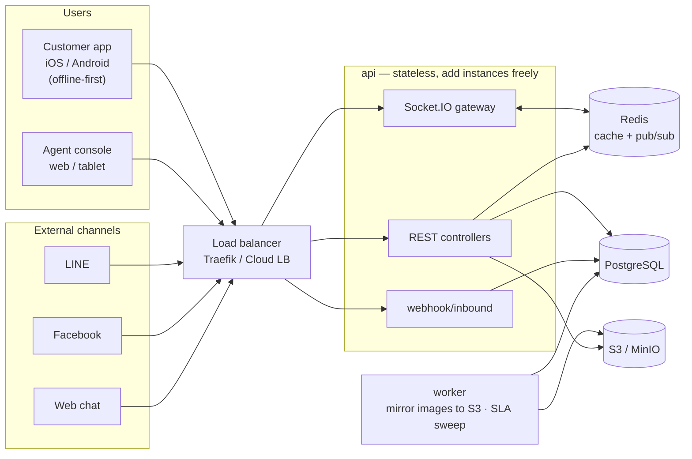
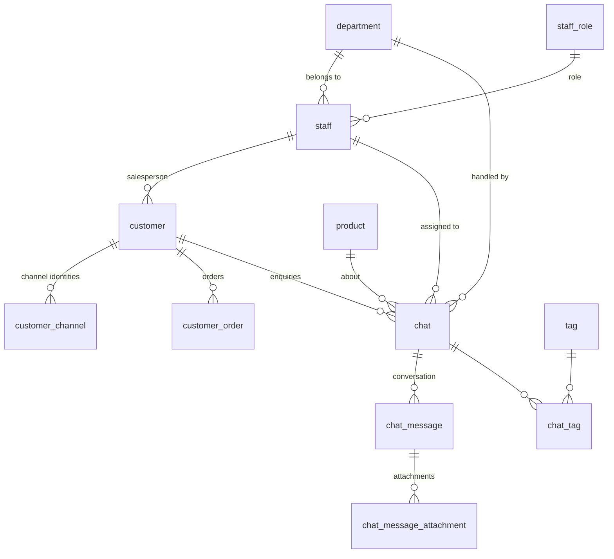

# Omnichannel Customer Enquiry Management System

Submission — 2-Day Practical Technical Assessment (Senior Mobile Developer)

| | |
|---|---|
| Repository | `<GIT_URL>` |
| Backend | `omnichannel-enquiry-api` — NestJS 11 · TypeORM · PostgreSQL 16 · Redis · MinIO (S3) · RabbitMQ · Socket.IO |
| App | `omnichannel-enquiry-app` — Expo SDK 57 (one codebase for iOS, Android and Web) |
| Infra | `omnichannel-enquiry-infra` — Terraform (not deployed; included to show the intended shape) |
| Full design docs | [`docs/design.md`](design.md) · UX [`docs/ux-ui.md`](ux-ui.md) · scale assumptions [`docs/scale-assumptions.md`](scale-assumptions.md) |

> A Thai version of this document is at [`docs/submission.md`](submission.md).

---

## 1. If you only have two minutes

- **One app, three platforms.** Customers use it on a phone and can work with no connection; agents use the same codebase on web or tablet as a three-pane console. Services, hooks and components are shared.
- **The backend is a modular monolith**, not microservices — at this size the operational cost would not pay for itself. Modules are split by responsibility with sub-modules inside them (`chat/enquiry`, `chat/message`, `chat/attachment`, `chat/sla`) so any of them can be lifted out later without a rewrite.
- **13 tables, 13 foreign keys**, named parent-first (`chat` → `chat_message` → `chat_message_attachment`) so related tables sit together when you open pgAdmin.
- **Offline is an outbox on SQLite.** Anything typed without a connection survives a force-quit and goes out by itself when the network returns. Duplicates are prevented by a device-generated idempotency key plus a unique constraint in the database.
- **Realtime is Socket.IO with the Redis adapter**, and every event carries the full record so screens never have to fetch again.
- Everything described here runs and has been checked. A 73-step smoke test walks from sign-in through to managing the product catalogue.

---

## 2. Running it

### 2.1 What you need

Node 20+, Docker Desktop, and — if you want it on a phone — Expo Go, an Android emulator or an iOS simulator.

### 2.2 Backend

```bash
cd omnichannel-enquiry-api
npm install
cp .env.example .env

# data services only (postgres, redis, rabbitmq, minio, mailpit)
docker compose up -d postgres redis rabbitmq minio minio-init mailpit

npm run migration:run
npm run start:dev          # API on http://localhost:4000
npm run start:worker:dev   # another terminal — background jobs (mirror images to S3, SLA sweep)
```

When `NODE_ENV=development` the **demo data is put in place on every boot** — departments, roles, staff, customers, 30 products, SLA policies, and 10 sample enquiries with their conversations and orders. Nobody has to remember the seed commands. Both seeds upsert by natural key, so booting repeatedly changes nothing. Set `SEED_ON_BOOT=false` to start against an empty database, and `npm run seed` / `npm run seed:demo` still work if you prefer to run them yourself.

**Swagger is only mounted outside production.** With `NODE_ENV=production`, `/api/docs` is not registered at all and returns 404 — it is a map of the whole API and does not belong in front of the public internet. Boot-time seeding is skipped in production too.

Everything in Docker instead: `docker compose up -d` (adds the Traefik load balancer, a one-shot `migrate` job, `api` and `worker`), then `docker compose exec api npm run seed`.
Horizontal scale test: `docker compose up -d --scale api=3 --scale worker=2`.

| URL | What it is |
|---|---|
| http://localhost:4000/api/docs | Swagger — the full API, callable from the page (off in production) |
| http://localhost:4000/api/health/ready | readiness, used by the load balancer |
| http://localhost:9001 | MinIO console (S3 locally) |
| http://localhost:8025 | Mailpit — mail the system sends in development |
| http://localhost:15672 | RabbitMQ (omni / omni_dev_password) |
| http://localhost:8080 | Traefik dashboard (full Docker mode only) |

### 2.3 App

```bash
cd omnichannel-enquiry-app
npm install
npm start      # press w for web, a for Android, i for iOS — or scan the QR with Expo Go
```

By default the app talks to `http://localhost:4000/api/v1`.

**On an emulator**, forward the ports back to the host and localhost works as-is:

```bash
adb reverse tcp:8081 tcp:8081 && adb reverse tcp:4000 tcp:4000
```

**On a real phone**, localhost means the phone itself, so point the app at your machine's LAN address:

```bash
cp .env.example .env
# then set your real IP, for example
# EXPO_PUBLIC_API_URL=http://192.168.1.20:4000/api/v1
# EXPO_PUBLIC_SOCKET_URL=http://192.168.1.20:4000
```

### 2.4 Accounts to try

Same password for all of them: `Password123!` (the sign-in screen has buttons that fill them in).

| Side | Email | What they see |
|---|---|---|
| Staff | `admin@foodlink.test` | everything, including the channel simulator and SLA settings |
| Staff | `manager@foodlink.test` | every enquiry in every department, and can edit SLA rules |
| Staff | `cs.supervisor@foodlink.test` | CS supervisor — assigns to others, changes the status of any enquiry in the department |
| Staff | `cs.agent@foodlink.test` | CS agent — only their own work and their department's |
| Staff | `qc.agent@foodlink.test` | QC agent — useful for showing that departments really cannot see each other |
| Customer | `malee@bkkbistro.test` | Bangkok Bistro — the fullest history and order list |
| Customer | `purchasing@siamriverside.test` | Siam Riverside |

### 2.5 Checking that it all works

```bash
cd omnichannel-enquiry-api
npm run smoke     # 73 checks: sign-in, scope, offline sync, attachments, webhooks, SLA, products
npm test          # 65 unit tests

cd ../omnichannel-enquiry-app
npx jest          # 17 tests — sync engine, formatters, permission bitmask
npx tsc --noEmit && npm run lint
```

`npm run smoke` can be run as often as you like without leaving anything behind, and it includes the offline test the brief asks for in §14.

---

## 3. Architecture



**Why it looks like this**

Neither `api` nor `worker` keeps anything in memory, so adding an instance is all it takes to scale out. Socket.IO reaches across instances through the Redis adapter, and the scheduled work (the SLA sweep) takes a Redis lock so several workers never do the same pass twice.

The expensive work — copying images out of a channel into our own bucket, walking enquiries whose SLA target has passed — is deliberately off the request path, so no user waits for it.

### From webhook to screen

The goal is for an agent to see the message as quickly as possible without giving up safety. The order is: verify the signature → check whether we have seen this message before → write it in one transaction → emit over Socket.IO with the full record → return 200.

The event carries the whole record because otherwise every open console would immediately fetch the same thing back, which becomes an N+1 the moment several agents have the inbox open.

---

## 4. Data model



`sla_policy` deliberately has no foreign key to `chat` — the reason is below.

**The rules we kept to**

- Tables are named parent-first, with the child carrying the parent's name: `chat` → `chat_message` → `chat_message_attachment`. Open pgAdmin and related tables are already sitting next to each other.
- The database is `snake_case`, the code is `camelCase`, and `SnakeNamingStrategy` converts between them so no mapping is written by hand.
- **One chat is one enquiry.** The brief specifies `/conversations` as the path, so that is what the API exposes; internally it is `chat` throughout.
- A message that arrives from a channel we cannot yet attribute creates an "unverified" customer. An agent merges that record into the real customer later, and the merge moves the channel identities, enquiries, orders and messages in a single transaction.
- **The SLA target is a snapshot on the chat itself** (`sla_minutes`, `sla_due_at`) rather than a join back to `sla_policy` at read time. If a manager edits a rule today, enquiries opened yesterday must not be judged retroactively by the new rule.

---

## 5. The brief, section by section

### §3 Enquiry types
All seven (`PRODUCT_INFORMATION`, `PRICING`, `COMPLAINT`, `ORDER_DELIVERY`, `INVOICE_PAYMENT`, `SAMPLE_REQUEST`, `GENERAL`), stored as an enum in `chat.enquiry_type`, with `enquiry_sub_type` for the finer label such as "damaged goods".

### §4 Customer application
Sign in and out, a profile page showing contact details and past orders, creating an enquiry with its type, product search, subject and description, priority, photo and file attachments, the status and conversation, and replying on an existing enquiry.

The home screen leads with four shortcuts — damaged goods, track an order, price or quotation, tax invoice — because those are the four things a restaurant customer asks about most. Each opens the form with the type already chosen.

### §5 Enquiry information
Everything the brief lists: reference (`ENQ-2026-000123`, from a database sequence), customer, channel, type, product, subject, description, priority, department and assignee, status, created and last-updated timestamps, and the SLA figures.

### §6 Workflow
The six statuses from the brief: `OPEN → ASSIGNED → IN_PROGRESS → WAITING_FOR_CUSTOMER → RESOLVED → CLOSED`.

- **REOPENED is not a seventh status, it is an event.** When a customer writes back on a closed enquiry the system reopens the original, increments `reopen_count` and starts a fresh SLA cycle. Reopening is something that happens to an enquiry, not a state it rests in — as a status you could never answer "who owns a REOPENED enquiry right now?".
- **ESCALATED is likewise an action**: it moves the enquiry to another department and stamps `escalated_at`. An escalated enquiry still has to move through the normal statuses afterwards.
- The transition table lives in one file shared by the API and the app, so the two can never disagree about the rules.
- The assignee may change the status; a supervisor with `INBOX_STATUS_CHANGE_ANY` may change any enquiry.
- Two people pressing at once is handled with an optimistic lock — send the version you saw, and a mismatch returns 409.

### §7 Agent application
Sign-in, dashboard, search across enquiries and customers, filters by status, type, priority, assignee and date, enquiry detail, replying, assigning and reassigning, changing status, escalating to another department, viewing attachments, and customer history.

The console is three panes — enquiry list, conversation, context panel — as designed in `ux-ui.md`. The right-hand panel has tabs for the customer, the details, internal notes, the customer's chat and the history.

**Internal notes are separate from ordinary messages** via `is_internal` on `chat_message`. A customer cannot reach them — not in the message list, which filters them out in the query, and not through an attachment link.

### §8 Departments
The seven from the brief, but as a `department` table an admin can add to and edit in Settings. Departments are deactivated rather than deleted so old history stays intact, and one is marked as the default for new enquiries.

### §9 Product search
30 mock products with code, name, category, brand, pack size and unit, searched with **pg_trgm** so a small typo still finds the right thing ("mozarela" finds Mozzarella). Standing up a separate full-text search service is not worth it at this size, and trigram copes better with Thai, which does not put spaces between words.

The brief only asks for mock data and search, but every other piece of master data is managed from Settings, which left products as the one read-only page. So there is now a **Settings › Products** page as well (`SETTINGS_PRODUCT_MANAGE`): add and edit, and **switch off rather than delete**, exactly as departments work. A discontinued product leaves the pickers while enquiries that already reference it keep showing it, and the list says how many enquiries mention each product so nobody retires one the team is still using.

### §10 Conversation and realtime — why Socket.IO
Every enquiry has its own thread. Messages carry timestamps and delivery state: the server stores `delivered_at` and `read_at`, while "sending" belongs to the app for as long as it has not heard back.

**Socket.IO** rather than a raw WebSocket, because:

1. **Reconnection and fallback come with it.** Mobile connections drop constantly; with a raw WebSocket we would be writing our own backoff. Some corporate networks also block WebSockets outright, and Socket.IO falls back to long-polling on its own.
2. **Rooms are built in**, which this brief needs badly — an agent must only receive events for enquiries they are allowed to see, so clients join rooms by scope (`chat:<id>`, `dept:<id>`, `staff:<id>`). A raw WebSocket would mean writing all of that routing ourselves.
3. **Crossing instances is one line** with the Redis adapter, so messages still reach everyone once there is more than one pod.
4. Acknowledgements are supported natively, which is what confirms delivery state.

The trade is a slightly larger payload than a raw WebSocket and a dependency on its client library — worth it for what it removes.

### §11 Omnichannel
`POST /webhooks/:channel` accepts LINE, Facebook and web chat, verifying an HMAC signature over the raw body (base64 for LINE, `sha256=<hex>` for Facebook) with a timing-safe comparison.

Recognising the same person: `customer_channel` records which sender id on which channel belongs to which customer. If we know them and they already have an open enquiry, the message continues that thread rather than opening a new one. If we have never seen them, an unverified customer is created for an agent to merge later.

The console has a **channel simulator** (`POST /webhooks/simulate`) that goes through exactly the same path as a real webhook, minus the signature. It demonstrates the scenario in §23.14 without connecting a real LINE account.

A redelivered message is never stored twice, because the channel's own `external_message_id` is kept with a unique constraint.

### §12 Customer 360
The right-hand panel gathers it in one place: contact details, linked channel identities, the full enquiry history, how many are still open, past complaints (filtered by type), order history (mock), the assigned salesperson, and last contact.

There is also a **customer chat** tab that collects every message this customer has exchanged across all of their enquiries, each line saying which enquiry it came from and jumping there when tapped. Searching that text is a separate permission, because reading a thread and searching every word a customer has ever written are not the same thing.

### §13–15 Offline and duplicate prevention

This is where most of the effort went.

**It is written to the device first.** The app always writes to an outbox in SQLite (`expo-sqlite`). The row's primary key is `client_id`, a UUID generated on the device — pressing send twice with the same id still leaves one row.

**It survives the app being killed**, because SQLite is on disk rather than in memory. On startup anything left in `SYNCING` is moved back to `PENDING_SYNC`, which is safe precisely because the API is idempotent.

**It sends itself when the connection returns**, driven by NetInfo, by the app coming back to the foreground, and by a slow 30-second tick for items waiting out a backoff.

**Retries back off**: `min(5s × 2^attempts, 15 minutes)` plus up to 20% jitter. The jitter is there so every device does not wake and fire at the same instant when the network returns.

**Temporary and permanent failures are told apart.** A 5xx means try again; a 4xx (validation, permission) means this item will never work, so it stops and is surfaced to the user. One bad item never blocks the rest.

**Duplicate prevention for §15.** The scenario is that the server creates the enquiry successfully but the response is lost, so the app retries. The approach:

1. The app generates `clientRequestId` when the user presses create, not when the request is sent, and reuses that same value on every retry.
2. The database has unique constraints on `chat.client_request_id` and `chat_message.client_message_id`.
3. The insert uses `ON CONFLICT DO NOTHING` and then reads the existing row back.
4. The API returns `created: true/false` — `true` the first time, `false` with the same record on any retry.

The result is one enquiry no matter how many times the request arrives, and the app can tell "newly created" from "already there" instead of guessing.

**Why the constraint rather than a check in code.** Checking for an existing row before inserting leaves a window between the two statements; two requests arriving together both pass the check. Letting the database decide is the only way to close that window for real.

**The test in §14** is part of `npm run smoke` (disable the network → create three → kill the app → restart → all three still there → reconnect → sync → exactly three on the server → sync again → still three), and it has also been walked through by hand on a real Android device.

**Worth stating plainly**: the offline queue covers plain text messages and creating enquiries. Internal notes and attachments still need a connection, since a file cannot be uploaded without one anyway. On web the outbox is in memory and is lost on refresh, because `expo-sqlite` on the web needs cross-origin isolation headers that are not worth it for a console used online; IndexedDB would be the answer if that changed.

### §16 SLA
`sla_policy` sets the target by enquiry type and priority, and the most specific rule wins (type + priority beats type alone, which beats the catch-all). It is edited in Settings › SLA without touching code, which is the "configurable where practical" the brief asks for.

The defaults follow the brief's own examples: product information 4 hours, complaint 2 hours, urgent complaint 30 minutes.

Screens show the time remaining and turn red once the target has passed. The worker sweeps every minute and emits an event so open screens update themselves.

There is a "pause while waiting for the customer" switch, because an enquiry stalled on the customer's reply should not count against the team.

### §17 Attachments
Images and files, with the type (jpeg/png/gif/webp/heic, pdf, csv, txt) and size (10 MB) validated on both sides.

The upload starts the moment the file is picked rather than when send is pressed, so sending is instant and a failure surfaces while the user is still typing.

On native it goes over `XMLHttpRequest` rather than `fetch`, because React Native streams the file straight from disk instead of reading it all into memory first — and because Expo's `fetch` from SDK 54 onwards accepts only a Blob, not the `{ uri }` every picker returns.

**File links are signed.** An `` or `<Image>` cannot send an Authorization header, so the link that comes with a message carries its own signature. It is issued while serving a message the caller was already allowed to read, is tied to that one attachment, and expires after six hours. The bucket itself stays private.

**Images from a channel are URL-first**: the source URL is stored and returned immediately so nobody waits on a download, then the worker fetches the file into S3 and updates the row. Screens switch to our own copy without the user noticing, and while the copy is still in flight they see a short note rather than a broken image.

Not done: a percentage bar during upload, which is currently a spinner. The brief says "where practical" and the plumbing is there, since XHR exposes `upload.onprogress`.

### §18 Search and dashboard
Search by reference, customer, product, phone, email and message text; filter by status, type, priority, assignee, department, tag and date range.

The dashboard shows total, open, in progress, waiting for customer, resolved and SLA-breached, broken down by type, department and channel, with a list of enquiries close to breaching.

### §19 Technical requirements
React Native (through Expo), TypeScript throughout, a REST API, local storage on SQLite, authentication, systematic error handling, a Git repository and documentation — all present. The reasoning behind each choice is in section 6.

### §20 The eleven required endpoints
All eleven, plus more. The full list is in section 7, or in Swagger.

### §21 ER and architecture diagrams
Sections 3 and 4 above. The full version, including why the table count was reduced, is in `docs/design.md` §5.

---

## 6. Why each choice

**NestJS** — the brief leaves the backend open. This one brings DI, guards, interceptors, a validation pipe and Swagger in one box. Work with permissions this fine-grained benefits a lot from guards declared as decorators: you can read an endpoint and see immediately what it requires.

**PostgreSQL** — we need real transactions (merging a customer moves rows in four tables at once), unique constraints for duplicate prevention, and pg_trgm for search. Postgres does all three without dragging in another service.

**TypeORM** — migrations are generated from the entities, so the schema and the code cannot drift apart, and `SnakeNamingStrategy` handles the naming convention.

**Expo rather than bare React Native** — the brief asks for React Native, and we want both a customer app and an agent console. Expo universal means writing it once for iOS, Android and web instead of maintaining two codebases. The trade is that a native module Expo Go does not bundle requires a development build.

**NativeWind (Tailwind for React Native)** — one set of design tokens that works on all three platforms, instead of a StyleSheet for native and CSS for web.

**TanStack Query** — caching, refetching, optimistic updates, and merging realtime state with HTTP state. Hand-rolling that is a lot of code and easy to get subtly wrong.

**Permissions as a bitmask (`bigint`)** — there are over forty permissions and nearly every request checks some of them. As a join table that is an extra query every time; as a bitmask it is read once at authentication (and cached) and checked with a bitwise operation that costs nothing. It is `bigint` because JSON numbers lose precision past 2^53, so it travels as a string and becomes a `BigInt` in the app.

**Chat visibility is one condition combined with OR**, not several queries merged afterwards — an enquiry that is both "mine" and "my department's" would otherwise appear twice. Every query that touches chat goes through the same `ChatAccessPolicy.applyScope`.

**Out-of-scope records return 404, not 403.** A 403 says "this exists, you just cannot have it", which lets someone walk ids and learn what the system holds.

---

## 7. API

The full, callable documentation is at **http://localhost:4000/api/docs** (Swagger). Everything lives under `/api/v1` except health.

| Group | Endpoints |
|---|---|
| Auth | `POST /auth/login` · `POST /auth/refresh` · `POST /auth/logout` · `GET /auth/me` |
| Customers | `GET /customers` · `GET /customers/:id` · `GET /customers/me` · `PATCH /customers/:id` · `GET /customers/:id/orders` · `GET /customers/:id/messages` · `POST /customers/:id/merge` |
| Enquiries | `GET /conversations` · `POST /conversations` · `GET /conversations/:id` · `PATCH /conversations/:id` · `PUT /conversations/:id/assign` · `PUT /conversations/:id/status` · `PUT /conversations/:id/escalate` · `PUT /conversations/:id/tags` |
| Messages | `GET /conversations/:id/messages` · `POST /conversations/:id/messages` · `POST /messages/sync` |
| Attachments | `POST /attachments` · `GET /attachments/:id/file` |
| Channels | `POST /webhooks/:channel` · `POST /webhooks/simulate` |
| Products | `GET /products` · `GET /products/:id` · `GET /settings/products` · `POST /products` · `PATCH /products/:id` |
| Dashboard | `GET /dashboard/summary` |
| Settings | `GET/POST/PATCH /sla-policies` · `/tags` · `/departments` · `/roles` · `/staff` |
| Health | `GET /api/health/live` · `GET /api/health/ready` |

**One error shape everywhere.** Every endpoint returns the same object, and `code` is used directly as an i18n key in the app:

```json
{ "statusCode": 409, "code": "chat.closed", "message": "…", "errors": [] }
```

This is deliberate: the app should not be mapping English sentences from the server into Thai. It looks `code` up in its translation file and gets the right language immediately, and a code with no translation yet falls back to a neutral message rather than showing a customer raw English.

**Realtime events**: `chat.created` · `chat.updated` · `chat.message.created` · `sla.changed` · `customer.updated` — each carries the full record.

---

## 8. Security

- **Passwords are hashed with argon2id**, not bcrypt, because it holds up better against GPU attacks.
- **Access tokens last 15 minutes and live in memory only** — never in localStorage, so XSS has nothing to take.
- **Refresh tokens rotate on every use** and reuse is detected: an old token appearing again suggests it was stolen, and the whole family is revoked immediately. On web they sit in an httpOnly cookie, on mobile in `expo-secure-store`.
- **Several tabs do not fight each other.** Rotation happens inside a Web Lock; otherwise one tab rotates, another keeps using the old token, and reuse detection signs everyone out.
- **Accounts lock after repeated failures**, and the response is identical whether the email or the password was wrong, so nobody can enumerate which accounts exist.
- **Webhooks verify an HMAC over the raw body**, compared in constant time.
- **Permissions are enforced in three places** — hidden controls in the UI, a guard on the controller, and a filter in the repository query. The last one matters most because it is the only layer that cannot be bypassed.

---

## 9. Error handling

- **API** — a single exception filter turns everything into the same shape; the validation pipe rejects properties that were never declared (`forbidNonWhitelisted`) so nothing unexpected reaches a service; 500s never leak internal detail.
- **App** — one `errorMessage()` turns any thrown value into something a person can read, telling a lost connection (a `TypeError` from fetch) apart from an API error.
- **A failed send never loses the message** — the bubble stays in its pending state and the queue retries it.
- **One bad item does not spoil the batch**, both in the sync endpoint and in a webhook delivery carrying several messages; each is handled independently.

---

## 10. Testing

| Suite | Count | What it covers |
|---|---|---|
| `npm run smoke` (API) | 73 | sign-in → visibility scope → assignment → status rules → automatic reopen → realtime → the offline test from §14 → attachments → webhooks → customer merge → SLA → product management |
| `npm test` (API) | 65 | chat access policy, status transitions, bitmask, money conversion, webhook signatures, signed attachment links |
| `npx jest` (app) | 17 | sync engine (ordering, retries, duplicates, interrupted runs), formatters, bitmask |

Beyond that, the whole flow was walked by hand on a real Android emulator — signing in, the profile page, opening an enquiry, attaching a photo from the gallery and sending it, and going offline, typing, and reconnecting.

---

## 11. Known limitations, and what production would need

**As it stands**

- LINE and Facebook are not connected for real. There are adapters that parse their actual payload shapes, plus the simulator — the brief says real integrations are not required.
- Orders are mock data; the real thing would come from an ERP.
- The offline queue covers plain text and creating enquiries. Attachments and internal notes still need a connection.
- On web the outbox is in memory and is lost on refresh; it should move to IndexedDB.
- No percentage bar during upload, only a spinner.
- **Not yet tested on iOS** — this was built on Windows. The code is shared and nothing branches on iOS, but it would be wrong to claim it has been seen running there.
- RabbitMQ is up in docker compose and `design.md` describes it as the fallback when the database is unavailable, but **it is not wired into the code yet**. Today a webhook that fails to write returns an error so the channel retries.
- No automated UI end-to-end tests (Detox / Playwright).

**Before going live**

1. **Observability first** — structured logs with a correlation id, metrics (p95 from webhook to screen, outbox depth, SLA breach rate), tracing across services, and an alert when the sync queue stops draining.
2. **Move background work onto a real queue.** The worker currently uses intervals with a Redis lock, which is fine for a prototype; production wants BullMQ or full RabbitMQ with a dead-letter queue and somewhere to see stuck jobs.
3. **Rate limiting at the edge**, particularly on `/auth/login` and the webhooks. Today there is only account lockout.
4. **Rotate secrets and move them into a secret manager**; they are in env files now.
5. **Add a read replica and PgBouncer** once read traffic grows — the dashboard and search are the first things that should move.
6. **Age messages out of the main table.** `chat_message` grows fastest and wants monthly partitioning with older data moved off.
7. **Virus-scan attachments** before they can be downloaded, and switch to S3 presigned URLs so the bytes stop flowing through the API.
8. **CI/CD** — typecheck, lint, tests and a migration check on every PR, with blue-green deploys because migrations are involved.
9. **Test on iOS and produce a development build** for the QA team.
10. **Backups with a rehearsed restore.** Turn on PITR and actually practise recovering at least once.

---

## 12. Demo script (the scenarios in §23)

A suggested order, about twelve minutes.

1. **Product information enquiry** — sign in to the app as `malee@bkkbistro.test`, tap "price / quotation", and search for a product with a small typo to show trigram still finding it.
2. **Complaint with a photo** — tap "damaged goods", pick the product, attach a photo, send, then switch to the console and watch it arrive without a refresh.
3. **Assign across departments** — escalate it to QC in the console, sign in as `qc.agent@foodlink.test` to see it appear in their inbox, and as `sales.agent@foodlink.test` to see that it does not.
4. **Exchange messages** — put the two screens side by side, type from the customer side, watch it appear for the agent, and watch the status move to "in progress" by itself.
5. **Web → LINE** — open the channel simulator, send from web chat with one sender id, then from LINE with the same id, and show the message continuing the same enquiry rather than opening a new one.
6. **Create enquiries offline** — turn off wifi on the phone, create three, and show the banner counting what is waiting.
7. **Kill and restart the app** — all three are still there.
8. **Reconnect and sync** — turn wifi back on, watch it send by itself, then check the database for exactly three.
9. **No duplicates** — sync again and `SELECT count(*)` to show it is still three.
10. **Customer 360** — open the right-hand panel for contact details, linked channels, orders, and the customer chat tab that collects every message across enquiries.

Steps 6 to 9 are the mandatory test from §14. For the automated version, run `npm run smoke` and read the lines about offline sync.

---

## 13. Project layout

```
omnichannel-enquiry/
├─ omnichannel-enquiry-api/
│  ├─ src/
│  │  ├─ common/          # auth, permissions, realtime, storage, filters, shared utils
│  │  ├─ config/          # env validated with Joi at boot
│  │  ├─ database/        # migrations + seeds
│  │  └─ modules/
│  │     ├─ auth/  customer/  staff/  catalog/  sync/  webhook/
│  │     └─ chat/          # enquiry · message · attachment · sla · tag · dashboard
│  ├─ scripts/smoke.mjs
│  └─ docs/               # design.md · ux-ui.md · scale-assumptions.md · submission.md
│
├─ omnichannel-enquiry-app/
│  └─ src/
│     ├─ app/             # routes only (expo-router)
│     ├─ components/      # common + inbox (+ modals)
│     ├─ hooks/queries/   # one file per API module
│     ├─ services/        # http-client + one service per module
│     ├─ offline/         # outbox (SQLite / memory) + sync engine + backoff
│     └─ i18n/            # Thai / English
│
└─ omnichannel-enquiry-infra/    # Terraform (not deployed)
```

Every API module has the same layers: controller → service → repository → dto. No module reaches into another module's repository; they talk through the service that fronts it, so lifting one out into its own deployment later does not mean rewriting the rest.
