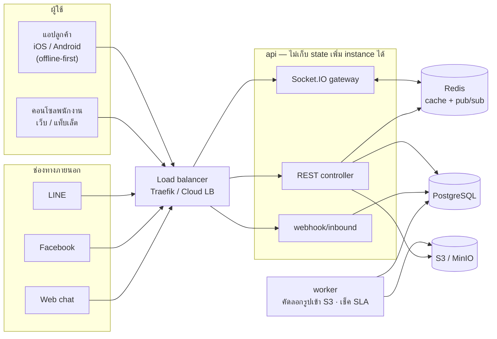
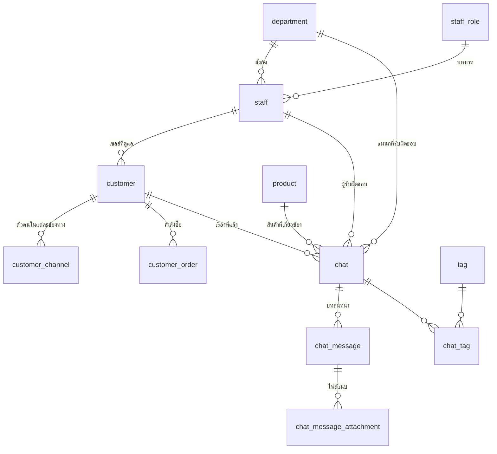

# Omnichannel Customer Enquiry Management System

เอกสารส่งมอบ — 2-Day Practical Technical Assessment (Senior Mobile Developer)

| | |
|---|---|
| Backend | [`omnichannel-enquiry-api`](https://github.com/pongthipath/omnichannel-enquiry-api) — NestJS 11 · TypeORM · PostgreSQL 16 · Redis · MinIO (S3) · RabbitMQ · Socket.IO |
| แอป | [`omnichannel-enquiry-app`](https://github.com/pongthipath/omnichannel-enquiry-app) — Expo SDK 57 (โค้ดชุดเดียว รันได้ทั้ง iOS / Android / Web) |
| Infra | `omnichannel-enquiry-infra` — Terraform (ยังไม่ได้ deploy จริง ใส่มาให้ดูแนวทาง) |
| เอกสารออกแบบเต็ม | [`docs/design.md`](design.md) · UX [`docs/ux-ui.md`](ux-ui.md) · สมมติฐาน scale [`docs/scale-assumptions.md`](scale-assumptions.md) |

> English version of this document: [`docs/submission.en.md`](submission.en.md)

---

## 1. อ่านตรงนี้ก่อนถ้ามีเวลา 2 นาที

- **แอปเดียวรันได้ทั้ง 3 แพลตฟอร์ม** ลูกค้าใช้บนมือถือ (ทำงานตอนไม่มีเน็ตได้) พนักงานใช้บนเว็บ/แท็บเล็ตเป็น layout 3 ช่อง โค้ดชุดเดียวกัน แชร์ service/hook/คอมโพเนนต์กันหมด
- **Backend เป็น modular monolith** ไม่ใช่ microservices เพราะขนาดงานยังไม่คุ้มกับค่าดูแล แต่แตก module ตามหน้าที่และมี sub-module ย่อย (`chat/enquiry`, `chat/message`, `chat/attachment`, `chat/sla`) ให้แยกออกไปทีหลังได้โดยไม่ต้องรื้อ
- **DB 13 ตาราง 13 FK** ตั้งชื่อเรียงจากแม่ไปลูก (`chat` → `chat_message` → `chat_message_attachment`) เปิด pgAdmin แล้วตารางที่เกี่ยวกันอยู่ติดกันเอง
- **Offline ใช้ outbox บน SQLite** สิ่งที่พิมพ์ตอนไม่มีเน็ตอยู่รอดแม้ปิดแอปทิ้ง แล้วส่งเองเมื่อเน็ตกลับมา กันซ้ำด้วย idempotency key ที่สร้างจากเครื่อง + unique constraint ใน DB
- **Realtime ใช้ Socket.IO + Redis adapter** ส่งข้อมูลเต็มไปกับ event เลย หน้าจอไม่ต้องยิง API ซ้ำ
- ทุกอย่างในเอกสารนี้รันจริงและตรวจแล้ว มี smoke test 73 ข้อไล่ตั้งแต่ login จนถึงการจัดการสินค้า

---

## 2. วิธีรัน

### 2.1 สิ่งที่ต้องมี

Node 20+, Docker Desktop, และถ้าจะรันบนมือถือก็ Expo Go (หรือ Android emulator / iOS simulator)

### 2.2 Backend

```bash
cd omnichannel-enquiry-api
npm install
cp .env.example .env

# ยกเฉพาะ data services ขึ้นมา (postgres, redis, rabbitmq, minio, mailpit)
docker compose up -d postgres redis rabbitmq minio minio-init mailpit

npm run migration:run
npm run start:dev     # API ขึ้นที่ http://localhost:4000
npm run start:worker:dev   # อีกเทอร์มินัล — งานเบื้องหลัง (คัดลอกรูปเข้า S3, เช็ค SLA เกินกำหนด)
```

ตอน `NODE_ENV=development` ระบบจะ **ใส่ข้อมูลตัวอย่างให้เองทุกครั้งที่ start** — แผนก บทบาท พนักงาน ลูกค้า สินค้า 30 รายการ กฎ SLA และเรื่องตัวอย่าง 10 เรื่องพร้อมบทสนทนาและคำสั่งซื้อ ไม่ต้องจำคำสั่ง seed ทั้งสอง seed เขียนแบบ upsert ตาม natural key เปิดซ้ำกี่รอบข้อมูลก็ไม่บวม ถ้าอยากทดสอบฐานข้อมูลเปล่าตั้ง `SEED_ON_BOOT=false` และถ้าอยากสั่งเองก็ยังมี `npm run seed` กับ `npm run seed:demo` เหมือนเดิม

**Swagger เปิดเฉพาะตอนที่ไม่ใช่ production** — ถ้า `NODE_ENV=production` จะไม่ผูก `/api/docs` เลย (ตอบ 404) เพราะมันคือแผนที่ของ API ทั้งระบบ ไม่ควรเปิดทิ้งไว้หน้าอินเทอร์เน็ต และ seed ตอน boot ก็ไม่ทำงานใน production เช่นกัน

ถ้าอยากรันทุกอย่างใน Docker รวด: `docker compose up -d` (ได้ Traefik เป็น load balancer, job `migrate`, `api`, `worker` มาด้วย) แล้ว `docker compose exec api npm run seed`
ทดสอบ scale แนวนอน: `docker compose up -d --scale api=3 --scale worker=2`

| URL | คืออะไร |
|---|---|
| http://localhost:4000/api/docs | Swagger — เอกสาร API ทั้งหมด ลองยิงได้จากหน้านี้เลย (ปิดเองใน production) |
| http://localhost:4000/api/health/ready | readiness ที่ load balancer ใช้ |
| http://localhost:9001 | MinIO console (S3 ในเครื่อง) |
| http://localhost:8025 | Mailpit — อีเมลที่ระบบส่งตอน dev |
| http://localhost:15672 | RabbitMQ (omni / omni_dev_password) |
| http://localhost:8080 | Traefik dashboard (เฉพาะโหมด Docker เต็ม) |

### 2.3 แอป

```bash
cd omnichannel-enquiry-app
npm install
npm start      # กด w = เว็บ, a = Android, i = iOS หรือสแกน QR ด้วย Expo Go
```

ค่าเริ่มต้นแอปจะยิงไปที่ `http://localhost:4000/api/v1`

**บน emulator** ต่อ port กลับมาที่เครื่องก่อน แล้วใช้ localhost ได้เลย:

```bash
adb reverse tcp:8081 tcp:8081 && adb reverse tcp:4000 tcp:4000
```

**บนมือถือจริง** localhost ใช้ไม่ได้ ต้องสร้าง `.env` ชี้มาที่ IP ของเครื่องในวง LAN:

```bash
cp .env.example .env
# แล้วแก้เป็น IP จริง เช่น
# EXPO_PUBLIC_API_URL=http://192.168.1.20:4000/api/v1
# EXPO_PUBLIC_SOCKET_URL=http://192.168.1.20:4000
```

### 2.4 บัญชีสำหรับทดลอง

รหัสผ่านเดียวกันหมด: `Password123!` (หน้า login มีปุ่มกดเลือกให้ ไม่ต้องพิมพ์)

| ฝั่ง | อีเมล | เห็นอะไร |
|---|---|---|
| พนักงาน | `admin@foodlink.test` | ทุกอย่าง รวมหน้าจำลองช่องทางและตั้งค่า SLA |
| พนักงาน | `manager@foodlink.test` | เห็นทุกเรื่องทุกแผนก แก้กฎ SLA ได้ |
| พนักงาน | `cs.supervisor@foodlink.test` | หัวหน้า CS — มอบหมายงานคนอื่น เปลี่ยนสถานะได้ทุกเรื่องในแผนก |
| พนักงาน | `cs.agent@foodlink.test` | เจ้าหน้าที่ CS — เห็นเฉพาะงานตัวเองกับงานแผนกตัวเอง |
| พนักงาน | `qc.agent@foodlink.test` | เจ้าหน้าที่ QC — ไว้ดูว่าข้ามแผนกแล้วมองไม่เห็นกันจริง |
| ลูกค้า | `malee@bkkbistro.test` | Bangkok Bistro — มีคำสั่งซื้อและประวัติครบที่สุด |
| ลูกค้า | `purchasing@siamriverside.test` | Siam Riverside |

### 2.5 ทดสอบว่าระบบทำงานครบ

```bash
cd omnichannel-enquiry-api
npm run smoke     # 73 ข้อ ไล่ตั้งแต่ login, scope, offline sync, ไฟล์แนบ, webhook, SLA, สินค้า
npm test          # unit test 65 ข้อ

cd ../omnichannel-enquiry-app
npx jest          # 17 ข้อ — sync engine, formatter, permission bitmask
npx tsc --noEmit && npm run lint
```

`npm run smoke` รันซ้ำได้เรื่อย ๆ ไม่ทิ้งขยะสะสม และมันครอบคลุมข้อ 14 ของโจทย์ (offline test) ไว้ด้วย

---

## 3. สถาปัตยกรรม



**ทำไมเป็นแบบนี้**

`api` กับ `worker` ไม่เก็บ state ในหน่วยความจำเลย เพิ่มจำนวน instance แล้วทำงานได้ทันที Socket.IO คุยข้าม instance ผ่าน Redis adapter ส่วนงานตามเวลา (เช็ค SLA) ใช้ Redis lock กันไม่ให้หลาย worker ทำงานซ้ำกัน

งานหนัก — คัดลอกรูปจากช่องทางเข้ามาเก็บเอง, ไล่หาเรื่องที่เกิน SLA — ไม่ได้อยู่ใน request path ผู้ใช้จึงไม่ต้องรอ

### เส้นทางข้อความจาก webhook ถึงหน้าจอ

เป้าหมายคือให้พนักงานเห็นข้อความเร็วที่สุดโดยยังปลอดภัย ลำดับคือ ตรวจลายเซ็น → เช็คว่าเคยได้รับแล้วหรือยัง → เขียน DB ใน transaction เดียว → ยิง Socket.IO พร้อมข้อมูลเต็ม → ตอบ 200 กลับไป

ที่ส่งข้อมูลเต็มไปกับ event เพราะไม่อยากให้หน้าจอต้องยิง API กลับมาถามอีกรอบ ซึ่งจะกลายเป็น N+1 เวลามีพนักงานเปิดจออยู่พร้อมกันหลายคน

---

## 4. Data model



`sla_policy` ตั้งใจไม่ผูก FK กับ `chat` — เหตุผลอยู่ในหัวข้อถัดไป

**หลักที่ยึด**

- ชื่อตารางเรียงจากแม่ไปลูก ลูกเอาชื่อแม่นำหน้า — `chat` → `chat_message` → `chat_message_attachment` เวลาเปิด pgAdmin ตารางที่เกี่ยวกันจะอยู่ติดกันโดยไม่ต้องจัดกลุ่มเอง
- DB เป็น `snake_case` โค้ดเป็น `camelCase` แปลงให้อัตโนมัติด้วย `SnakeNamingStrategy` ไม่ต้องเขียน mapping เอง
- **1 chat = 1 enquiry** โจทย์ให้ path เป็น `/conversations` เลยใช้ตามนั้นที่ชั้น API ส่วนข้างในเรียก `chat` ตลอด
- เรื่องที่ระบบรับมาจากช่องทางแต่ยังไม่รู้ว่าเป็นลูกค้ารายไหน จะสร้างเป็นลูกค้า "ยังไม่ยืนยันตัวตน" ไว้ก่อน แล้วพนักงานกดรวมเข้ากับลูกค้าจริงทีหลังได้ ตอนรวมจะย้ายช่องทาง เรื่อง คำสั่งซื้อ และข้อความทั้งหมดใน transaction เดียว
- **SLA เก็บเป็น snapshot ที่ตัว chat** (`sla_minutes`, `sla_due_at`) ไม่ได้ join กลับไปที่ `sla_policy` ตอนอ่าน เพราะถ้าผู้จัดการแก้กฎวันนี้ เรื่องที่เปิดไปแล้วเมื่อวานต้องไม่ถูกตัดสินด้วยกฎใหม่ย้อนหลัง

---

## 5. ไล่ตามโจทย์ทีละข้อ

### §3 ประเภทคำถาม
ครบทั้ง 7 ประเภท (`PRODUCT_INFORMATION`, `PRICING`, `COMPLAINT`, `ORDER_DELIVERY`, `INVOICE_PAYMENT`, `SAMPLE_REQUEST`, `GENERAL`) เก็บเป็น enum ใน `chat.enquiry_type` และมีช่อง `enquiry_sub_type` ไว้ระบุย่อย เช่น "สินค้าเสียหาย"

### §4 แอปลูกค้า
เข้า/ออกจากระบบ, หน้าข้อมูลของฉัน (ดูข้อมูลติดต่อและคำสั่งซื้อย้อนหลัง), แจ้งเรื่องใหม่พร้อมเลือกประเภท, ค้นหาสินค้า, ใส่หัวข้อกับรายละเอียด, เลือกความเร่งด่วน, แนบรูป/ไฟล์, ดูสถานะและบทสนทนา, ตอบกลับในเรื่องเดิม

หน้าแรกมีปุ่มลัด 4 อัน (สินค้าเสียหาย / ติดตามออเดอร์ / ขอราคา / ใบกำกับภาษี) เพราะจากโจทย์ 4 เรื่องนี้คือสิ่งที่ลูกค้าร้านอาหารถามบ่อยที่สุด กดปุ๊บได้ฟอร์มที่เลือกประเภทให้แล้ว

### §5 ข้อมูลของเรื่อง
มีครบตามที่ขอ: เลขที่เรื่อง (`ENQ-2026-000123` สร้างจาก sequence), ลูกค้า, ช่องทาง, ประเภท, สินค้า, หัวข้อ, รายละเอียด, ความเร่งด่วน, แผนก/ผู้รับผิดชอบ, สถานะ, เวลาสร้าง, เวลาอัปเดตล่าสุด, ข้อมูล SLA

### §6 Workflow
6 สถานะตามโจทย์ `OPEN → ASSIGNED → IN_PROGRESS → WAITING_FOR_CUSTOMER → RESOLVED → CLOSED`

- **REOPENED** ไม่ได้ทำเป็นสถานะที่ 7 แต่ทำเป็นการกระทำ — ถ้าลูกค้าทักกลับมาในเรื่องที่ปิดไปแล้ว ระบบเปิดเรื่องเดิมใหม่อัตโนมัติ นับ `reopen_count` เพิ่ม และเริ่มจับเวลา SLA รอบใหม่ เหตุผลคือ "เปิดใหม่" เป็นเหตุการณ์ ไม่ใช่สถานะที่เรื่องค้างอยู่ได้ ถ้าทำเป็นสถานะจะตอบไม่ได้ว่าเรื่องที่ REOPENED อยู่ตอนนี้ใครถืออยู่
- **ESCALATED** ก็เป็นการกระทำเช่นกัน — ส่งต่อไปอีกแผนกแล้วประทับเวลาไว้ที่ `escalated_at` ไม่ใช่สถานะ เพราะเรื่องที่ escalate ไปแล้วก็ยังต้องเดินตามสถานะปกติต่อ
- ตารางการเปลี่ยนสถานะอยู่ในไฟล์เดียว ใช้ร่วมกันทั้ง API และแอป จะได้ไม่มีทางที่สองฝั่งคิดกฎไม่ตรงกัน
- คนที่เปลี่ยนสถานะได้คือผู้รับผิดชอบเรื่องนั้น หัวหน้าที่มีสิทธิ์ `INBOX_STATUS_CHANGE_ANY` เปลี่ยนได้ทุกเรื่อง
- กันสองคนกดพร้อมกันด้วย optimistic lock (ส่ง version ที่เห็นมาด้วย ไม่ตรงกันตอบ 409)

### §7 แอปพนักงาน
เข้าสู่ระบบ, แดชบอร์ด, ค้นหาเรื่องและลูกค้า, กรองตามสถานะ/ประเภท/ความเร่งด่วน/ผู้รับผิดชอบ/ช่วงเวลา, เปิดดูรายละเอียด, ตอบลูกค้า, มอบหมาย/เปลี่ยนผู้รับผิดชอบ, เปลี่ยนสถานะ, ส่งต่อแผนก, ดูไฟล์แนบ, ดูประวัติลูกค้า

จอทำงานเป็น 3 ช่อง (รายการเรื่อง / บทสนทนา / แผงข้อมูล) ตามที่ออกแบบใน `ux-ui.md` แผงขวามีแท็บ ลูกค้า / รายละเอียด / โน้ตภายใน / แชทลูกค้า / ประวัติ

**โน้ตภายในแยกจากข้อความปกติ** ใช้ field `is_internal` บน `chat_message` ลูกค้าไม่มีทางเห็น ทั้งตอนดึงรายการ (query กรองออก) และตอนเปิดไฟล์แนบ

### §8 แผนก
7 แผนกตามโจทย์ แต่ทำเป็นตาราง `department` ให้ admin เพิ่ม/แก้เองได้ในหน้า Settings ปิดใช้งานแทนการลบเพื่อไม่ให้ประวัติเก่าเสีย และกำหนดได้ว่าแผนกไหนเป็นค่าเริ่มต้นของเรื่องใหม่

### §9 ค้นหาสินค้า
สินค้า mock 30 รายการ มีรหัส ชื่อ หมวด แบรนด์ ขนาดบรรจุ หน่วย ค้นด้วย **pg_trgm** ซึ่งพิมพ์ผิดนิดหน่อยก็ยังเจอ (เช่น "mozarela" หา Mozzarella เจอ) เลือกวิธีนี้เพราะติดตั้ง full-text search แยกไม่คุ้มกับข้อมูลระดับนี้ และ trigram รองรับภาษาไทยที่ไม่มีการเว้นวรรคได้ดีกว่า

โจทย์ขอแค่ข้อมูล mock กับการค้นหา แต่หน้า master data อื่นทุกหน้าจัดการได้หมด สินค้าจึงเป็นหน้าเดียวที่อ่านอย่างเดียว เลยเพิ่มหน้า **Settings › จัดการสินค้า** ให้ครบ (สิทธิ์ `SETTINGS_PRODUCT_MANAGE`) เพิ่มและแก้ไขได้ และ **ปิดใช้งานแทนการลบ** เหมือนแผนก — สินค้าที่เลิกขายจะหายจากตัวเลือก แต่เรื่องเก่าที่อ้างถึงมันยังแสดงได้ปกติ หน้าจัดการบอกด้วยว่าสินค้าแต่ละตัวถูกอ้างถึงในกี่เรื่อง จะได้ไม่เผลอปิดตัวที่ทีมใช้อยู่

### §10 บทสนทนาและ realtime — เลือก Socket.IO เพราะอะไร
ทุกเรื่องมี thread ของตัวเอง ข้อความมี timestamp และสถานะการส่ง — ฝั่ง server เก็บ `delivered_at` กับ `read_at` ส่วนสถานะ "กำลังส่ง" เป็นของฝั่งแอประหว่างที่ยังไม่ได้รับคำตอบกลับมา

เลือก **Socket.IO** ไม่ใช่ WebSocket ดิบ ด้วยเหตุผล:

1. **มี reconnect และ fallback ให้แล้ว** มือถือหลุด ๆ ติด ๆ เป็นเรื่องปกติ ถ้าใช้ WebSocket ดิบต้องเขียน backoff เอง แถมเน็ตองค์กรบางที่บล็อก WebSocket ซึ่ง Socket.IO ถอยไป long-polling ให้เอง
2. **มี room ในตัว** — จำเป็นมากกับโจทย์นี้ เพราะพนักงานต้องได้ event เฉพาะเรื่องที่ตัวเองมีสิทธิ์เห็น เราจึงให้ join ห้องตาม scope (`chat:<id>`, `dept:<id>`, `staff:<id>`) ถ้าใช้ WebSocket ดิบต้องมาทำ routing เองทั้งหมด
3. **ข้าม instance ได้ด้วย Redis adapter แค่บรรทัดเดียว** พอ scale เป็นหลาย pod ข้อความยังถึงทุกคน
4. รองรับ acknowledgement ในตัว ใช้ยืนยันสถานะส่งถึงได้

ที่แลกมาคือ payload ใหญ่กว่า WebSocket ดิบเล็กน้อยและผูกกับ client library ของมันเอง ซึ่งรับได้เมื่อเทียบกับที่ประหยัดไป

### §11 Omnichannel
`POST /webhooks/:channel` รับจาก LINE / Facebook / web chat ตรวจลายเซ็น HMAC บน raw body (LINE เป็น base64, Facebook เป็น `sha256=<hex>`) เทียบแบบ timing-safe

การจับคู่คนเดิม: ดูจาก `customer_channel` ว่ารหัสผู้ส่งในช่องทางนั้นเคยผูกกับลูกค้าคนไหนไว้ ถ้าเจอและลูกค้ายังมีเรื่องที่เปิดค้างอยู่ ข้อความจะไปต่อในเรื่องเดิม ไม่เปิดเรื่องใหม่ ถ้าไม่เคยเจอเลยก็สร้างลูกค้าแบบยังไม่ยืนยันตัวตนไว้ให้พนักงานรวมทีหลัง

มีหน้า **จำลองช่องทาง** ในคอนโซล (`POST /webhooks/simulate`) ยิงเข้าเส้นทางเดียวกับ webhook จริงทุกประการ ต่างแค่ไม่ต้องมีลายเซ็น ใช้สาธิตสถานการณ์ตามโจทย์ข้อ 23.14 ได้เลยโดยไม่ต้องต่อ LINE จริง

ข้อความซ้ำไม่เข้าสองรอบ เพราะเก็บ `external_message_id` ของช่องทางไว้และมี unique constraint

### §12 Customer 360
แผงขวาในคอนโซลรวมไว้ที่เดียว: ข้อมูลติดต่อ, ช่องทางที่ผูกไว้, ประวัติเรื่องทั้งหมด, จำนวนเรื่องที่ยังเปิดอยู่, เรื่องร้องเรียนเก่า (กรองจากประเภท), ประวัติคำสั่งซื้อ (mock), เซลส์ที่ดูแล, ติดต่อล่าสุด

มีแท็บ **แชทลูกค้า** เพิ่มมาด้วย — รวมทุกข้อความที่ลูกค้าคนนี้เคยคุยข้ามทุกเรื่อง แต่ละบรรทัดบอกว่ามาจากเรื่องไหน กดแล้วเด้งไปเรื่องนั้นได้ การค้นหาข้อความแยกสิทธิ์ต่างหาก เพราะการอ่าน thread กับการค้นทุกคำที่ลูกค้าเคยพิมพ์ไม่ใช่เรื่องเดียวกัน

### §13–15 Offline และการกันสร้างซ้ำ

นี่คือส่วนที่ลงแรงมากที่สุด

**เก็บลงเครื่องก่อน** แอปเขียน outbox ลง SQLite (`expo-sqlite`) ก่อนเสมอ แถวมี `client_id` เป็น primary key ซึ่งเป็น UUID ที่สร้างจากเครื่อง — กด 2 ครั้งด้วย id เดิมก็ยังมีแถวเดียว

**ยังอยู่หลังปิดแอป** เพราะเป็น SQLite บนดิสก์ ไม่ใช่ state ในหน่วยความจำ ตอนเปิดแอปใหม่จะเปลี่ยนแถวที่ค้างสถานะ `SYNCING` กลับเป็น `PENDING_SYNC` (ปลอดภัยเพราะ API เป็น idempotent อยู่แล้ว)

**ส่งเองเมื่อเน็ตกลับมา** ฟังทั้งจาก NetInfo, ตอนแอปกลับมา foreground, และมี tick ช้า ๆ ทุก 30 วินาทีเผื่อรายการที่รอ backoff อยู่

**ลองใหม่แบบถอยห่าง** `min(5 วินาที × 2^ครั้งที่ลอง, 15 นาที)` บวก jitter ไม่เกิน 20% jitter มีไว้กันทุกเครื่องตื่นมายิงพร้อมกันตอนเน็ตกลับมา

**แยกพังชั่วคราวกับพังถาวร** ถ้า server ตอบ 5xx = ลองใหม่ได้ ถ้าตอบ 4xx (ข้อมูลไม่ผ่าน validation, ไม่มีสิทธิ์) = ไม่ลองแล้ว เอาขึ้นมาบอกผู้ใช้ รายการเสียตัวเดียวไม่บล็อกที่เหลือ

**การกันซ้ำตามโจทย์ข้อ 15** สถานการณ์คือ server สร้างเรื่องสำเร็จแล้วแต่ response หายระหว่างทาง แอปไม่รู้เลยยิงซ้ำ — วิธีที่ใช้:

1. แอปสร้าง `clientRequestId` (UUID) ตั้งแต่ตอนกดสร้าง ไม่ใช่ตอนส่ง แล้วใช้ค่าเดิมทุกครั้งที่ลองใหม่
2. DB มี unique constraint บน `chat.client_request_id` และ `chat_message.client_message_id`
3. ตอน insert ใช้ `ON CONFLICT DO NOTHING` แล้วอ่านแถวเดิมกลับมา
4. API ตอบ `created: true/false` กลับไปให้ — ครั้งแรกได้ `true` ยิงซ้ำได้ `false` พร้อมข้อมูลชุดเดิม

ผลคือถึงจะยิงซ้ำกี่รอบก็ได้เรื่องเดียว และแอปแยกออกว่า "สร้างใหม่" กับ "อันเดิมที่เคยส่งสำเร็จแล้ว" ต่างกันอย่างไร ไม่ต้องเดา

**การเก็บให้ถูกที่** ที่เลือก unique constraint ใน DB แทนการเช็คในโค้ดก่อน insert เพราะการเช็คก่อนแล้วค่อย insert มีช่องว่างระหว่างสองคำสั่ง ถ้ามีสอง request เข้ามาพร้อมกันพอดีจะรอดทั้งคู่ ให้ DB เป็นคนตัดสินคือทางเดียวที่ปิดช่องนั้นได้จริง

**เทสตามโจทย์ข้อ 14** อยู่ใน `npm run smoke` แล้ว (ปิดเน็ต → สร้าง 3 เรื่อง → ปิดแอป → เปิดใหม่ → ครบ 3 → ต่อเน็ต → sync → server ได้ 3 → sync ซ้ำ → ยังได้ 3) และตรวจซ้ำบน Android จริงแล้วด้วย

**ข้อจำกัดที่ต้องบอกตรง ๆ**: คิวออฟไลน์รองรับเฉพาะข้อความตัวอักษรกับการเปิดเรื่องใหม่ โน้ตภายในและไฟล์แนบยังต้องมีเน็ต เพราะไฟล์อัปโหลดตอนไม่มีเน็ตไม่ได้อยู่แล้ว ส่วนบนเว็บ outbox อยู่ในหน่วยความจำ หายเมื่อรีเฟรช เพราะ `expo-sqlite` บนเว็บต้องตั้ง header cross-origin isolation ซึ่งไม่คุ้มกับคอนโซลที่ใช้ตอนออนไลน์อยู่แล้ว ถ้าจะทำจริงใช้ IndexedDB แทน

### §16 SLA
`sla_policy` กำหนดเป้าหมายตามประเภทคำถาม + ความเร่งด่วน กฎที่เจาะจงกว่าชนะ (ประเภท+ความเร่งด่วน > ประเภทอย่างเดียว > กฎครอบจักรวาล) ตั้งค่าได้ในหน้า Settings › SLA โดยไม่ต้องแก้โค้ด ตามที่โจทย์ขอให้ configurable

ค่าเริ่มต้นตามตัวอย่างในโจทย์: ข้อมูลสินค้า 4 ชั่วโมง, ร้องเรียน 2 ชั่วโมง, ร้องเรียนด่วน 30 นาที

หน้าจอแสดงเวลาที่เหลือ และขึ้นป้ายแดงเมื่อเกินกำหนด worker ไล่เช็คทุกนาทีแล้วยิง event ให้หน้าจอที่เปิดอยู่เปลี่ยนสีเอง

มีสวิตช์ "หยุดนับเวลาเมื่อรอลูกค้าตอบ" เพราะถ้าเรื่องค้างเพราะลูกค้ายังไม่ตอบ ไม่ควรนับเป็นความผิดของทีม

### §17 ไฟล์แนบ
อัปโหลดรูปและไฟล์ได้ ตรวจชนิดไฟล์ (jpeg/png/gif/webp/heic, pdf, csv, txt) และขนาด (ไม่เกิน 10 MB) ทั้งสองฝั่ง

อัปโหลดทันทีที่เลือกไฟล์ ไม่ใช่ตอนกดส่ง กดส่งเลยไม่ต้องรอ และถ้าอัปโหลดพัง ผู้ใช้เห็นทันทีตอนเลือก ยังไม่ทันพิมพ์ข้อความเสร็จด้วยซ้ำ

ฝั่ง native ใช้ `XMLHttpRequest` ไม่ใช่ `fetch` เพราะ React Native stream ไฟล์จากดิสก์ให้เลย ไม่ต้องอ่านทั้งไฟล์เข้าหน่วยความจำก่อน (และ `fetch` ของ Expo SDK 54 ขึ้นไปรับเฉพาะ Blob ไม่รับ `{ uri }` ที่ picker คืนมา)

**ลิงก์ไฟล์เป็นแบบเซ็นกำกับ** เพราะ `` กับ `<Image>` ส่ง Authorization header ไม่ได้ ลายเซ็นออกให้ตอนเสิร์ฟข้อความให้คนที่มีสิทธิ์อ่านอยู่แล้ว ผูกกับไฟล์เดียว และหมดอายุใน 6 ชั่วโมง ตัว bucket ยังปิดสนิท

**รูปจากช่องทางใช้ URL-first** — เก็บ URL ต้นทางลง DB ทันทีแล้วตอบกลับ ไม่ให้ผู้ใช้รอดาวน์โหลด จากนั้น worker ค่อยดึงไฟล์มาเก็บใน S3 แล้วอัปเดตแถวเดิม หน้าจอสลับไปใช้รูปของเราเองโดยผู้ใช้ไม่รู้สึกอะไร ระหว่างที่ยังคัดลอกไม่เสร็จจะขึ้นข้อความบอกแทนรูปเสีย

ที่ยังไม่ได้ทำ: แถบแสดง % ระหว่างอัปโหลด (ตอนนี้เป็น spinner) ซึ่งโจทย์เขียนว่า "where practical" — โครงรองรับแล้วเพราะ XHR มี `upload.onprogress` ให้อยู่

### §18 ค้นหาและแดชบอร์ด
ค้นได้ด้วยเลขที่เรื่อง ชื่อลูกค้า สินค้า เบอร์โทร อีเมล และคำในข้อความ กรองตามสถานะ ประเภท ความเร่งด่วน ผู้รับผิดชอบ แผนก แท็ก และช่วงเวลา

แดชบอร์ดมีทั้งหมด / เปิดอยู่ / กำลังทำ / รอลูกค้า / แก้ไขแล้ว / เกิน SLA และแยกตามประเภท แผนก ช่องทาง พร้อมรายการที่ใกล้เกินกำหนด

### §19 ข้อกำหนดทางเทคนิค
React Native (ผ่าน Expo), TypeScript ทั้งระบบ, REST API, เก็บข้อมูลในเครื่องด้วย SQLite, มี auth, จัดการ error เป็นระบบ, อยู่ใน Git, มีเอกสาร — ครบตามที่ขอ เหตุผลการเลือกแต่ละอย่างอยู่ในหัวข้อ 6

### §20 API ขั้นต่ำ 11 endpoint
ครบทั้ง 11 และมีเพิ่มอีก ดูรายการเต็มในหัวข้อ 7 หรือที่ Swagger

### §21 ER และ architecture diagram
อยู่ในหัวข้อ 3 และ 4 ของเอกสารนี้ รายละเอียดเต็มพร้อมเหตุผลที่ตัดตารางลงอยู่ใน `docs/design.md` §5

---

## 6. เหตุผลที่เลือกแต่ละอย่าง

**NestJS** — โจทย์ให้อิสระเลือก backend เอง เลือกตัวนี้เพราะมี DI, guard, interceptor, validation pipe และ Swagger มาให้ในกล่องเดียว งานที่มีเรื่องสิทธิ์ซับซ้อนแบบนี้ได้ประโยชน์จาก guard ที่ประกาศบน decorator มาก อ่านโค้ดแล้วรู้ทันทีว่า endpoint ไหนต้องมีสิทธิ์อะไร

**PostgreSQL** — ต้องการ transaction จริง (การรวมลูกค้าย้ายข้อมูล 4 ตารางพร้อมกัน), unique constraint สำหรับกันซ้ำ, และ pg_trgm สำหรับค้นหา ทั้งสามอย่างนี้ Postgres ทำได้หมดโดยไม่ต้องลากบริการเพิ่ม

**TypeORM** — migration generate จาก entity ได้ ทำให้ schema กับโค้ดไม่หลุดจากกัน และ `SnakeNamingStrategy` แปลงชื่อให้เอง

**Expo แทน React Native เปล่า ๆ** — โจทย์ขอ React Native และอยากได้ทั้งแอปลูกค้ากับคอนโซลพนักงาน Expo universal ทำให้เขียนครั้งเดียวรันได้ทั้ง iOS Android และเว็บ ไม่ต้องดูแลสองโค้ดเบส ตัวที่ต้องแลกคือถ้าอยากใช้ native module ที่ Expo Go ไม่ได้ผูกมาให้ ต้องทำ development build

**NativeWind (Tailwind บน React Native)** — อยากได้ระบบ token เดียวที่ใช้ได้ทั้ง 3 แพลตฟอร์ม แทนการเขียน StyleSheet แยกและ CSS แยก

**TanStack Query** — cache, refetch, optimistic update, การรวม state ของ realtime กับ HTTP เข้าด้วยกัน ถ้าทำเองต้องเขียนเยอะและพลาดง่าย

**สิทธิ์เก็บเป็น bitmask (`bigint`)** — สิทธิ์มี 40 กว่าตัวและต้องเช็คแทบทุก request ถ้าเก็บเป็นตาราง join จะกลายเป็น query เพิ่มทุกครั้ง เก็บเป็น bitmask แล้วอ่านทีเดียวตอน authenticate (มี cache) เช็คด้วย bitwise ซึ่งไม่มีต้นทุน ที่ใช้ `bigint` เพราะ JSON number เกิน 2^53 แล้วเพี้ยน จึงส่งเป็น string แล้วแปลงเป็น `BigInt` ที่ฝั่งแอป

**การมองเห็นแชทใช้เงื่อนไขเดียวต่อด้วย OR** — ไม่ใช่ยิงหลาย query แล้วเอามารวม เพราะเรื่องที่เป็นทั้ง "ของฉัน" และ "ของแผนกฉัน" จะขึ้นซ้ำสองแถว ทุก query ที่แตะ chat ต้องผ่าน `ChatAccessPolicy.applyScope` ตัวเดียวกันหมด

**ของนอก scope ตอบ 404 ไม่ใช่ 403** — ถ้าตอบ 403 เท่ากับบอกว่า "มีเรื่องนี้อยู่จริงนะ แค่คุณไม่มีสิทธิ์" ซึ่งเดา id ไล่ดูได้ว่าระบบมีอะไรบ้าง

---

## 7. API

เอกสารเต็มพร้อมลองยิงได้ที่ **http://localhost:4000/api/docs** (Swagger) ทุก endpoint อยู่ใต้ `/api/v1` ยกเว้น health

| กลุ่ม | Endpoint |
|---|---|
| Auth | `POST /auth/login` · `POST /auth/refresh` · `POST /auth/logout` · `GET /auth/me` |
| ลูกค้า | `GET /customers` · `GET /customers/:id` · `GET /customers/me` · `PATCH /customers/:id` · `GET /customers/:id/orders` · `GET /customers/:id/messages` · `POST /customers/:id/merge` |
| เรื่อง | `GET /conversations` · `POST /conversations` · `GET /conversations/:id` · `PATCH /conversations/:id` · `PUT /conversations/:id/assign` · `PUT /conversations/:id/status` · `PUT /conversations/:id/escalate` · `PUT /conversations/:id/tags` |
| ข้อความ | `GET /conversations/:id/messages` · `POST /conversations/:id/messages` · `POST /messages/sync` |
| ไฟล์แนบ | `POST /attachments` · `GET /attachments/:id/file` |
| ช่องทาง | `POST /webhooks/:channel` · `POST /webhooks/simulate` |
| สินค้า | `GET /products` · `GET /products/:id` · `GET /settings/products` · `POST /products` · `PATCH /products/:id` |
| แดชบอร์ด | `GET /dashboard/summary` |
| ตั้งค่า | `GET/POST/PATCH /sla-policies` · `/tags` · `/departments` · `/roles` · `/staff` |
| Health | `GET /api/health/live` · `GET /api/health/ready` |

**รูปแบบ error เดียวกันหมด** ทุก endpoint ตอบ error หน้าตาเดียวกัน โดย `code` ใช้เป็น i18n key ตรง ๆ ที่ฝั่งแอป:

```json
{ "statusCode": 409, "code": "chat.closed", "message": "…", "errors": [] }
```

ทำแบบนี้เพราะไม่อยากให้แอปต้องมานั่ง map ข้อความภาษาอังกฤษจาก server เป็นภาษาไทย แอปแค่เอา `code` ไปหาในไฟล์แปลก็ได้ข้อความที่ถูกภาษาของผู้ใช้ทันที และถ้าเจอ code ที่ยังไม่มีคำแปลก็ตกไปที่ข้อความกลาง ไม่ขึ้นข้อความภาษาอังกฤษดิบให้ลูกค้าเห็น

**Realtime event** `chat.created` · `chat.updated` · `chat.message.created` · `sla.changed` · `customer.updated` — ทุก event ส่งข้อมูลเต็มไปด้วย

---

## 8. ความปลอดภัย

- **รหัสผ่านแฮชด้วย argon2id** ไม่ใช่ bcrypt เพราะทนการโจมตีด้วย GPU ได้ดีกว่า
- **Access token อายุ 15 นาที เก็บในหน่วยความจำอย่างเดียว** ไม่ลง localStorage เพื่อไม่ให้ XSS หยิบไปได้
- **Refresh token หมุนทุกครั้งที่ใช้** และตรวจการใช้ซ้ำ — ถ้าเจอ token เก่าถูกใช้อีกครั้งแปลว่าอาจโดนขโมย ระบบจะเพิกถอนทั้งสายทันที บนเว็บเก็บใน httpOnly cookie บนมือถือเก็บใน `expo-secure-store`
- **หลายแท็บไม่ตีกัน** ใช้ Web Locks API ให้การหมุน token เกิดทีละอัน ไม่งั้นแท็บหนึ่งหมุนแล้วอีกแท็บถือ token เก่าไปยิงต่อ กลายเป็นถูกมองว่าโดนขโมยแล้ว logout ทั้งหมด
- **ล็อกบัญชีเมื่อกรอกผิดหลายครั้ง** และตอบข้อความเดียวกันไม่ว่าอีเมลผิดหรือรหัสผิด เพื่อไม่ให้ไล่เดาว่าบัญชีไหนมีอยู่จริง
- **Webhook ตรวจ HMAC บน raw body** เทียบแบบ timing-safe
- **เช็คสิทธิ์ 3 ชั้น** — ซ่อนปุ่มบน UI, guard ที่ controller, และกรองใน query ชั้น repository ชั้นสุดท้ายสำคัญที่สุดเพราะเป็นชั้นเดียวที่ข้ามไม่ได้จริง

---

## 9. การจัดการ error

- **ฝั่ง API** — exception filter ตัวเดียวแปลงทุก error เป็นรูปแบบเดียวกัน, validation pipe ปฏิเสธ field ที่ไม่ได้ประกาศไว้ (`forbidNonWhitelisted`) กันข้อมูลแปลกปลอมหลุดเข้าไป, error ระดับ 500 ไม่ส่งรายละเอียดภายในออกไป
- **ฝั่งแอป** — `errorMessage()` ตัวเดียวแปลง error ทุกแบบเป็นข้อความที่ผู้ใช้อ่านรู้เรื่อง แยกกรณีเน็ตหลุด (`TypeError` จาก fetch) ออกจาก error ของ API
- **การส่งข้อความล้มเหลวไม่ทำข้อความหาย** ฟองข้อความยังอยู่ในสถานะรอส่ง และคิวจะลองใหม่ให้เอง
- **หนึ่งข้อความเสียไม่ทำทั้งชุดพัง** — ทั้งใน batch sync และใน webhook ที่ส่งมาหลายข้อความพร้อมกัน แต่ละรายการแยกกันเด็ดขาด

---

## 10. การทดสอบ

| ชุด | จำนวน | ครอบคลุม |
|---|---|---|
| `npm run smoke` (API) | 73 ข้อ | ไล่ตั้งแต่ login → scope การมองเห็น → มอบหมาย → กฎการเปลี่ยนสถานะ → เปิดเรื่องใหม่อัตโนมัติ → realtime → offline sync ตามโจทย์ข้อ 14 → ไฟล์แนบ → webhook → รวมลูกค้า → SLA → จัดการสินค้า |
| `npm test` (API) | 65 ข้อ | นโยบายการมองเห็นแชท, กฎเปลี่ยนสถานะ, bitmask, การแปลงจำนวนเงิน, ลายเซ็น webhook, ลิงก์ไฟล์แนบ |
| `npx jest` (แอป) | 17 ข้อ | sync engine (ลำดับการส่ง, retry, ของซ้ำ, ถูกฆ่ากลางทาง), formatter, bitmask |

นอกจากนี้ยังไล่มือบน Android emulator จริงทั้งชุด — เข้าสู่ระบบ, หน้าข้อมูลของฉัน, เปิดเรื่อง, แนบรูปจากคลังแล้วส่ง, ตัดเน็ตแล้วพิมพ์แล้วต่อเน็ตใหม่

---

## 11. ข้อจำกัดที่รู้อยู่ และสิ่งที่ต้องทำก่อนขึ้น production

**ข้อจำกัดตอนนี้**

- LINE / Facebook ยังไม่ได้ต่อของจริง มีแต่ adapter ที่แปลง payload รูปแบบจริงกับหน้าจำลอง (โจทย์ระบุว่าไม่จำเป็น)
- ระบบคำสั่งซื้อเป็นข้อมูล mock ของจริงต้องต่อกับ ERP
- คิวออฟไลน์รองรับเฉพาะข้อความตัวอักษรกับการเปิดเรื่องใหม่ ไฟล์แนบและโน้ตภายในยังต้องมีเน็ต
- บนเว็บ outbox อยู่ในหน่วยความจำ หายเมื่อรีเฟรช (ควรเปลี่ยนเป็น IndexedDB)
- ยังไม่มีแถบ % ตอนอัปโหลด เป็น spinner
- ยังไม่ได้ทดสอบบน iOS จริง (เครื่องที่พัฒนาเป็น Windows) โค้ดเป็นชุดเดียวกันและไม่มีส่วนที่แยกตาม iOS แต่พูดตรง ๆ ว่ายังไม่ได้เห็นกับตา
- RabbitMQ ยกขึ้นมาใน docker compose แล้วและออกแบบไว้ใน `design.md` ว่าจะใช้เป็นทางสำรองตอน DB ล่ม แต่ **ยังไม่ได้ต่อเข้าโค้ดจริง** ตอนนี้ webhook ที่เขียน DB ไม่สำเร็จจะตอบ error กลับไปให้ต้นทางส่งซ้ำ
- ยังไม่มี E2E test อัตโนมัติฝั่ง UI (Detox / Playwright)

**ถ้าจะขึ้นจริง**

1. **Observability ก่อนเพื่อน** — structured log พร้อม correlation id, metric (p95 ของ webhook→UI, ความยาวคิว outbox, อัตรา SLA เกินกำหนด), tracing ข้าม service และ alert เมื่อคิว sync ค้างผิดปกติ
2. **ย้ายงานเบื้องหลังไปที่คิวจริงจัง** ตอนนี้ worker ใช้ interval + Redis lock ซึ่งพอสำหรับ prototype ของจริงควรเป็น BullMQ หรือ RabbitMQ เต็มรูปแบบ มี dead-letter queue และหน้าจอดูงานที่ค้าง
3. **Rate limit ที่ขอบ** โดยเฉพาะ `/auth/login` และ webhook ตอนนี้มีแค่ล็อกบัญชี
4. **หมุน secret และย้ายเข้า secret manager** ตอนนี้อยู่ใน env
5. **แยก read replica + PgBouncer** เมื่อ query อ่านเริ่มหนัก แดชบอร์ดกับการค้นหาเป็นตัวหลักที่ควรไปอยู่ replica
6. **เก็บข้อความเก่าออกจากตารางหลัก** `chat_message` จะโตเร็วที่สุด ควรแบ่ง partition ตามเดือนและย้ายของเก่าออก
7. **ไฟล์แนบควรสแกนไวรัส** ก่อนให้ดาวน์โหลด และเปลี่ยนไปใช้ presigned URL ของ S3 ตรง ๆ เพื่อไม่ให้ไฟล์วิ่งผ่าน API
8. **CI/CD** — รัน typecheck, lint, test, migration check ทุก PR และ deploy แบบ blue-green เพราะมี migration
9. **ทดสอบบน iOS และทำ development build** สำหรับแจกทีมทดสอบ
10. **Backup และซ้อมกู้คืน** ตั้ง PITR ไว้และซ้อมกู้จริงอย่างน้อยครั้งหนึ่ง

---

## 12. สคริปต์สาธิต (ตามโจทย์ข้อ 23)

ลำดับที่แนะนำ ใช้เวลาประมาณ 12 นาที

1. **เปิดเรื่องถามข้อมูลสินค้า** — เข้าแอปด้วย `malee@bkkbistro.test` กดปุ่ม "ขอราคา / ใบเสนอราคา" ค้นสินค้าด้วยคำที่สะกดผิดเล็กน้อยให้เห็นว่า trigram ยังหาเจอ
2. **ร้องเรียนพร้อมแนบรูป** — กด "สินค้าเสียหาย" เลือกสินค้า แนบรูป ส่ง แล้วสลับไปคอนโซลให้เห็นว่าเรื่องขึ้นทันทีโดยไม่ต้องรีเฟรช
3. **มอบหมายข้ามแผนก** — ในคอนโซลกดส่งต่อไป QC แล้วเข้าด้วย `qc.agent@foodlink.test` ให้เห็นว่าเรื่องโผล่ในกล่องงานเขา และเข้าด้วย `sales.agent@foodlink.test` ให้เห็นว่ามองไม่เห็น
4. **คุยโต้ตอบกัน** — เปิดสองจอข้างกัน พิมพ์จากฝั่งลูกค้าแล้วดูว่าขึ้นฝั่งพนักงานทันที และสถานะเปลี่ยนเป็น "กำลังดำเนินการ" ให้เอง
5. **เว็บ → LINE** — เปิดหน้า "จำลองช่องทาง" ส่งข้อความจาก web chat ด้วยรหัสผู้ส่งหนึ่ง แล้วส่งจาก LINE ด้วยรหัสเดิม ให้เห็นว่าข้อความไปต่อในเรื่องเดิม ไม่เปิดเรื่องใหม่
6. **สร้างเรื่องตอนไม่มีเน็ต** — ปิด wifi ที่มือถือ สร้าง 3 เรื่อง ให้เห็นแถบบอกว่ารออยู่กี่ข้อความ
7. **ฆ่าแอปแล้วเปิดใหม่** — ปิดแอปทิ้ง เปิดใหม่ ทั้ง 3 เรื่องยังอยู่
8. **ต่อเน็ตแล้ว sync** — เปิด wifi ดูว่ามันส่งเอง แล้วเช็คใน DB ว่าได้ 3 เรื่องพอดี
9. **กันซ้ำ** — สั่ง sync ซ้ำอีกรอบ แล้ว `SELECT count(*)` ให้เห็นว่ายังเป็น 3
10. **Customer 360** — เปิดแผงขวาให้เห็นข้อมูลติดต่อ ช่องทางที่ผูกไว้ คำสั่งซื้อ และแท็บแชทลูกค้าที่รวมทุกข้อความข้ามเรื่อง

ข้อ 6–9 คือเทสบังคับตามโจทย์ข้อ 14 ถ้าอยากดูแบบอัตโนมัติรัน `npm run smoke` แล้วดูบรรทัดที่ขึ้นต้นด้วย "offline"

---

## 13. โครงโปรเจกต์

```
omnichannel-enquiry/
├─ omnichannel-enquiry-api/
│  ├─ src/
│  │  ├─ common/          # auth, permission, realtime, storage, filter, util ที่ใช้ร่วมกัน
│  │  ├─ config/          # ตรวจ env ด้วย Joi ตอนบูต
│  │  ├─ database/        # migration + seed
│  │  └─ modules/
│  │     ├─ auth/  customer/  staff/  catalog/  sync/  webhook/
│  │     └─ chat/          # enquiry · message · attachment · sla · tag · dashboard
│  ├─ scripts/smoke.mjs
│  └─ docs/               # design.md · ux-ui.md · scale-assumptions.md · submission.md
│
├─ omnichannel-enquiry-app/
│  └─ src/
│     ├─ app/             # route เท่านั้น (expo-router)
│     ├─ components/      # common + inbox (+ modal)
│     ├─ hooks/queries/   # หนึ่งไฟล์ต่อหนึ่ง API module
│     ├─ services/        # http-client + service ต่อ module
│     ├─ offline/         # outbox (SQLite / memory) + sync engine + backoff
│     └─ i18n/            # ไทย / อังกฤษ
│
└─ omnichannel-enquiry-infra/    # Terraform (ยังไม่ได้ deploy)
```

ทุก module ฝั่ง API เรียงชั้นเหมือนกันหมด: controller → service → repository → dto ไม่มี module ไหนแตะ repository ของ module อื่นโดยตรง คุยกันผ่าน service ที่เป็นหน้าบ้านเท่านั้น เพื่อให้วันหนึ่งที่อยากแยกออกไปเป็นบริการของตัวเอง ไม่ต้องไล่แก้ทั้งโปรเจกต์
